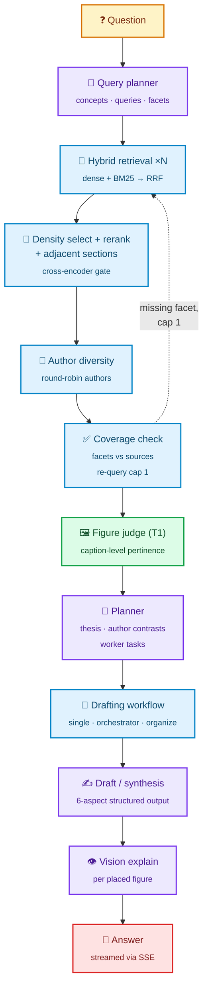

# 📚 statrag — RAG over Statistical Textbooks

[](https://www.python.org/)
[](https://fastapi.tiangolo.com/)
[](https://react.dev/)
[](https://vitejs.dev/)
[](https://www.typescriptlang.org/)
[](https://qdrant.tech/)
[](https://openai.com/)
[](https://www.deepseek.com/)
[](https://groq.com/)
[](https://www.langchain.com/)
[](https://katex.org/)
[](https://www.docker.com/)
[](https://developer.mozilla.org/en-US/docs/Web/API/Server-sent_events)
[](src/services/chat/tests/)
[](#-status)

> A **local-first, multi-mode study companion** that turns a personal library of statistics, econometrics, causal-inference, ML, and quant-finance textbooks into a tutor that *teaches* — every claim grounded, every citation clickable, every figure pertinence-judged.

## 🏛️ Project Architecture (high-level)

Full end-to-end view: **browser SPA ↔ FastAPI backend ↔ core infra ↔ Qdrant + SQLite**, plus the offline **ingestion task** that fills Qdrant. Backend enforces a **Chinese wall**: `core` imports nothing in-repo; `tasks` and `services` import only `core`; services never cross. Frontend talks to the backend through one REST client and one SSE client — no other coupling.

```mermaid
flowchart TB
    accTitle: statrag full project architecture
    accDescr: Browser SPA with state/components/views/modals talks via REST + SSE to a FastAPI backend whose chat service composes agents, retrievers, prompts, schemas, and an LLM router over 3 providers. Backend reads/writes Qdrant via core; chat persistence in SQLite. Separate ingestion task pipeline writes textbook + image collections into Qdrant. All packaged via Docker compose with dev and prod profiles.

    %% ─── FRONTEND ────────────────────────────────────────────────────────────
    subgraph FE["🖥️  Frontend — web/  (React 18 · Vite 5 · TS strict)"]
      direction TB
      FE_APP["App.tsx<br/><sub>layout · routing · theme</sub>"]
      subgraph FE_STATE["state/"]
        FE_CHAT["useChat reducer"]
        FE_PERS["persist · tweaks"]
      end
      subgraph FE_API["api/"]
        FE_REST["client.ts<br/><sub>REST</sub>"]
        FE_SSE["sse.ts<br/><sub>streamChat / status / stream</sub>"]
      end
      subgraph FE_COMP["components/"]
        FE_SHELL["Topbar · Sidebar · ContextPanel<br/>InputBar · MessageThread"]
        FE_PICK["ModelPicker · ModePicker<br/>SettingsPicker · NodeModelDropdown"]
        FE_PIPE["PipelineDiagram<br/><sub>reads data/tutorPipeline.ts</sub>"]
      end
      subgraph FE_VIEWS["components/views/  (1 per schema)"]
        FE_VIEW["TutorView · QuizView · DAGView<br/>ReportView · StudyPathView<br/>RoadmapView · NavigationView · AnnotateView"]
      end
      subgraph FE_MOD["components/modals/"]
        FE_MODAL["AboutModelModal · BookModal<br/>SourceModal · FocusModal"]
      end
      FE_APP --> FE_STATE
      FE_APP --> FE_COMP
      FE_APP --> FE_MOD
      FE_COMP --> FE_VIEWS
      FE_STATE --> FE_API
    end

    %% ─── BACKEND ─────────────────────────────────────────────────────────────
    subgraph BE["🐍 Backend — src/services/chat/  (FastAPI · SSE · Python 3.12)"]
      direction TB
      API["api.py<br/><sub>/api/health · /api/figures · /api/chat<br/>/api/chat/{id}/stream · /api/chat/{id}/status<br/>/api/study_plans/*</sub>"]
      subgraph BE_ROUTERS["sub-routers"]
        R_BOOKS["books.py<br/><sub>/api/books</sub>"]
        R_RET["retrieval.py<br/><sub>/api/search</sub>"]
        R_LLM["llm/router.py<br/><sub>/api/models</sub>"]
        R_STORE["store.py<br/><sub>/api/conversations · /api/preferences</sub>"]
      end
      ORCH["orchestrator.py<br/><sub>mode dispatch</sub>"]
      RUNS["runs.py<br/><sub>detached resumable<br/>per-conv asyncio.Task</sub>"]
      subgraph AGENTS["agents/"]
        AG["deep_tutor · coverage · image_judge<br/>orchestrator_workers · graph<br/>prereqs · research · study_path"]
      end
      subgraph RETR["retrievers/ + retrieval.py"]
        RX["density · diversity · image_density<br/>hybrid RRF (dense + BM25)"]
      end
      subgraph LLMP["llm/"]
        LR["openai_client · deepseek_client<br/>groq_client · router"]
      end
      PROMPTS["prompts/<br/><sub>11 mode prompts<br/>XML-tagged (role/context/task)</sub>"]
      SCHEMAS["schemas/<br/><sub>_core · output · output_repair</sub>"]
      TOOLS["tools/<br/><sub>inspect_figure · retrieve_figures<br/>kg_neighbors · extract_terms</sub>"]
      EXTRA["highlights · rerankers · query_expansion<br/>memory · kg · vision · cost · checkpointer"]

      API --> BE_ROUTERS
      API --> ORCH
      ORCH --> RUNS
      ORCH --> AGENTS
      AGENTS --> RETR
      AGENTS --> LLMP
      AGENTS --> PROMPTS
      AGENTS --> SCHEMAS
      AGENTS --> TOOLS
      AGENTS --> EXTRA
    end

    %% ─── OTHER SERVICES ──────────────────────────────────────────────────────
    subgraph SVC2["📦 Other services (src/services/)"]
      RETSVC["retrieval/<br/><sub>chain · cli</sub>"]
      EVAL["eval/<br/><sub>dataset · runner · metrics</sub>"]
    end

    %% ─── CORE ────────────────────────────────────────────────────────────────
    subgraph CORE["🧱 Core (src/core/)"]
      CFG["config.py<br/><sub>.env settings</sub>"]
      QS["qdrant_store.py<br/><sub>client factory</sub>"]
    end

    %% ─── INGESTION TASK ─────────────────────────────────────────────────────
    subgraph TASK["📥 Ingestion task (src/ingestion/)"]
      ING["pipeline.py<br/>5 stages: regex_pass → llm_enrich →<br/>build_documents → embed → persist"]
      ING_IMG["ingest_images_only.py"]
      ING_YAML["books/&lt;slug&gt;.yaml<br/>+ data/parsed/&lt;slug&gt;/book.json"]
      ING_YAML --> ING
      ING_YAML --> ING_IMG
    end

    %% ─── STORAGE + EXTERNAL ─────────────────────────────────────────────────
    subgraph DATA["🗄️ Storage + external"]
      QD[("Qdrant 1.12<br/>&lt;field&gt;_textbooks +<br/>&lt;field&gt;_images +<br/>concepts_kg")]
      DB[("SQLite<br/>data/chat.db<br/>conversations · messages<br/>prefs · study_plans")]
      FS[("Local FS<br/>whitelisted figure roots")]
      EXT_LLM(["OpenAI · DeepSeek · Groq<br/>HTTPS"])
    end

    %% ─── OPS ─────────────────────────────────────────────────────────────────
    subgraph OPS["🐳 Ops (ops/)"]
      COMPOSE["docker-compose.yml<br/><sub>qdrant + qdrant-backup (default)<br/>statrag-chat + statrag-web (prod profile)</sub>"]
      NGINX["nginx.conf<br/><sub>:5173 → /api → :8765</sub>"]
      SCRIPTS["scripts/<br/><sub>render_state.py · qdrant_snapshot.sh</sub>"]
    end

    %% ─── WIRING ──────────────────────────────────────────────────────────────
    FE_REST -- REST --> API
    FE_SSE  -- SSE  --> API
    RUNS -- SSE events --> FE_SSE
    R_STORE --> DB
    API -- /api/figures --> FS
    LR -- HTTPS --> EXT_LLM
    RETR --> CORE
    RETSVC --> CORE
    EVAL --> CORE
    AGENTS --> CORE
    ING --> CORE
    ING_IMG --> CORE
    CORE --> QD
    ING --> QD
    ING_IMG --> QD

    COMPOSE -. runs .-> BE
    COMPOSE -. runs .-> FE
    COMPOSE -. runs .-> QD
    NGINX -. proxies prod .-> FE

    %% ─── STYLE ───────────────────────────────────────────────────────────────
    classDef fe   fill:#fef3c7,stroke:#d97706,stroke-width:2px,color:#7c2d12
    classDef be   fill:#ede9fe,stroke:#7c3aed,stroke-width:2px,color:#4c1d95
    classDef svc  fill:#e0e7ff,stroke:#4f46e5,stroke-width:2px,color:#3730a3
    classDef core fill:#e0f2fe,stroke:#0284c7,stroke-width:2px,color:#0c4a6e
    classDef task fill:#dcfce7,stroke:#16a34a,stroke-width:2px,color:#14532d
    classDef data fill:#fee2e2,stroke:#dc2626,stroke-width:2px,color:#7f1d1d
    classDef ops  fill:#f3f4f6,stroke:#4b5563,stroke-width:2px,color:#1f2937

    class FE_APP,FE_CHAT,FE_PERS,FE_REST,FE_SSE,FE_SHELL,FE_PICK,FE_PIPE,FE_VIEW,FE_MODAL fe
    class API,R_BOOKS,R_RET,R_LLM,R_STORE,ORCH,RUNS,AG,RX,LR,PROMPTS,SCHEMAS,TOOLS,EXTRA be
    class RETSVC,EVAL svc
    class CFG,QS core
    class ING,ING_IMG,ING_YAML task
    class QD,DB,FS,EXT_LLM data
    class COMPOSE,NGINX,SCRIPTS ops
```



**Reality check** (what this diagram captures that the previous one missed):

- **Frontend internals** — 5 shell components, 4 modals, 8 per-schema views, a PipelineDiagram, state layer (reducer + persist + tweaks), and the REST + SSE clients as separate transports.
- **Backend sub-routers** — `api.py` is a thin shell; the real route surface is composed from `books.router`, `retrieval.router`, `llm/router.py`, and `store.router` (mounted under `/api`).
- **Detached runs** — `runs.py` owns the per-conversation `asyncio.Task` and event buffer; SSE responses are subscribers, not generators.
- **Agents are plural** — `deep_tutor` is one of 8 agent modules (`coverage`, `image_judge`, `orchestrator_workers`, `graph`, `prereqs`, `research`, `study_path`).
- **3 LLM providers** — OpenAI, DeepSeek, Groq, all dispatched through `llm/router.py`.
- **Two storage stores** — Qdrant for vectors *and* SQLite for chat persistence; `/api/figures` reads from whitelisted local FS roots.
- **Ops layer** — docker-compose runs Qdrant + auto-backup by default; the chat + web containers live behind a `prod` profile so dev (`:8766`/`:5175`) and prod (`:8765`/`:5173`) coexist.

---

## ⚠️ Status

> [!WARNING]
> **Ongoing project — NOT complete.** Most surface area wired but only **Tutor mode** is end-to-end working today. The other 10 modes exist as scaffolding + route handlers; their pipelines are stubs, partial, or unreviewed. Treat the rest as a roadmap.

---

## 🎯 What Makes It Different

| Capability | What statrag does | Why it matters |
|---|---|---|
| **Hybrid retrieval** | Dense (OpenAI 3072d) **+** BM25 sparse, fused server-side by Qdrant native RRF | One round-trip, no client-side rank drift |
| **9-stage tutor pipeline** | Query planner → density rerank → author diversity → coverage check → figure judge → synthesis plan → structured draft | Textbook-grade answers, not chunk dumps |
| **6-aspect schema** | `TL;DR · Definition · Formal Statement · Example & Intuition · Applications · Further Reading` | Forces depth; no skimping |
| **Verbatim formal statements** | If source has a numbered theorem → blockquote it. If not → empty (heading hidden) | Zero invented math |
| **Per-claim citations** | Every `[N]` marker has a matching citation; reconciler synthesizes missing ones in marker order | No orphan refs, no renumbering bugs |
| **Image judge** | Two-tier (caption → vision) pertinence judge; up to 3 figures injected inline at the best-scoring aspect | Figures land *where they belong* |
| **Detached, resumable SSE runs** | Background `asyncio.Task` per conversation; close tab → generation keeps running → reopen → resume from last `seq` | Production-grade chat lifecycle |
| **Prompt schema invariant** | Every prompt XML-tagged (`<role>` / `<context>` / `<task>` + addenda); enforced by audit test | Small models (Llama 4 Scout, gpt-oss) don't silently break |
| **Chinese-wall architecture** | `core` imports nothing; `tasks` and `services` import only `core`; services never cross | New feature = new folder, not refactor |

---

## 🧠 Tutor Mode Pipeline (the one mode that works end-to-end)

> This graph describes **Tutor mode only**, not the whole project. It mirrors `web/src/data/tutorPipeline.ts` (the canonical source surfaced in the in-app "About this pipeline" modal) and the stage sequence in `src/services/chat/agents/deep_tutor.py::run_deep_tutor`.



**Node roles** (matches the in-app modal — each LLM node is model-overridable per stage):

| Stage | Default model | Locked? |
|---|---|:---:|
| Query planner | `gpt-5.4-nano-2026-03-17` | swappable |
| Hybrid retrieval | `text-embedding-3-large` + RRF | locked |
| Density + rerank + adjacent | cross-encoder | locked |
| Author diversity | (deterministic) | locked |
| Coverage check | facet re-query | locked |
| Figure judge (T1) | `gpt-5.4-nano-2026-03-17` | swappable |
| Planner | `gpt-5.4-nano-2026-03-17` | swappable |
| Drafting workflow | single / orchestrator / organize | swappable |
| Draft / synthesis | follows picker (default nano; `deepseek-v4-pro` for organize) | swappable |
| Vision explain | `gpt-4o-mini` | swappable |

---

## 🧩 Chat Modes

| Mode | Slug | Status | Intended capability |
|---|---|:---:|---|
| **Tutor** | `tutor` | ✅ working | Deep multi-stage tutor (the whole pipeline above) |
| Compare | `compare` | 🚧 stub | Side-by-side concept / method / author comparison |
| Figures | `figures` | 🚧 stub | Figure-first retrieval and explanation |
| Quiz | `quiz` | 🚧 stub | Question generation per section / chapter |
| Navigate | `navigate` | 🚧 stub | TOC / structural browsing across books |
| Prereqs | `prereqs` | 🚧 stub | Prerequisite-concept DAG for a topic |
| Annotate | `annotate` | 🚧 stub | Inline annotation of a passage |
| Research | `research` | 🚧 stub | Open-ended research synthesis |
| Math | `math` | 🚧 stub | Equation / derivation focused answers |
| Path | `path` | 🚧 stub | Learning-path suggestion |
| Roadmap | `roadmap` | 🚧 stub | Multi-step study roadmap with milestones |

Use `mode: "tutor"` in `/api/chat` until the rest is hardened.

---

## 🏗️ Stack

| Layer | Tech |
|---|---|
| **Vector DB** | Qdrant 1.12.4 — per-field collections (`<field>_textbooks` + `<field>_images`) |
| **Embeddings** | OpenAI `text-embedding-3-large` (3072d, dense + caption) |
| **Sparse** | Qdrant native BM25 via `fastembed` |
| **Chat LLMs** | OpenAI (`gpt-5.4-nano`, `gpt-5.4`), DeepSeek (`v4-pro`), Groq (`llama-4-scout`, `gpt-oss-120b/20b`) |
| **Backend** | Python 3.12 · FastAPI · sse-starlette · LangChain / LangGraph · Pydantic v2 |
| **Frontend** | React 18 · Vite 5 · TypeScript (strict) · KaTeX · hand-rolled markdown |
| **Storage** | SQLite (conversations, prefs) · Qdrant snapshots (auto-backup) |
| **Ops** | Docker Compose · multi-stage builds · dev + prod profiles |

---

## 🚀 Quick Start

```bash
# 1. clone + venv
git clone https://github.com/IohanFaustino/statrag.git && cd statrag
python3.12 -m venv .venv
.venv/bin/python -m pip install -r requirements.txt

# 2. secrets
cp .env.example .env
# fill OPENAI_API_KEY (required); DEEPSEEK_API_KEY / GROQ_API_KEY optional

# 3. Qdrant (empty)
docker compose -f ops/docker/docker-compose.yml up -d

# 4. frontend deps
cd web && npm install && cd ..

# 5. ingest at least one book (raw OCR sources NOT shipped)
python -m src.ingestion.pipeline --book <slug> --chapter chNN

# 6. dev stack — backend :8766 + frontend :5175
./scripts/dev.sh
```

Open **<http://localhost:5175>**.

---

## 📥 Ingest Your Own Books

The repo ships **code only** — no data, no Qdrant points, no `.env`. Full operational guide: **[`docs/tasks/ingestion.md`](docs/tasks/ingestion.md)**. Summary:

```bash
# locate chapter boundaries
grep -n "^# \|^## [0-9]\|^### [0-9]\+\.1\s" /path/to/book.md | head -40

# preview (1 LLM call, no manifest write)
.venv/bin/python -m src.ingestion.pipeline \
  --book <slug> --chapter ch01 --limit-sections 1 --force

# full ingest
.venv/bin/python -m src.ingestion.pipeline --book <slug>
```

A `rag-add-book` Claude Code skill automates steps 1–5 with three confirmation gates (yaml → preview → full).

---

## 🔌 Ports

| Profile | Frontend | Backend | Qdrant |
|---|:---:|:---:|:---:|
| dev (`./scripts/dev.sh`) | **5175** | **8766** | 6333 |
| prod (`docker compose --profile prod up`) | 5173 | 8765 | 6333 |

Qdrant dashboard: <http://localhost:6333/dashboard>.

---

## 📊 Numbers (live)

- **26** books indexed across **6** field collections
- **8,083** image points (30× growth from first pass)
- **488** backend tests + frontend test suite
- **50+** per-feature deep-dive docs ([`docs/services/chat-features/`](docs/services/chat-features/))
- **14** API routes + `GET /api/figures` (whitelisted file serving)

---

## 🔒 Security Notes (Self-Hosting)

- `.env` git-ignored. `.env.example` lists required keys.
- CORS = `allow_origins=["*"]` in `src/services/chat/api.py` for dev. **Restrict before exposing.**
- `/api/figures` whitelists local FS roots — edit `_FIGURE_ROOTS` for your machine.

---

## 📚 Docs

| Doc | Purpose |
|---|---|
| [`CLAUDE.md`](CLAUDE.md) | Architecture + Chinese wall + commands |
| [`docs/system/architecture.md`](docs/system/architecture.md) | 5-stage ingestion + retrieval |
| [`docs/system/invariants.md`](docs/system/invariants.md) | 28 invariants verified per commit |
| [`docs/services/chat.md`](docs/services/chat.md) | SSE backbone + detached runs |
| [`docs/services/frontend.md`](docs/services/frontend.md) | React SPA + TutorView contract |
| [`docs/services/chat-features/`](docs/services/chat-features/) | Per-feature deep-dives (50+) |
| [`docs/tasks/ingestion.md`](docs/tasks/ingestion.md) | Add-a-book recipe |

---

## 📝 License

Personal research project. No license granted by default — contact author.
