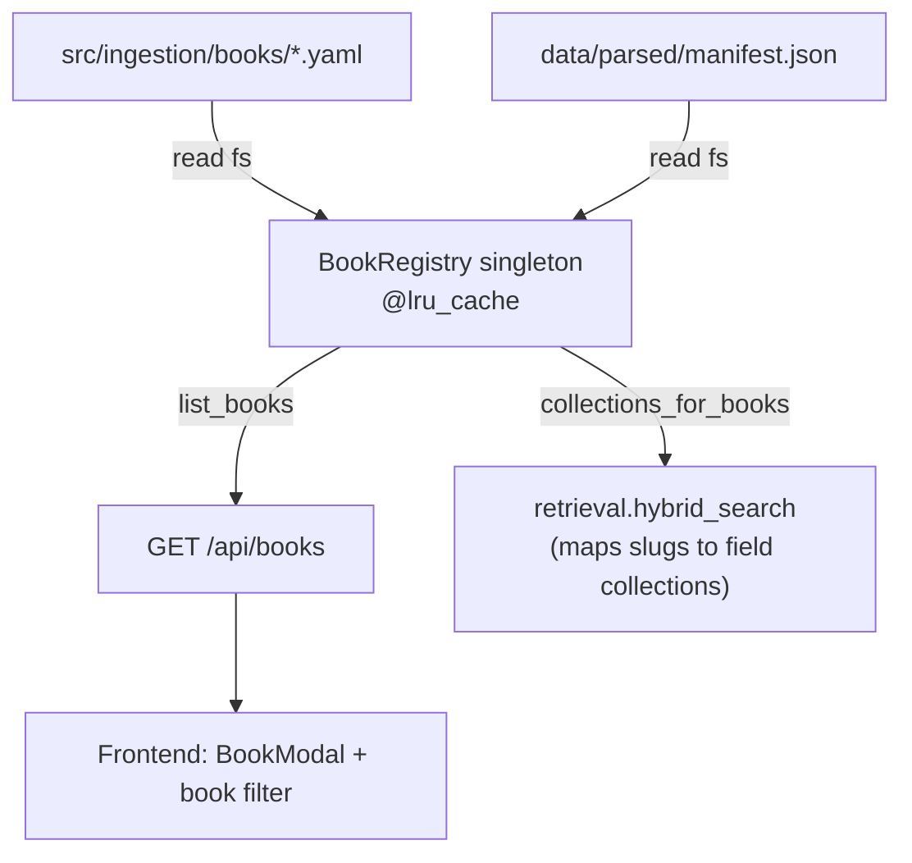

# 01 — Book registry + `/api/books`

## Purpose

Single source of truth for "what books exist and which Qdrant collections to query." Built once from `data/parsed/manifest.json` + `src/ingestion/books/*.yaml` (filesystem, no module import — respects Chinese wall). Provides 26 books grouped by field, w/ per-book stats (chunks, figures, chapters) and color.

## Flow



## Key code

`src/services/chat/books.py`:

```python
@lru_cache(maxsize=1)
def _registry() -> BookRegistry: ...

def list_books() -> list[Book]: ...
def get_book(slug: str) -> Book | None: ...
def books_for_field(field: str) -> list[Book]: ...
def collections_for_books(slugs: list[str]) -> dict[str, list[str]]:
    """Group slugs by their field collection. Used to fan out retrieval.
    Returns {'<field>_textbooks': [slug, ...]}."""

router = APIRouter()

@router.get("/books")
def list_books_endpoint() -> list[Book]: ...

@router.get("/books/{slug}")
def get_book_endpoint(slug: str) -> Book: ...
```

Color palette keyed by field: `introduction=#7EC8A4`, `econometrics=#E8A87C`, `ml_dp=#4F9CF9`, `causal_inference=#9B8FCC`, `math=#F0C060`, `risk=#FF6B7E`.

## Book schema

```python
class Book(BaseModel):
    id: str             # slug, e.g. "islp"
    title: str
    short: str          # display short (e.g. "ISLP")
    authors: str
    edition: str
    field: str          # "introduction" | ...
    theme: str
    chapters: int
    chunks: int
    figures: int
    collection: str         # "<field>_textbooks"
    image_collection: str   # "<field>_images"
    color: str
    cover: str              # slug used by frontend BookCover placeholder
    description: str
    selected: bool          # default True
    indexed: bool           # True if manifest has success entry
```

## Mapping (demo↔reality)

Design demo assumed `<book>_chunks` collections. Reality is per-FIELD `<field>_textbooks` with `book_slug` payload key. `collections_for_books()` groups requested books by field and emits payload filter `book_slug IN [...]`. Frontend never touches collection names.

## Tests

`src/services/chat/tests/test_books.py` — 8 tests:
- list_books >= 1
- collections_for_books(["islp"]) → `{"introduction_textbooks": ["islp"]}`
- get_book("nonexistent") → None
- books_for_field grouping
- registry is `@lru_cache` singleton

## Wall

Imports: `src.services.chat.schemas`, stdlib (`pathlib`, `json`), `pyyaml`, `fastapi`. NO `src.ingestion.*` imports.
