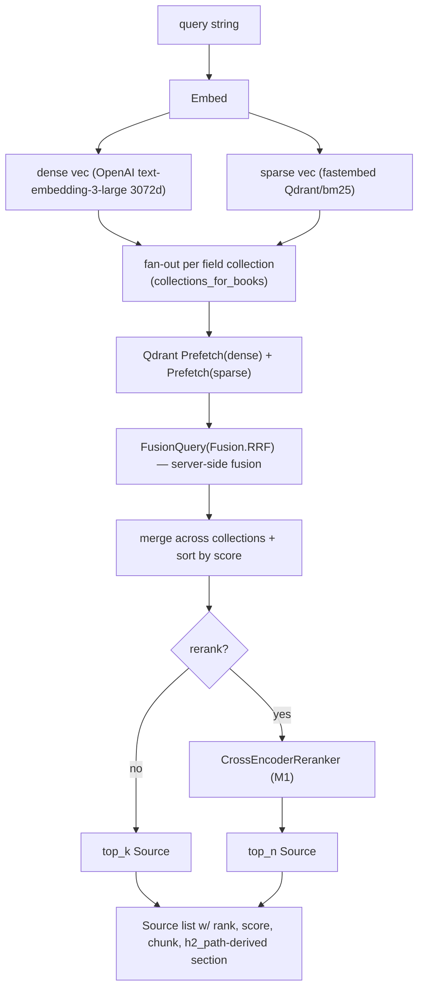

# 02 — Hybrid RRF retrieval

## Purpose

Hybrid dense + sparse (BM25) retrieval over per-field Qdrant collections, fused server-side via Reciprocal Rank Fusion. Returns ranked `Source` objects with payload-derived section labels, ready for the LLM context assembler.

## Flow



## Key code

`src/services/chat/retrieval.py`:

```python
def hybrid_search(
    query: str,
    *,
    book_slugs: list[str] | None = None,
    top_k: int = 5,
    rerank: bool = False,
    rerank_top_n: int | None = None,
) -> tuple[list[Source], RetrievalMetadata]:
    """Hybrid dense+sparse RRF search over Qdrant section-level chunks."""

def _query_collection(collection, dense_vec, sparse_vec, top_k, payload_filter):
    res = client().query_points(
        collection_name=collection,
        prefetch=[
            Prefetch(query=dense_vec, using=TEXT_VECTOR, limit=top_k * 4),
            Prefetch(query=sparse_vec, using=SPARSE_VECTOR, limit=top_k * 4),
        ],
        query=FusionQuery(fusion=Fusion.RRF),
        limit=top_k,
        query_filter=payload_filter,
        with_payload=True,
    )
    return list(res.points)

def _build_filter(slugs: list[str]) -> Filter | None:
    return Filter(must=[FieldCondition(key="book_slug", match=MatchAny(any=slugs))])
```

Payload → Source mapping uses real ingestion schema (`h1`, `h2_path`, `chapter_id`, `page_from`, `book_slug`, `text`):

```python
def _point_to_source(point, rank) -> Source:
    h2_path = payload.get("h2_path") or ""
    section = h2_path.split(" | ")[-1].strip()  # last segment
    title = h2_path                              # full path
    return Source(rank=rank, book=payload["book_slug"], chapter=payload["chapter_id"],
                  section=section, title=title, excerpt=text[:200],
                  score=point.score, page=payload.get("page_from"),
                  chunkId=str(point.id), chunk=text, highlights=[])
```

## Multi-query variant (M3)

```python
async def multi_query_hybrid_search(
    queries: list[str], *, book_slugs=None, top_k=5, rerank=False, rerank_top_n=None,
) -> tuple[list[Source], RetrievalMetadata]:
    """Runs hybrid_search in parallel for each query (asyncio.to_thread),
    dedups by chunkId keeping highest score, re-sorts, optional single rerank pass."""
```

## Figure retrieval

```python
def search_figures(query, book_slugs=None, k=5) -> list[Figure]: ...
def search_figures_with_scores(query, book_slugs=None, k=5) -> list[tuple[Figure, float]]:
    """Same as search_figures but returns parallel score list — used by vision gate."""
```

Pre-flight: `client().get_collections()` filters to only existing `<field>_images` collections to avoid 404 spam from fields without ingested images.

## Endpoint

`POST /api/search` body = `SearchRequest{query, books?, topK?, scoreThreshold?}` → returns `{sources, figures, metadata}`.

## Tests

`src/services/chat/tests/test_retrieval.py` — 17+5 tests:
- TestHybridSearch: shape, ordering, dedup, page extraction, filter, fallback when book_slugs is None
- TestMultiQueryHybridSearch: dedup by chunkId, highest-score retention, delegate to single-query when len==1, joined metadata
- Qdrant mocked via monkeypatch on `src.core.qdrant_store.client`
