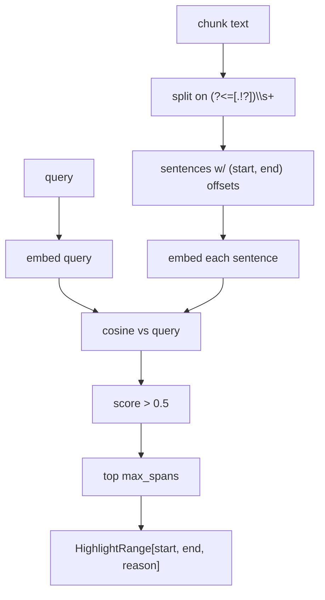

# 03 — Sentence-level highlight reranker

## Purpose

Compute character ranges within a retrieved chunk that best match the user query. Backend-provided ranges power the `<mark>` highlights in `SourceModal` (UI doesn't substring-match). Heuristic path per design 05_rag_pipeline.md (LLM-cited path deferred to v2).

## Flow



## Key code

`src/services/chat/highlights.py`:

```python
def compute_highlights(
    query: str,
    chunk: str,
    *,
    max_spans: int = 3,
) -> list[HighlightRange]:
    """Sentence-level dense re-score over a chunk. Returns char-range highlights."""
    sentences = _split_sentences(chunk)
    if len(sentences) <= 2:
        return [HighlightRange(start=0, end=len(chunk), reason="full chunk")]
    texts = [query] + [s["text"] for s in sentences]
    embs = _embed_batch(texts)  # one OpenAI batch call
    q_emb = embs[0]
    scored = [
        (cosine(q_emb, embs[i+1]), s)
        for i, s in enumerate(sentences)
    ]
    scored.sort(key=lambda x: -x[0])
    out = []
    for score, sent in scored[:max_spans]:
        if score > 0.5:
            out.append(HighlightRange(start=sent["start"], end=sent["end"],
                                      reason=f"score={score:.2f}"))
    return out
```

## Short-circuit

Chunks with `<= 2` sentences return a single full-chunk range — saves an API call.

## Cost

One OpenAI batch embedding call per source. Orchestrator wraps in `try/except` so highlight failure never blocks streaming.

## Tests

`test_retrieval.py::TestComputeHighlights` — 8 tests:
- empty chunk → empty
- 1-sentence and 2-sentence short-circuits return full-chunk
- multi-sentence triggers API batch
- max_spans cap respected
- threshold (score > 0.5) excludes weak matches
- correct `HighlightRange` types

## Frontend integration

`SourceModal.tsx` consumes `HighlightRange[]` directly:

```tsx
{slices.map((s, i) =>
  s.hl ? <mark key={i} className="src-hl">{s.text}</mark> : <span key={i}>{s.text}</span>
)}
```

Falls back to substring matching when backend returns `string[]` (legacy path).
