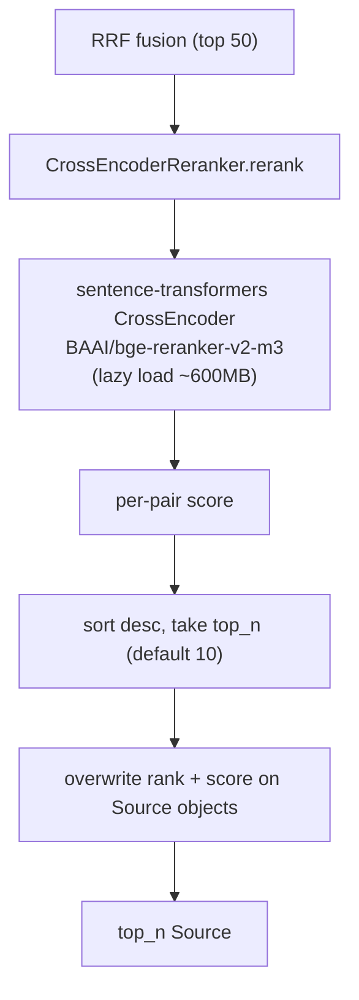

# 04 — Cross-encoder reranker (M1)

## Purpose

Reorder retrieval candidates with a local cross-encoder. Most ROI-positive upgrade per the plan; gated behind `RetrievalFlags.rerank` so each mode opts in. Free, offline, no rate limits (per ADR-002).

## Flow



## Key code

`src/services/chat/rerankers.py`:

```python
class CrossEncoderReranker:
    """Lazy-loaded BAAI/bge-reranker-v2-m3 cross-encoder.

    Loads ~600MB on first call; cached for process lifetime.
    Memory budget: <= 2GB resident (NFR10).
    """
    def __init__(self, model: str | None = None) -> None:
        self.model_name = model or settings.reranker_model

    @cached_property
    def _model(self):
        from sentence_transformers import CrossEncoder
        return CrossEncoder(self.model_name, max_length=512)

    def rerank(self, query: str, hits: list[Source], top_n: int) -> list[Source]:
        if not hits:
            return hits
        pairs = [(query, h.excerpt or h.chunk[:512]) for h in hits]
        scores = self._model.predict(pairs, show_progress_bar=False)
        ranked = sorted(zip(scores, hits), key=lambda t: -float(t[0]))[:top_n]
        out = []
        for new_rank, (score, h) in enumerate(ranked, start=1):
            h.rank = new_rank
            h.score = float(score)
            out.append(h)
        return out


def get_reranker() -> CrossEncoderReranker:
    """Process-level singleton."""
```

## Wiring into retrieval

`hybrid_search(query, *, rerank=False, rerank_top_n=None)`:

- `rerank=False` (default): fetch `top_k` from RRF directly.
- `rerank=True`: fetch `settings.rerank_top_k_in` (50) candidates from RRF, then `get_reranker().rerank(query, candidates, top_n=rerank_top_n or settings.rerank_top_n_out)` (default 10).

`RetrievalMetadata.mode` reflects the choice: `"hybrid (RRF: dense + sparse) + rerank=bge-reranker-v2-m3"`.

## Config

`src/core/config.py`:

```python
reranker_model: str = Field("BAAI/bge-reranker-v2-m3", alias="RERANKER_MODEL")
rerank_top_k_in: int = Field(50, alias="RERANK_TOP_K_IN")
rerank_top_n_out: int = Field(10, alias="RERANK_TOP_N_OUT")
```

## Gate (per plan)

`ModeSpec.retrieval_flags.rerank` default is `True` for new modes but `False` for tutor in v1 (until M4 baseline lift measured). Flip globally when eval reports ≥10% lift on T2.

## Tests

`test_reranker.py` — 3 tests:
- monotonic reorder (relevant first)
- top_n caps output
- empty hits → empty out, no model load

Tests mock `CrossEncoderReranker._model` via `r.__dict__["_model"] = FakeModel()` so no model download in CI.

## Trade-offs (ADR-002)

- (+) Free, offline, no rate limits, project-aligned
- (+) ~1.5GB resident after load — within NFR10 budget
- (–) Cold-start latency on first call (~3s)
- Alt rejected: Cohere `rerank-3` (paid, network), separate microservice (overhead)
