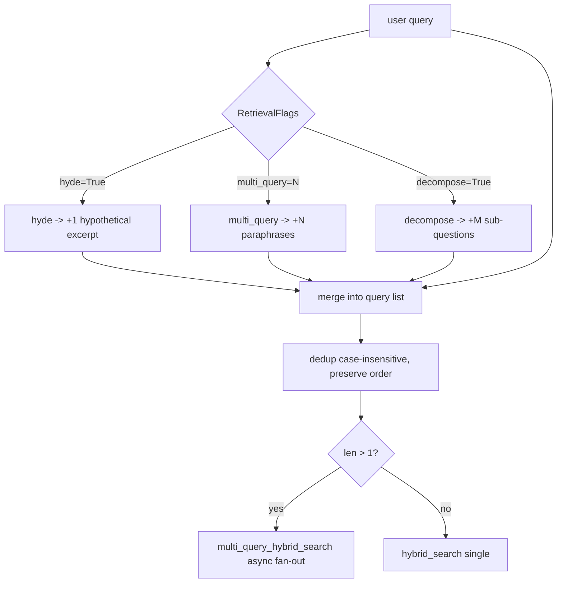

# 05 — Query expansion: HyDE + multi-query + decompose (M3)

## Purpose

Three async LLM-driven query expansion strategies to bridge the vocabulary gap between user language and book language. Gated per-mode via `RetrievalFlags`.

## Flow



## Key code

`src/services/chat/query_expansion.py`:

```python
async def hyde(query: str, *, model=None) -> str:
    """Generate a 3-sentence hypothetical textbook excerpt."""
    p = ("Write a 3-sentence hypothetical excerpt from a statistics/econometrics "
         "textbook that would directly answer the following query. Use precise "
         "mathematical language. Do NOT include preamble or meta-commentary.\n\n"
         f"Query: {query}")
    return (await _llm_short(p, model=model, max_tokens=250)).strip()

async def multi_query(query: str, *, n: int = 3, model=None) -> list[str]:
    """Generate n alternative phrasings using diverse vocabulary."""
    # Returns JSON array of strings.

async def decompose(query: str, *, model=None) -> list[str]:
    """Decompose into 2-4 atomic sub-questions."""

async def expand_queries(query: str, *, flags: RetrievalFlags) -> list[str]:
    """Apply flags to produce final dedup'd query list.
    Order: [original, hyde, *multi_query, *decompose]."""
    queries = [query]
    if flags.hyde:        queries.append(await hyde(query))
    if flags.multi_query: queries.extend(await multi_query(query, n=flags.multi_query))
    if flags.decompose:   queries.extend(await decompose(query))
    # dedup preserving order, case-insensitive
    seen = set(); out = []
    for q in queries:
        k = q.strip().lower()
        if k and k not in seen:
            seen.add(k); out.append(q)
    return out
```

Uses `openai.AsyncOpenAI` directly (no langchain). Default model = `settings.openai_model_nano` (cheap).

## Per-mode defaults (set in `modes.py`)

| Mode | hyde | multi_query | decompose |
|---|---|---|---|
| tutor | off | 0 | off |
| compare | off | 2 | off |
| navigate | **on** | 0 | off |
| quiz | off | 0 | off |
| research | off | 0 | **on** |
| math | **on** | 0 | off |
| path | off | 0 | **on** |
| prereqs | off | 0 | off |
| figures | off | 0 | off |
| annotate | off | 0 | off |
| roadmap | off | 2 | off |

Adjust freely without code changes — runtime flag.

## Cost

Each enabled flag = 1 extra short LLM call (≤300 tokens). All three enabled = 3 calls. Default `tutor` mode = 0 extra calls.

## Tests

`test_query_expansion.py` — 14 tests:
- hyde returns text (mocked LLM)
- multi_query parses JSON array
- multi_query n=0 returns empty
- multi_query malformed JSON returns empty (no crash)
- decompose parses array
- expand_queries dedup (case-insensitive)
- expand_queries no-flags returns [original] only
- error paths swallowed (logged warning, never crash)

All LLM calls mocked via `unittest.mock.AsyncMock`.

## Wiring

`orchestrator.stream_chat`:

```python
flags = spec.retrieval_flags
queries = await expand_queries(rewritten, flags=flags)
if len(queries) > 1:
    sources, metadata = await multi_query_hybrid_search(queries, ...)
else:
    sources, metadata = hybrid_search(rewritten, ...)
metadata.rewrittenQuery = " | ".join(queries)[:300]
```

Single-query path unchanged → tutor mode SSE tests stay green.
