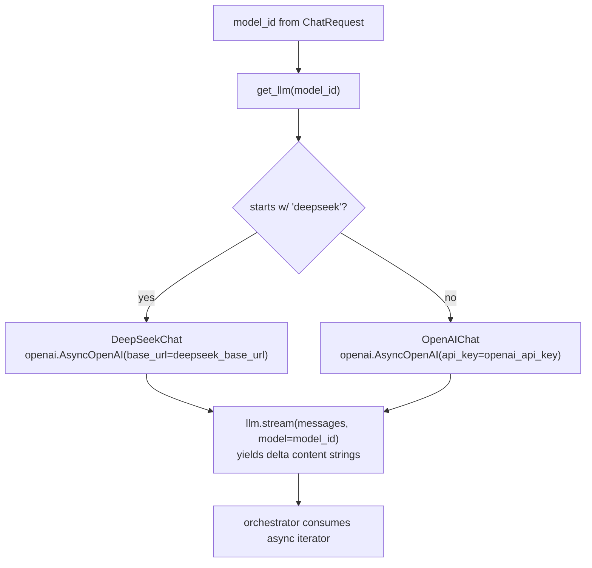

# 06 — LLM router (OpenAI + DeepSeek async streaming)

## Purpose

Async streaming abstraction over multiple OpenAI-compatible providers. Routes by `model_id` prefix. Both providers go through the `openai` SDK (DeepSeek via `base_url` override).

## Flow



## Key code

`src/services/chat/llm/base.py`:

```python
@dataclass
class ChatMessage:
    role: str   # "system" | "user" | "assistant"
    content: str

class LLMError(RuntimeError): ...

class BaseLLM(ABC):
    @abstractmethod
    async def stream(self, messages: list[ChatMessage], *, model: str,
                     temperature: float = 0.2, max_tokens: int | None = None,
                     ) -> AsyncIterator[str]: ...
```

`src/services/chat/llm/openai_client.py`:

```python
class OpenAIChat(BaseLLM):
    def __init__(self) -> None:
        self._client = openai.AsyncOpenAI(api_key=settings.openai_api_key)

    async def stream(self, messages, *, model, temperature=0.2, max_tokens=None):
        try:
            stream = await self._client.chat.completions.create(
                model=model,
                messages=[{"role": m.role, "content": m.content} for m in messages],
                stream=True, temperature=temperature, max_tokens=max_tokens,
            )
            async for chunk in stream:
                delta = chunk.choices[0].delta.content
                if delta:
                    yield delta
        except openai.OpenAIError as e:
            raise LLMError(f"OpenAI: {e}") from e
```

`src/services/chat/llm/deepseek_client.py` — same shape, different `base_url`. Eager `LLMError` if `DEEPSEEK_API_KEY` missing.

`src/services/chat/llm/router.py`:

```python
def get_llm(model_id: str) -> tuple[BaseLLM, str]:
    if model_id.startswith("deepseek"):
        return DeepSeekChat(), model_id
    return OpenAIChat(), model_id

def list_providers() -> list[ModelProvider]:
    return [
        ModelProvider(id="openai", name="OpenAI", short="OAI", color="#10A37F",
                      models=[Model(id="gpt-4o", ...), Model(id="gpt-5.4-nano-...", ...), ...]),
        ModelProvider(id="deepseek", name="DeepSeek", short="DS", color="#4D6BFE",
                      models=[Model(id="deepseek-chat", ...), Model(id="deepseek-v4-pro", ...)]),
    ]

router = APIRouter()
@router.get("/models")
def models_endpoint() -> list[ModelProvider]: return list_providers()
```

## Model registry (hardcoded)

| Provider | ID | tagline | cost | speed | ctx |
|---|---|---|---|---|---|
| OpenAI | gpt-4o | Multimodal flagship | $$$ | fast | 128k |
| OpenAI | gpt-4o-mini | Cheap + fast | $ | fast | 128k |
| OpenAI | gpt-5.4-nano-2026-03-17 | Project default | $ | fast | 200k |
| OpenAI | gpt-5.4-2026-03-05 | Full reasoning | $$$$ | med | 400k |
| DeepSeek | deepseek-chat | General purpose | $ | fast | 128k |
| DeepSeek | deepseek-reasoner | Chain-of-thought | $$ | slow | 128k |
| DeepSeek | deepseek-v4-pro | Latest pro tier | $$ | med | 128k |

UI shows these in `ModelPicker`. Adding a model = edit `router.py` only.

## Tests

`test_llm_router.py` — 9 tests:
- get_llm("gpt-4o") → OpenAIChat
- get_llm("deepseek-chat") → DeepSeekChat
- get_llm("unknown-model") → OpenAIChat (default route)
- list_providers returns 2
- exact model counts per provider
- field completeness

No real API calls (constructors lazy-create clients but `stream` not called).

## Endpoint

`GET /api/models` → `ModelProvider[]`.

## Env

```
OPENAI_API_KEY=sk-...     # required
DEEPSEEK_API_KEY=...      # optional (lazy check at provider switch)
DEEPSEEK_BASE_URL=https://api.deepseek.com/v1
```
