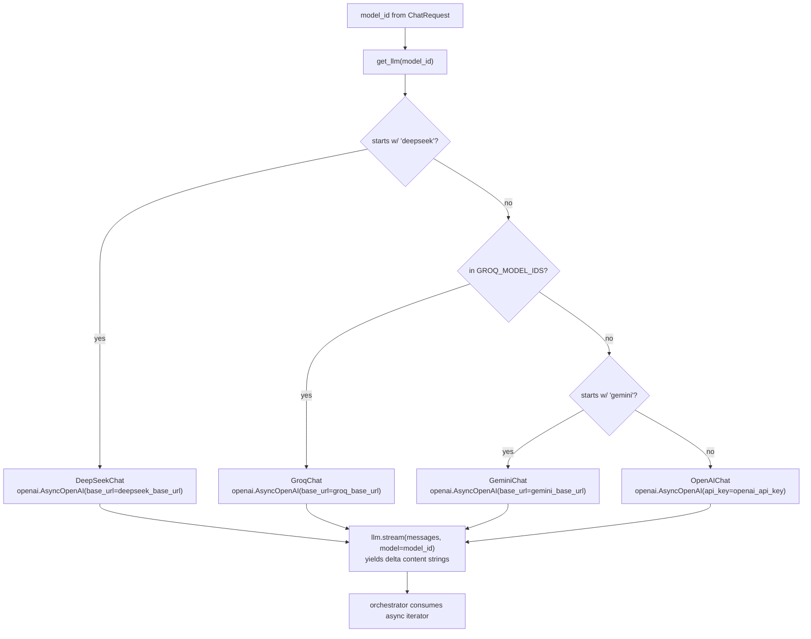

# 06 — LLM router (OpenAI + DeepSeek + Groq + Google Gemini async streaming)

## Purpose

Async streaming abstraction over multiple OpenAI-compatible providers. Routes by `model_id` prefix / membership set. All providers go through the `openai` SDK with per-provider `base_url` overrides.

## Flow



## Key code

`src/services/chat/llm/base.py`:

```python
@dataclass
class ChatMessage:
    role: str   # "system" | "user" | "assistant"
    content: str

class LLMError(RuntimeError): ...

class BaseLLM(ABC):
    @abstractmethod
    async def stream(self, messages: list[ChatMessage], *, model: str,
                     temperature: float = 0.2, max_tokens: int | None = None,
                     ) -> AsyncIterator[str]: ...
```

`src/services/chat/llm/openai_client.py`:

```python
class OpenAIChat(BaseLLM):
    def __init__(self) -> None:
        self._client = openai.AsyncOpenAI(api_key=settings.openai_api_key)

    async def stream(self, messages, *, model, temperature=0.2, max_tokens=None):
        try:
            stream = await self._client.chat.completions.create(
                model=model,
                messages=[{"role": m.role, "content": m.content} for m in messages],
                stream=True, temperature=temperature, max_tokens=max_tokens,
            )
            async for chunk in stream:
                delta = chunk.choices[0].delta.content
                if delta:
                    yield delta
        except openai.OpenAIError as e:
            raise LLMError(f"OpenAI: {e}") from e
```

`src/services/chat/llm/deepseek_client.py` — same shape, different `base_url`. Eager `LLMError` if `DEEPSEEK_API_KEY` missing.

`src/services/chat/llm/groq_client.py` — same shape; supports `response_format` natively. Eager `LLMError` if `GROQ_API_KEY` missing. Routes via `GROQ_MODEL_IDS` set (not a prefix, to avoid `openai/gpt-oss-*` collisions).

`src/services/chat/llm/gemini_client.py` — mirrors `GroqChat`; uses Gemini's OpenAI-compat endpoint. Eager `LLMError` if `GEMINI_API_KEY` missing. Routes via `"gemini"` prefix (reliable, no collisions).

`src/services/chat/llm/router.py`:

```python
def get_llm(model_id: str) -> tuple[BaseLLM, str]:
    if model_id.startswith("deepseek"):
        return DeepSeekChat(), model_id
    if model_id in GROQ_MODEL_IDS:
        return GroqChat(), model_id
    if model_id.startswith("gemini"):
        return GeminiChat(), model_id
    return OpenAIChat(), model_id

def aclient_for(model_id: str | None) -> openai.AsyncOpenAI:
    if model_id and model_id in GROQ_MODEL_IDS:
        return openai.AsyncOpenAI(api_key=settings.groq_api_key, base_url=settings.groq_base_url)
    if model_id and model_id.startswith("deepseek"):
        return openai.AsyncOpenAI(api_key=settings.deepseek_api_key, base_url=settings.deepseek_base_url)
    if model_id and model_id.startswith("gemini"):
        return openai.AsyncOpenAI(api_key=settings.gemini_api_key, base_url=settings.gemini_base_url)
    return openai.AsyncOpenAI(api_key=settings.openai_api_key)

def list_providers() -> list[ModelProvider]: ...  # 4 providers now
```

## Model registry (hardcoded)

| Provider | ID | tagline | cost | speed | ctx |
|---|---|---|---|---|---|
| OpenAI | gpt-4o | Multimodal flagship | $$$ | fast | 128k |
| OpenAI | gpt-4o-mini | Cheap + fast | $ | fast | 128k |
| OpenAI | gpt-5.4-nano-2026-03-17 | Project default | $ | fast | 200k |
| OpenAI | gpt-5.4-2026-03-05 | Full reasoning | $$$$ | med | 400k |
| DeepSeek | deepseek-chat | General purpose | $ | fast | 128k |
| DeepSeek | deepseek-reasoner | Chain-of-thought | $$ | slow | 128k |
| DeepSeek | deepseek-v4-pro | Latest pro tier | $$ | med | 128k |
| Groq | meta-llama/llama-4-scout-17b-16e-instruct | Groq default — fast multimodal | $ | fast | 128k |
| Groq | llama-3.3-70b-versatile | Versatile large | $ | fast | 128k |
| Groq | openai/gpt-oss-120b | Open-weight flagship | $$ | fast | 128k |
| Groq | openai/gpt-oss-20b | Open-weight small | $ | fast | 128k |
| Google | gemini-2.5-flash | Fast multimodal — draft candidate | $ | fast | 1M |
| Google | gemini-2.5-pro | Flagship reasoning | $$$ | med | 1M |

UI shows these in `ModelPicker`. Adding a model = edit `router.py` only.

## Tests

`test_llm_router.py` — routing + registry tests (updated to 4 providers):
- get_llm("gpt-4o") → OpenAIChat
- get_llm("deepseek-chat") → DeepSeekChat
- get_llm("meta-llama/…") → GroqChat (via GROQ_MODEL_IDS set)
- get_llm("openai/gpt-oss-120b") → GroqChat (same set, not prefix — avoids collision)
- get_llm("unknown-model") → OpenAIChat (default route)
- list_providers returns 4 providers; GROQ_MODEL_IDS matches registry exactly

`test_router_gemini.py` — 10 tests (Gemini-specific):
- get_llm("gemini-2.5-flash") → GeminiChat
- get_llm("gemini-2.5-pro") → GeminiChat
- GeminiChat with empty key → LLMError("GEMINI_API_KEY missing")
- GeminiChat wires correct base_url
- aclient_for("gemini-2.5-flash") → AsyncOpenAI at gemini_base_url
- aclient_for with empty key → LLMError
- list_providers includes "google" provider with 2 models
- GEMINI_MODEL_IDS matches registry

No real API calls in any test.

## Endpoint

`GET /api/models` → `ModelProvider[]`.

## Env

```
OPENAI_API_KEY=sk-...     # required
DEEPSEEK_API_KEY=...      # optional (lazy check at provider switch)
DEEPSEEK_BASE_URL=https://api.deepseek.com/v1
GROQ_API_KEY=gsk-...      # optional
GROQ_BASE_URL=https://api.groq.com/openai/v1
GEMINI_API_KEY=AIza...    # optional (lazy check at provider switch)
GEMINI_BASE_URL=https://generativelanguage.googleapis.com/v1beta/openai/
```
