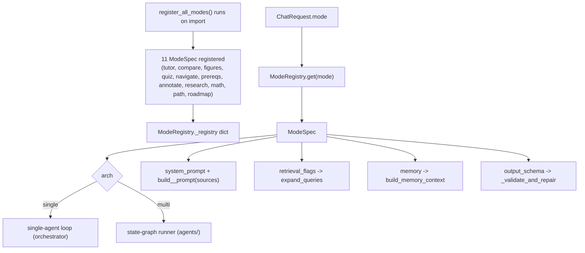

# 07 — Mode registry + ModeSpec + Pydantic schemas (M2)

## Purpose

Configuration as data: all 11 modes are declared once as `ModeSpec` instances. Each carries persona prompt, output schema, retrieval flags, model tier, memory strategy, and graph cap. Orchestrator dispatches purely on `ModeSpec.arch` (single/multi). Adding a 12th mode = 1 `ModeSpec.register()` call + 1 prompt file + 1 schema.

## Flow



## Key code

`src/services/chat/modes.py`:

```python
@dataclass(frozen=True)
class RetrievalFlags:
    hyde: bool = False
    multi_query: int = 0
    decompose: bool = False
    adjacent_sections: bool = False
    rerank: bool = True
    rerank_top_n: int = 8


@dataclass(frozen=True)
class ModeSpec:
    id: ModeId
    icon: str
    arch: Literal["single", "multi"]
    system_prompt: str
    few_shot: list = field(default_factory=list)
    output_schema: Type[BaseModel] = TutorAnswer
    tools: list[str] = field(default_factory=list)
    retrieval_flags: RetrievalFlags = field(default_factory=RetrievalFlags)
    model: Literal["nano", "pro", "pro_vision"] = "nano"
    max_tool_calls: int = 3
    max_graph_iters: int = 12
    post_validators: tuple[str, ...] = ("citation",)
    memory: Literal["off", "sliding", "summary", "vec", "auto", "persist"] = "off"


class ModeRegistry:
    _registry: dict[str, ModeSpec] = {}

    @classmethod
    def register(cls, spec: ModeSpec) -> None: cls._registry[spec.id] = spec

    @classmethod
    def get(cls, mode_id: str) -> ModeSpec: ...

    @classmethod
    def all(cls) -> list[ModeSpec]: ...


def register_all_modes() -> None:
    """Idempotent — re-import does not duplicate."""
    if ModeRegistry._registry: return
    ModeRegistry.register(ModeSpec(id="tutor", arch="single",
        system_prompt=tutor_p.TUTOR_INSTRUCTIONS, output_schema=TutorAnswer,
        retrieval_flags=RetrievalFlags(rerank=False), memory="auto", ...))
    # ... 10 more registrations
```

## 11 mode registrations (summary)

| id | arch | model | memory | output_schema | rerank |
|---|---|---|---|---|---|
| tutor | single | nano | auto | TutorAnswer | False (gated) |
| compare | single | nano | sliding | CompareAnswer | True |
| figures | single | pro_vision | sliding | FiguresAnswer | True |
| quiz | single | nano | off | Quiz | True |
| navigate | single | nano | off | NavigationList | True |
| prereqs | **multi** | nano | off | DAG | True |
| annotate | single | nano | off | AnnotatedReading | True |
| research | **multi** | nano | off | Report | True |
| math | single | pro_vision | sliding | MathAnswer | True |
| path | **multi** | nano | persist | StudyPlan | True |
| roadmap | single | nano | off | Roadmap | True |

## 11 Pydantic output schemas

`src/services/chat/schemas/output.py`:

```python
class Citation(BaseModel):
    book: str; chapter: str; section: str; page: int | None = None

class FigureRef(BaseModel):
    ref: str; book: str; chapter: str; caption: str = ""

class TutorAnswer(BaseModel):
    text: str; citations: list[Citation]
    math_blocks: list[str] = []; figures: list[FigureRef] = []

class Question(BaseModel):
    stem: str; options: list[str]; answer_idx: int
    rubric: str; source: Citation
    difficulty: Literal["easy", "medium", "hard"]

class Quiz(BaseModel): questions: list[Question]

class NavResult(BaseModel):
    book: str; chapter: str; section: str; title: str; score: float; page: int | None

class NavigationList(BaseModel): results: list[NavResult]

class ConceptNode(BaseModel):
    id: str; label: str; source: Citation | None

class ConceptEdge(BaseModel):
    from_id: str; to_id: str; weight: float

class DAG(BaseModel):
    nodes: list[ConceptNode]; edges: list[ConceptEdge]
    cycles_broken: list[str] = []

class Annotation(BaseModel):
    term: str; definition: str
    source: Citation | None
    position: tuple[int, int]

class AnnotatedReading(BaseModel): annotations: list[Annotation]

class StanceClaim(BaseModel):
    claim: str
    stance: Literal["SUPPORTS", "CONTRADICTS", "BACKGROUND"]
    evidence: list[Citation]; confidence: float

class Report(BaseModel):
    claims: list[StanceClaim]
    synthesis: str
    coverage_gaps: list[str] = []

class StudyWeek(BaseModel):
    week: int; sections: list[Citation]; hours_est: float

class StudyPlan(BaseModel):
    goal: str
    weeks: list[StudyWeek]
    coverage_gaps: list[str] = []
    replanned_from_version: int = 0

class Scene(BaseModel):
    id: int; title: str; concept: str
    source: Citation; suggested_visual: str
    duration_hint: str; figure: str | None

class Roadmap(BaseModel):
    topic: str; scenes: list[Scene]; duration_total_min: int

class CompareAnswer(BaseModel): ...     # cross-book sections + synthesis
class FiguresAnswer(BaseModel): ...     # figure refs + text
class MathAnswer(BaseModel): ...        # LaTeX blocks + text + figures
```

## Schemas package migration

Old `schemas.py` (flat module) became `schemas/` package:

```
schemas/
  __init__.py        # re-exports both _core and output
  _core.py           # original module contents (Book, Source, ...)
  output.py          # 11 new output schemas
  output_repair.py   # repair prompt builder
```

Backward compat: `from src.services.chat.schemas import Source` still works.

## Tests

`test_modes.py` — 29 tests:
- registry has 11 entries
- each mode registered (parametrized)
- each mode's `output_schema.model_validate(fixture)` passes
- POST /api/chat with each `mode` returns SSE `done` (LLM mocked)
- schema-repair path exercised
- spec.arch == "multi" only for prereqs/research/path

## Wall

Imports: `src.services.chat.schemas.*`, `pydantic`. NO ingestion or other services.
