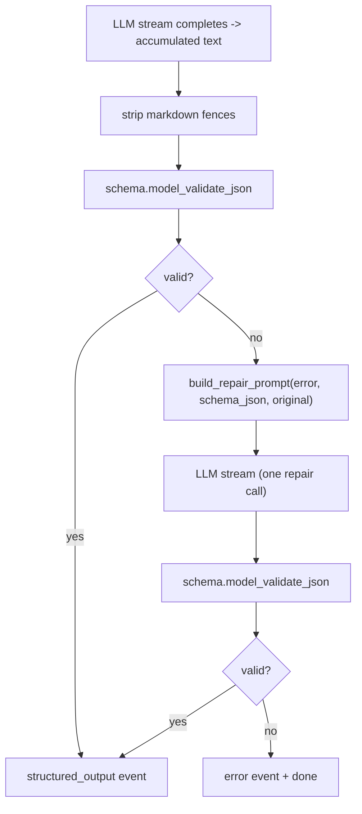

# 08 — Pydantic schema validation + repair retry (ADR-005)

## Purpose

When a mode declares an `output_schema`, the orchestrator validates the LLM's accumulated text against it after the stream completes. On `ValidationError`, one schema-repair pass is attempted with the error + JSON Schema injected. Second failure → emit partial + SSE `error` event.

## Flow



## Key code

`src/services/chat/schemas/output_repair.py`:

```python
def build_repair_prompt(error: str, schema_json: str, original_output: str) -> str:
    return (
        "Your previous response did not match the required schema. "
        "Repair it and emit ONLY valid JSON.\n\n"
        f"Schema (JSON Schema):\n{schema_json}\n\n"
        f"Validation error:\n{error}\n\n"
        f"Original output:\n{original_output}\n\n"
        "Return ONLY valid JSON conforming to the schema. No prose."
    )
```

`src/services/chat/orchestrator.py`:

```python
async def _validate_and_repair(accumulated, spec, llm, model_id):
    schema_cls = spec.output_schema

    # First attempt
    try:
        text = accumulated.strip()
        if text.startswith("```"):
            lines = text.splitlines()
            text = "\n".join(lines[1:-1]) if len(lines) > 2 else text
        return schema_cls.model_validate_json(text).model_dump(), None
    except Exception as first_err:
        first_error = str(first_err)

    # Repair
    schema_json = json.dumps(schema_cls.model_json_schema(), indent=2)
    repair_prompt = build_repair_prompt(first_error, schema_json, accumulated)
    try:
        repaired = ""
        async for chunk in llm.stream([ChatMessage("user", repair_prompt)],
                                      model=model_id):
            repaired += chunk
        return schema_cls.model_validate_json(repaired.strip("```")).model_dump(), None
    except Exception as second_err:
        return None, str(second_err)
```

## When it runs

Only for modes where `spec.output_schema is not TutorAnswer` AND the mode is `single` arch. Multi-agent modes (prereqs/research/path) construct the schema object directly in code and skip the validate/repair path — they emit `structured_output` from the graph nodes.

Tutor stays a free-form prose stream — no schema enforcement; UI renders tokens directly.

## Cost

Best case: 0 extra LLM calls (output validates first time).
Worst case: 1 extra call (repair). Tracked via `cost.log_call` if M8's logging is enabled.

## Tests

`test_modes.py::test_schema_repair_path`:
- Stub LLM emits invalid JSON first → repair call → valid JSON
- Verify SSE sequence: meta → tokens → (repair invisible to client) → structured_output(valid) → done
- Second failure → error event emitted
