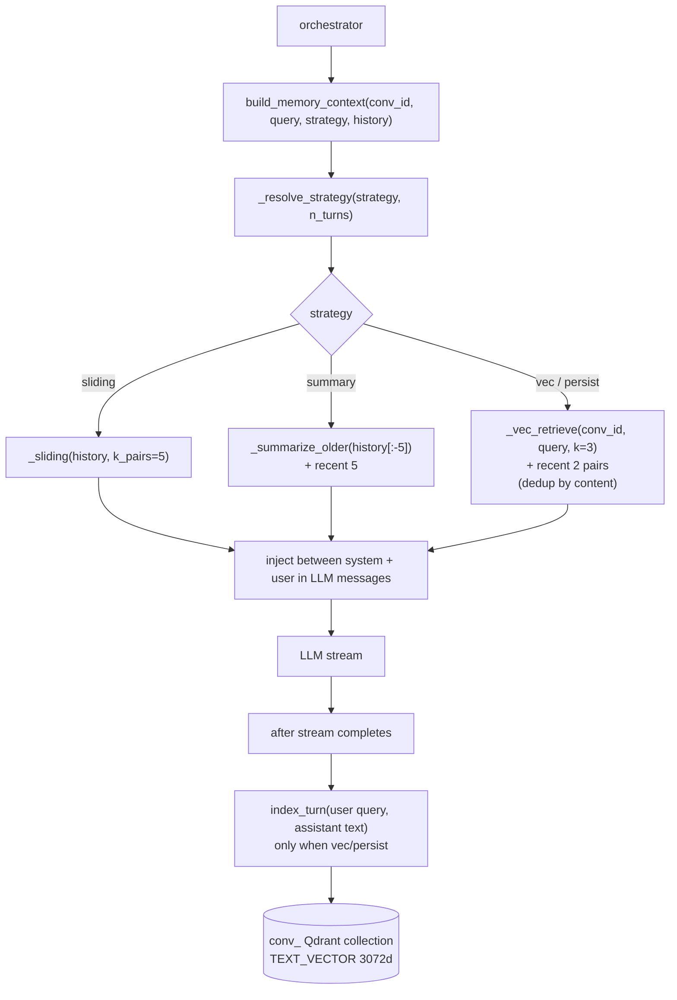

# 09 — Memory namespace (M9, ADR-006)

## Purpose

Per-conversation memory with three strategies and auto-escalation by turn count. Solves the "context window bloat" failure mode listed in `docs/upgrades/abstract.md` §1. Mode 10 (path) uses `persist` to survive deletes.

## Strategies

| Strategy | When | Mechanism |
|---|---|---|
| `off` | mode explicitly stateless | no memory injected |
| `sliding` | turns ≤ 10 | last 5 user+assistant pairs verbatim |
| `summary` | 10 < turns ≤ 30 | LLM-summarize older half; keep last 5 turns intact |
| `vec` | turns > 30 | embed each turn → `conv_<id>` Qdrant collection; semantic-recall top-3 + recent 3 |
| `persist` | mode 10 only | like `vec` but NOT dropped on conv delete |
| `auto` | dispatch by turn count | sliding/summary/vec |

## Flow



## Key code

`src/services/chat/memory.py`:

```python
def _resolve_strategy(strategy: str, n_turns: int) -> str:
    if strategy != "auto":
        return strategy
    if n_turns <= 10:  return "sliding"
    if n_turns <= 30:  return "summary"
    return "vec"


def _sliding(history, *, k_pairs=5) -> list[ChatMessage]:
    msgs = []
    for m in history[-(2 * k_pairs):]:
        if m.get("role") in ("user", "assistant") and isinstance(m.get("content"), str):
            msgs.append(ChatMessage(role=m["role"], content=m["content"]))
    return msgs


async def _summarize_older(older) -> ChatMessage:
    """LLM nano summary → single synthetic system message."""
    ...

async def _vec_retrieve(conv_id, query, *, k=3) -> list[ChatMessage]:
    """Semantic-search conv_<id> Qdrant collection. Empty if collection absent."""
    ...

async def index_turn(conv_id, role, content, turn_idx) -> None:
    """Embed + upsert one turn into conv_<id>."""
    name = _conv_collection_name(conv_id)
    ensure_text_collection(name)
    emb = (await oa.embeddings.create(model=settings.embedding_model,
                                       input=content[:8000])).data[0].embedding
    client().upsert(collection_name=name, points=[PointStruct(
        id=f"{conv_id}-{turn_idx}", vector={TEXT_VECTOR: emb},
        payload={"role": role, "content": content, "turn_idx": turn_idx},
    )])

def cleanup_conv_collection(conv_id: str) -> None:
    """Drop conv_<id> collection. Called from DELETE /api/conversations/{id}."""
    client().delete_collection(collection_name=_conv_collection_name(conv_id))

async def build_memory_context(conv_id, current_query, *, strategy, history):
    """Return list[ChatMessage] to inject between system prompt and the current turn."""
```

## Wiring (orchestrator)

```python
if spec.memory != "off" and req.conversationId:
    mem_msgs = await build_memory_context(
        req.conversationId, req.message,
        strategy=spec.memory, history=history,
    )
    messages = [messages[0], *mem_msgs, *messages[1:]]
```

After streaming completes:

```python
if req.conversationId and spec.memory in ("vec", "persist", "auto"):
    n_turns = len(history) if history else 0
    if _resolve_strategy(spec.memory, n_turns + 2) in ("vec", "persist"):
        await index_turn(req.conversationId, "user", req.message, n_turns)
        await index_turn(req.conversationId, "assistant", accumulated_text, n_turns + 1)
```

## Cleanup on conv delete

`store.api_delete_conversation`:

```python
@router.delete("/conversations/{conv_id}", status_code=204, response_class=Response)
def api_delete_conversation(conv_id: str) -> Response:
    if not delete_conversation(conv_id):
        raise HTTPException(404)
    cleanup_conv_collection(conv_id)
    return Response(status_code=204)
```

Path mode (`memory="persist"`) — collection is NOT cleaned up automatically. (Plan §11 lists post-v1 TTL cron.)

## Tests

`test_memory.py` — 27 tests:
- _resolve_strategy auto → sliding/summary/vec by turn count
- _sliding keeps last k pairs
- build_memory_context off → []
- mocked Qdrant client for cleanup
- vec retrieve dedup (content prefix match)
- summarize_older returns single system msg

All Qdrant + OpenAI calls mocked via `unittest.mock.patch`.
