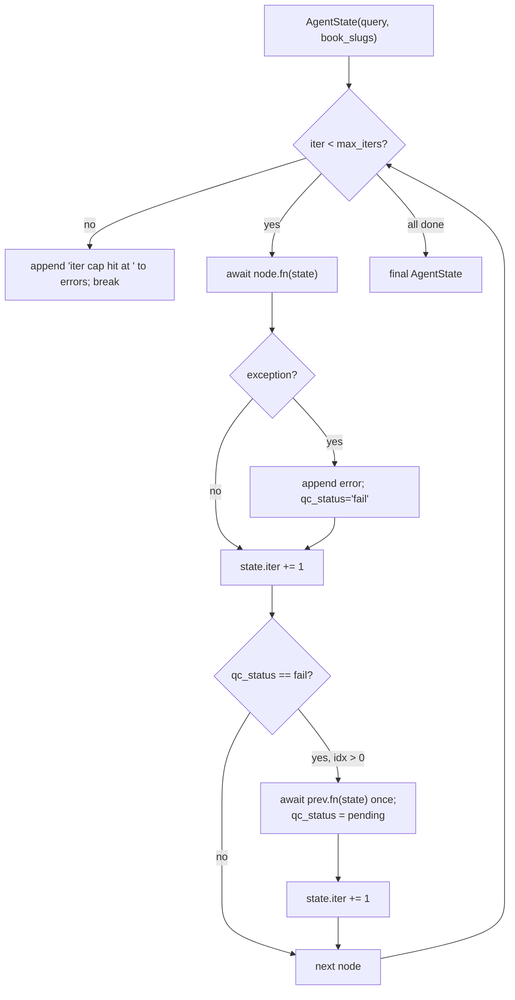

# 10 — Multi-agent state graph runner (M5, ADR-001)

## Purpose

Roll-own deterministic async state graph for modes 6/8/10. Linear node traversal w/ iter cap and one-step retry-on-fail. No LangGraph dep (ADR-001 trade: minimal-dep + project-aligned simplicity over framework features we don't use).

## Flow



## Key code

`src/services/chat/agents/state.py`:

```python
@dataclass
class AgentState:
    query: str = ""
    book_slugs: list[str] | None = None
    sources: list[Any] = field(default_factory=list)
    concepts: list[dict] = field(default_factory=list)
    edges: list[dict] = field(default_factory=list)
    claims: list[dict] = field(default_factory=list)
    output: Any = None
    iter: int = 0
    qc_status: str = "pending"     # pending|pass|fail
    errors: list[str] = field(default_factory=list)
    extras: dict[str, Any] = field(default_factory=dict)
```

`src/services/chat/agents/graph.py`:

```python
@dataclass
class Node:
    name: str
    fn: Callable[[AgentState], Awaitable[AgentState]]


class StateGraph:
    def __init__(self, nodes: list[Node], *, max_iters: int = 12) -> None:
        self.nodes = nodes
        self.max_iters = max_iters

    async def run(self, state: AgentState) -> AgentState:
        for idx, node in enumerate(self.nodes):
            if state.iter >= self.max_iters:
                state.errors.append(f"iter cap hit at {node.name}")
                break
            try:
                state = await node.fn(state)
            except Exception as exc:
                state.errors.append(f"{node.name}: {type(exc).__name__}: {exc}")
                state.qc_status = "fail"
            state.iter += 1
            # one retry of previous node on fail
            if state.qc_status == "fail" and idx > 0 and state.iter < self.max_iters:
                state.qc_status = "pending"
                try:
                    state = await self.nodes[idx - 1].fn(state)
                except Exception as exc:
                    state.errors.append(f"{self.nodes[idx-1].name}(retry): {exc}")
                state.iter += 1
        return state
```

## Generic nodes (`agents/nodes.py`)

| Node | Purpose | Used by |
|---|---|---|
| `retrieve_node` | hybrid_search w/ rerank=True, top_k=8 | prereqs, research |
| `extract_concepts` | LLM extract 10 concepts → state.concepts | prereqs |
| `build_dag` | LLM extract edges between concepts | prereqs |
| `cycle_detect` | DFS color-marking, removes back-edges → state.extras["cycles_broken"] | prereqs |
| `sequence_topo` | Kahn's BFS → state.extras["ordering"] | prereqs, path |

Research and study_path have their own node sets in `research.py` and `study_path.py`.

## Per-mode wiring

```python
# prereqs.py
def build_graph() -> StateGraph:
    return StateGraph(nodes=[
        Node("retrieve", retrieve_node),
        Node("extract_concepts", extract_concepts),
        Node("build_dag", build_dag),
        Node("cycle_detect", cycle_detect),
        Node("sequence", sequence_topo),
    ], max_iters=12)
```

Cross-mode invocation supported: `study_path.invoke_prereqs_subgraph` calls `run_prereqs(goal, book_slugs)` once per sub-goal in a fresh `AgentState` — no shared state.

## Tests

`test_agents_graph.py` — 9 tests covering iter cap, retry-on-fail, no-retry for first-node fail, qc_status reset, exception capture, empty nodes, state mutation propagation, iter increments.

## Trade-offs (ADR-001)

- (+) Zero new deps; full control of iter cap, retries, cost log
- (+) Chinese-wall friendly (single sibling import)
- (–) No checkpoint replay or observability layer
- (–) Migration cost if scope explodes (≥30 nodes/mode)
- Alt rejected: LangGraph (~30 transitive deps, opinionated checkpointing); LlamaIndex Workflows (heavier, couples to LlamaIndex retrieval).
