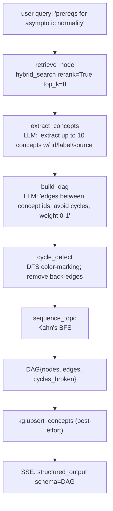

# 11 — Mode 6 prereqs DAG (M5)

## Purpose

Build a directed acyclic graph of concept prerequisites from textbook content. 5-node graph: retrieve → extract_concepts → build_dag → cycle_detect → sequence_topo. Persists to `concepts_kg` Qdrant collection for cross-mode reuse (mode 10 invokes this subgraph).

## Flow



## Key code

`src/services/chat/agents/prereqs.py`:

```python
def build_graph() -> StateGraph:
    return StateGraph(
        nodes=[
            Node("retrieve", retrieve_node),
            Node("extract_concepts", extract_concepts),
            Node("build_dag", build_dag),
            Node("cycle_detect", cycle_detect),
            Node("sequence", sequence_topo),
        ],
        max_iters=12,
    )


async def run_prereqs(query: str, book_slugs: list[str] | None) -> DAG:
    state = AgentState(query=query, book_slugs=book_slugs)
    state = await build_graph().run(state)
    nodes = [
        ConceptNode(id=c["id"], label=c["label"],
                    source=Citation(**c["source"]) if c.get("source") else None)
        for c in state.concepts
    ]
    edges = [
        ConceptEdge(from_id=e["from"], to_id=e["to"], weight=float(e.get("weight", 1.0)))
        for e in state.edges
    ]
    try:
        upsert_concepts(nodes, edges)  # best-effort
    except Exception:
        pass
    return DAG(nodes=nodes, edges=edges,
               cycles_broken=state.extras.get("cycles_broken", []))
```

## Cycle detection (`agents/nodes.py`)

```python
def _detect_cycles(nodes, edges) -> tuple[list[dict], list[str]]:
    """DFS color-marking. Returns (cleaned_edges, removed_descriptions)."""
    adj = {n["id"]: [] for n in nodes}
    for e in edges:
        if e.get("from") in adj and e.get("to") in adj:
            adj[e["from"]].append(e["to"])
    removed = []
    visited = {n: 0 for n in adj}   # 0=white 1=gray 2=black

    def visit(u: str) -> bool:
        if visited[u] == 1: return True   # back edge = cycle
        if visited[u] == 2: return False
        visited[u] = 1
        for v in list(adj[u]):
            if visit(v):
                adj[u].remove(v)
                removed.append(f"{u}->{v}")
        visited[u] = 2
        return False

    for n in list(adj): visit(n)
    clean = [e for e in edges if e.get("to") in adj.get(e.get("from", ""), [])]
    return clean, removed
```

## Orchestrator dispatch

```python
if spec.arch == "multi" and req.mode == "prereqs":
    from src.services.chat.agents.prereqs import run_prereqs
    yield {"type": "meta", "mode": "prereqs", ...}
    dag = await run_prereqs(req.message, book_slugs)
    yield {"type": "structured_output", "schema": "DAG", "data": dag.model_dump()}
    yield {"type": "done"}
    return
```

## Frontend view

`web/src/components/views/DAGView.tsx` renders:
- Concept list (id + label + source citation)
- Edge table (from_id → to_id with weight badge)
- `cycles_broken` warning chip if non-empty

## Tests

`test_agents_prereqs.py` — 15 tests:
- pure `_detect_cycles`: no cycle, 2-node cycle, 3-node cycle, unknown nodes dropped
- `cycle_detect` node populates extras
- `sequence_topo`: linear chain, no-edges, diamond (A first, D last), isolated nodes appended
- `run_prereqs` end-to-end w/ mocked LLM and Qdrant
- cycle-break integration: edges {A→B, B→C, C→A} → C→A removed; cycles_broken non-empty
- upsert failure non-fatal

## Critical problems addressed

Per abstract.md §6:
- **Implicit dependencies**: LLM extracts edges from vocabulary patterns in retrieved excerpts
- **LLM cycles**: cycle_detect removes back-edges deterministically
- **Cross-book section IDs**: `Citation(book, chapter, section)` unifies the namespace
