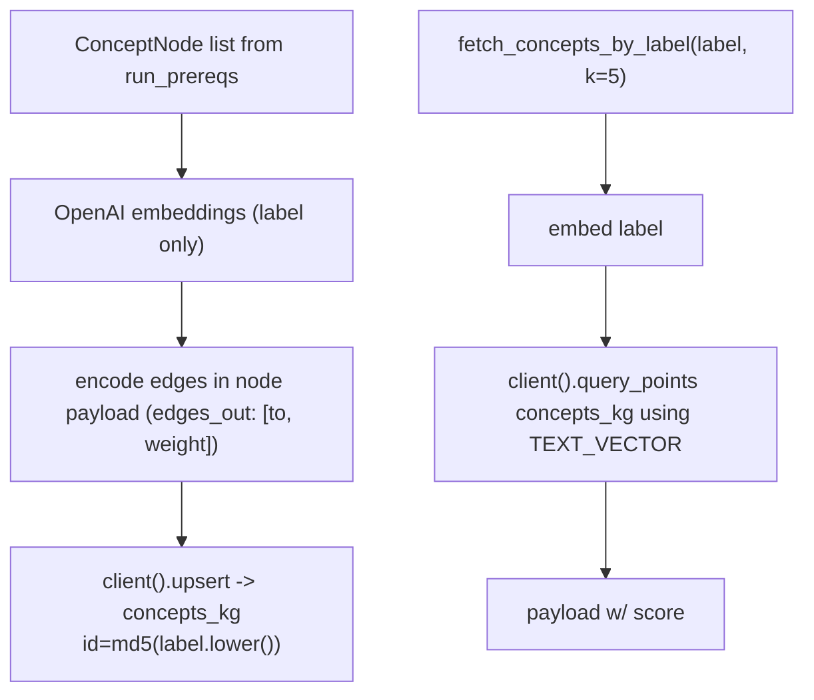

# 12 — KG persistence: `concepts_kg` Qdrant collection (M5, ADR-003)

## Purpose

Persist the prereqs-extracted concept graph across requests. Enables incremental enrichment and cross-mode reuse (mode 10 `path` invokes `run_prereqs` per sub-goal and the KG accumulates). Semantic lookup by label embedding ("find concepts like X").

## Flow



## Collection schema

| Field | Type | Notes |
|---|---|---|
| (vector) | TEXT_VECTOR, 3072d | label embedding (OpenAI text-embedding-3-large) |
| `label` | str | concept human label |
| `concept_id` | str | snake_case stable id from LLM |
| `source` | dict | `{book, chapter, section}` citation |
| `edges_out` | list | `[{to: concept_id, weight: float}, ...]` |

Edges encoded in node payload (no separate "edge" point type) — simpler than a property graph but trade: edge queries less natural. Pagination on large DAGs awkward (ADR-003 trade).

## Key code

`src/services/chat/kg.py`:

```python
COLLECTION = "concepts_kg"

def _point_id(label: str) -> str:
    return hashlib.md5(label.lower().encode()).hexdigest()


def upsert_concepts(nodes: list[ConceptNode], edges: list[ConceptEdge]) -> None:
    """Embed each node label + upsert; edges encoded in node payload."""
    ensure_text_collection(COLLECTION)
    oa = openai.OpenAI(api_key=settings.openai_api_key)
    labels = [n.label for n in nodes]
    emb = oa.embeddings.create(model=settings.embedding_model, input=labels).data
    adj_out = {n.id: [] for n in nodes}
    for e in edges:
        adj_out.setdefault(e.from_id, []).append({"to": e.to_id, "weight": e.weight})
    points = [
        PointStruct(
            id=_point_id(n.label),
            vector={TEXT_VECTOR: emb[i].embedding},
            payload={
                "label": n.label, "concept_id": n.id,
                "source": n.source.model_dump() if n.source else None,
                "edges_out": adj_out.get(n.id, []),
            },
        )
        for i, n in enumerate(nodes)
    ]
    client().upsert(collection_name=COLLECTION, points=points)


def fetch_concepts_by_label(label: str, *, k: int = 5) -> list[dict]:
    """Semantic nearest-neighbor lookup."""
    oa = openai.OpenAI(api_key=settings.openai_api_key)
    v = oa.embeddings.create(model=settings.embedding_model, input=label).data[0].embedding
    res = client().query_points(
        collection_name=COLLECTION, query=v, using=TEXT_VECTOR, limit=k, with_payload=True,
    )
    return [{**(p.payload or {}), "score": p.score} for p in res.points]
```

## Resilience

All Qdrant calls wrapped in `try/except` w/ `logger.exception`. `upsert_concepts` failure is non-fatal in `run_prereqs` — DAG still returned to user.

## Trade-offs (ADR-003)

- (+) One DB to operate (already running Qdrant)
- (+) Semantic concept lookup free
- (–) Edge queries less natural than property graph
- (–) Stale on ingestion updates (no rebuild hook yet — plan §11 lists post-v1)
- Alt rejected: NetworkX + SQLite (loses semantic lookup), Neo4j (heavyweight infra)

## Tests

Indirect via `test_agents_prereqs.py::test_run_prereqs_persists_to_kg`:
- mock `upsert_concepts` → verify called with correct nodes/edges
- mock failure → DAG still returned (non-fatal)

## Open follow-ups

- Rebuild trigger on ingest event (hook into manifest write)
- Edge queries: separate "concept_pair" point per edge for direct retrieval
- Concept deduplication across runs (currently md5(label) collapses synonyms differently)
