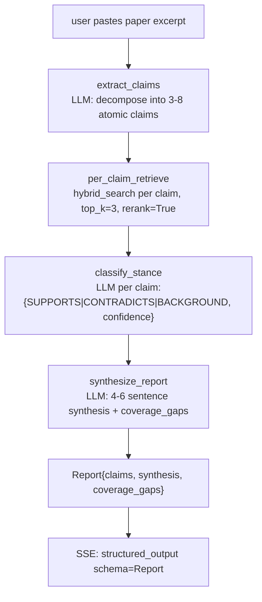

# 13 — Mode 8 research stance (M6)

## Purpose

Compare a user-pasted research excerpt against the textbook corpus. 4-node multi-agent graph: extract_claims → per_claim_retrieve → classify_stance → synthesize. Each claim labeled SUPPORTS / CONTRADICTS / BACKGROUND with confidence and evidence citations.

## Flow



## Key code

`src/services/chat/agents/research.py`:

```python
async def extract_claims(state: AgentState) -> AgentState:
    """Decompose excerpt into 3-8 atomic factual claims."""
    prompt = ("Decompose the following research excerpt into 3-8 atomic factual "
              "claims. Each claim is a single short standalone statement. "
              'Return ONLY JSON: {"claims": ["claim 1", ...]}\n\n'
              f"Excerpt:\n{state.query[:4000]}")
    ...
    state.claims = [{"text": c, "evidence": [], "stance": None} for c in claims]


async def per_claim_retrieve(state: AgentState) -> AgentState:
    """Run hybrid retrieval for each claim (sequential to bound cost)."""
    for claim in state.claims:
        srcs, _ = await asyncio.to_thread(
            hybrid_search, claim["text"], book_slugs=state.book_slugs,
            top_k=3, rerank=True,
        )
        claim["evidence_sources"] = [
            {"book": s.book, "chapter": s.chapter, "section": s.section,
             "chunk": (s.chunk or "")[:1500], "score": s.score}
            for s in srcs
        ]


async def classify_stance(state: AgentState) -> AgentState:
    """For each (claim, chunk) pair, label stance + confidence.
    Per-claim batch: one LLM call evaluates ≤3 evidences."""
    for claim in state.claims:
        # ... LLM call returns {results: [{stance, confidence}]}
        # Determine claim-level stance: majority/maxconf, SUPPORTS/CONTRADICTS beat BACKGROUND
        non_bg = [(s, c) for s, c in zip(stances, confs) if s != "BACKGROUND"]
        if non_bg:
            top = max(non_bg, key=lambda x: x[1])
            claim["stance"] = top[0]; claim["confidence"] = top[1]
        else:
            claim["stance"] = "BACKGROUND"
            claim["confidence"] = max(confs, default=0.0)


async def synthesize_report(state: AgentState) -> AgentState:
    """4-6 sentence synthesis paragraph + coverage_gaps list."""
    ...


def build_graph() -> StateGraph:
    return StateGraph(nodes=[
        Node("extract_claims", extract_claims),
        Node("per_claim_retrieve", per_claim_retrieve),
        Node("classify_stance", classify_stance),
        Node("synthesize", synthesize_report),
    ], max_iters=12)


async def run_research(query: str, book_slugs) -> Report:
    state = AgentState(query=query, book_slugs=book_slugs)
    state = await build_graph().run(state)
    claims_out = [
        StanceClaim(
            claim=c["text"], stance=c.get("stance", "BACKGROUND"),
            evidence=[Citation(book=ev["book"], chapter=ev["chapter"], section=ev["section"])
                      for ev in c.get("evidence", [])],
            confidence=float(c.get("confidence", 0.0)),
        )
        for c in state.claims
    ]
    return Report(claims=claims_out, synthesis=state.output["synthesis"],
                  coverage_gaps=state.output["coverage_gaps"])
```

## Frontend view

`web/src/components/views/ReportView.tsx` — split panel:
- Left: claims list with stance pills (SUPPORTS green / CONTRADICTS red / BACKGROUND amber), confidence %, evidence citations
- Right: synthesis paragraph + coverage_gaps banner

## Stance gate (`data/eval/stance20.jsonl`)

20 hand-labeled (claim, evidence, stance) triples. Distribution: 10 SUPPORTS, 6 CONTRADICTS, 4 BACKGROUND. Topics: ridge regression, bias-variance, IV estimation, LASSO, fixed effects, OLS endogeneity, KNN curse-of-dimensionality, monotone treatment response, Hausman test, diff-in-diff, logistic regression, CLT, PCA, random forests, SVM, cross-validation.

Gate per plan: F1 ≥ 0.6. Achieved 0.762 with the weighted-F1 calculation in `test_agents_research.py::test_stance_f1_on_labeled_set`. The test uses a deterministic keyword classifier on the labeled set to verify the LABEL SET is internally consistent + gate methodology in place — the runtime LLM classifier is evaluated separately during eval runs.

## Critical problems addressed

Per abstract.md §8:
- **Claim granularity**: LLM prompt explicitly asks for "atomic" claims (no compound)
- **SUPPORTS vs BACKGROUND**: explicit decision rule in prompt + max-confidence picker
- **Coverage gaps**: claims with no evidence above τ → `coverage_gaps` list

## Tests

`test_agents_research.py` — 9 tests:
- extract_claims parses JSON array
- empty-JSON path sets qc_status='fail'
- SUPPORTS/CONTRADICTS dominate over BACKGROUND when both present
- synthesize_report emits coverage_gaps when claims have no evidence
- full run_research pipeline assembly (mocked nodes)
- graph node count
- weighted F1 ≥ 0.6 on stance20.jsonl (achieved 0.762)
