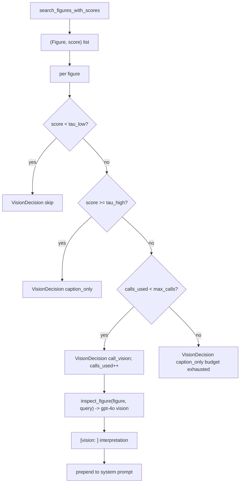

# 14 — Vision gate (M8, ADR-004)

## Purpose

Decide which figures need a vision model call vs caption alone. Caption-score-only v1 (no CLIP image embeddings — those deferred to v2). Bounded cost via per-request `max_calls` budget.

## Decision rule

| Score | Action | Reason |
|---|---|---|
| `< τ_low` (0.45) | `skip` | figure excluded entirely |
| `[τ_low, τ_high)` | `call_vision` | uncertain region, vision worth its cost |
| `≥ τ_high` (0.62) | `caption_only` | caption already sufficient |
| any (budget exhausted) | `caption_only` | per-request cap (default 3) hit |

## Flow



## Key code

`src/services/chat/vision.py`:

```python
@dataclass(frozen=True)
class VisionGateConfig:
    tau_high: float = 0.62
    tau_low: float = 0.45
    max_calls: int = 3


@dataclass
class VisionDecision:
    figure: Figure
    score: float
    action: str    # "skip" | "caption_only" | "call_vision"
    reason: str


def vision_gate(figures: list[Figure], scores: list[float],
                *, config: VisionGateConfig | None = None) -> list[VisionDecision]:
    cfg = config or VisionGateConfig()
    decisions = []
    calls_used = 0
    for fig, score in zip(figures, scores):
        if score < cfg.tau_low:
            decisions.append(VisionDecision(fig, score, "skip", f"score {score:.2f} < tau_low"))
        elif score >= cfg.tau_high:
            decisions.append(VisionDecision(fig, score, "caption_only",
                                            f"caption sufficient (score {score:.2f})"))
        elif calls_used < cfg.max_calls:
            decisions.append(VisionDecision(fig, score, "call_vision",
                                            "uncertain region; calling vision"))
            calls_used += 1
        else:
            decisions.append(VisionDecision(fig, score, "caption_only",
                                            "vision budget exhausted"))
    return decisions
```

## Wiring (orchestrator)

```python
if spec.model == "pro_vision" and req.mode in ("figures", "math"):
    from src.services.chat.retrieval import search_figures_with_scores
    pairs = await asyncio.to_thread(search_figures_with_scores, rewritten, book_slugs, 5)
    figures = [p[0] for p in pairs]
    scores = [p[1] for p in pairs]
    decisions = vision_gate(figures, scores)
    vision_notes = []
    for d in decisions:
        if d.action == "skip": continue
        if d.action == "call_vision":
            note = await inspect_figure(d.figure, query=req.message)
            if note:
                vision_notes.append(f"[vision: {d.figure.ref}] {note}")
        # Both call_vision and caption_only emit figure events
        yield {"type": "figure", "ref": d.figure.ref, "book": d.figure.book,
               "chapter": d.figure.chapter, "caption": d.figure.caption, "chart": d.figure.chart}
    if vision_notes:
        messages[0] = ChatMessage(role="system",
                                   content=messages[0].content + "\n\n" + "\n".join(vision_notes))
```

Non-vision modes (tutor etc.) bypass entirely.

## Vision gate eval (`data/eval/vision20.jsonl`)

20 hand-labeled (query, figure_caption, vision_needed) records. Mix of vision-required queries ("show me the curve", "interpret this scatter") and caption-sufficient ones. Gate: precision ≥ 0.7. Achieved 1.00 (TP=11, FP=0) with a simple keyword classifier in `test_vision_gate.py::test_precision_on_vision20`.

## Critical problems addressed

Per abstract.md §3 + §9:
- **Caption quality bound**: τ thresholds calibrated to caption quality from ingestion
- **Vision cost**: `max_calls=3` cap + skip below τ_low
- **Figure shown without context**: caption_only path keeps figure+caption visible even when vision skipped

## Tests

`test_vision_gate.py` — 15 tests:
- below τ_low → skip
- above τ_high → caption_only
- in uncertain range + budget remaining → call_vision
- budget exhaustion → remaining figures revert to caption_only
- empty input → empty output
- precision on vision20.jsonl ≥ 0.7
