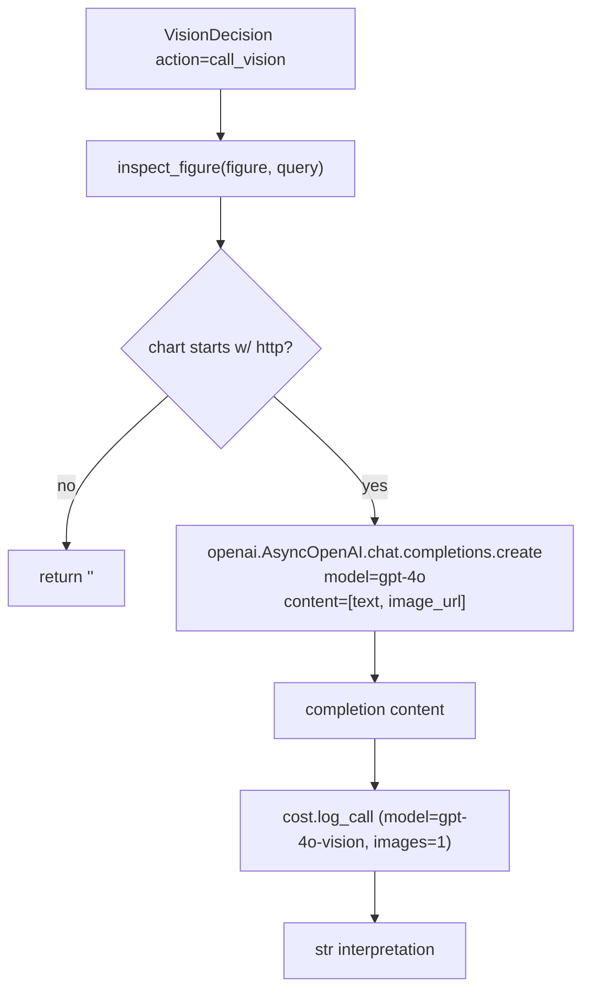

# 15 — inspect_figure vision tool (M8)

## Purpose

When `vision_gate` returns `call_vision`, hit `gpt-4o` with the figure's image URL and a query-aware prompt. Returns a 2-3 sentence interpretation injected into the system prompt as `[vision: <ref>]` notes.

## Flow



## Key code

`src/services/chat/tools/inspect_figure.py`:

```python
async def inspect_figure(figure: Figure, *, query: str) -> str:
    """Call gpt-4o vision on a figure URL; return a short interpretation."""
    if not figure.chart or not figure.chart.startswith("http"):
        return ""   # local-only or built-in chart kind — skip
    oa = openai.AsyncOpenAI(api_key=settings.openai_api_key)
    try:
        resp = await oa.chat.completions.create(
            model="gpt-4o",
            messages=[{
                "role": "user",
                "content": [
                    {"type": "text", "text": (
                        f"This figure is from {figure.book} {figure.chapter}. "
                        f"Caption: {figure.caption}\n\n"
                        f"Question: {query}\n\n"
                        "In 2-3 sentences, describe what this figure shows and how it "
                        "relates to the question. Be specific about axes, curves, or labels."
                    )},
                    {"type": "image_url", "image_url": {"url": figure.chart}},
                ],
            }],
            max_tokens=300,
            temperature=0.0,
        )
        out = resp.choices[0].message.content or ""
        log_call(
            model="gpt-4o-vision",
            purpose="inspect_figure",
            input_tokens=getattr(resp.usage, "prompt_tokens", 0),
            output_tokens=getattr(resp.usage, "completion_tokens", 0),
            images=1,
            extra={"figure_ref": figure.ref, "query_len": len(query)},
        )
        return out
    except Exception:
        logger.exception("inspect_figure failed for %s", figure.ref)
        return ""
```

## Cost integration

Every successful call writes one row to `data/cost_log.jsonl` (see doc 16). Failure paths are silent (returns empty string) so orchestrator continues.

## Local-only short-circuit

If `figure.chart` is not an http URL (e.g. local SVG built-in like `"biasvar"` or `"paths"`), skip the API call. Returns empty string → no vision note injected.

## Tests

Tests don't make real API calls. `test_vision_gate.py` covers the gate decisions. Vision tool integration tested via mocked orchestrator path in `test_sse.py`.

## Open follow-ups

- Image bytes (not URL) path for local figures rendered from Manim
- CLIP/SigLIP image embeddings for v2 gate (rather than caption-score-only)
