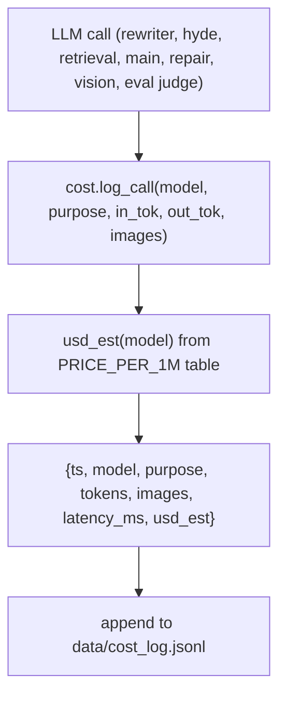

# 16 — Cost estimator + log (M8)

## Purpose

Per-LLM-call cost transparency. Static price table + `data/cost_log.jsonl` append per call (purpose, model, tokens, latency, USD est). Enables budget alarms and per-mode cost analysis.

## Flow



## Price table (`src/services/chat/cost.py`)

```python
PRICE_PER_1M = {
    # OpenAI (USD / 1M tokens)
    "gpt-4o":                {"in": 2.50,  "out": 10.00},
    "gpt-4o-mini":           {"in": 0.15,  "out":  0.60},
    "gpt-5.4-nano-2026-03-17": {"in": 0.10, "out": 0.40},
    "gpt-5.4-2026-03-05":    {"in": 5.00,  "out": 15.00},
    # DeepSeek
    "deepseek-chat":         {"in": 0.27,  "out":  1.10},
    "deepseek-reasoner":     {"in": 0.55,  "out":  2.20},
    "deepseek-v4-pro":       {"in": 0.55,  "out":  2.20},
    # Vision (image tiles ≈ extra per-image charge on top of token cost)
    "gpt-4o-vision":         {"in": 2.50, "out": 10.00, "per_image": 0.001},
    # Embeddings
    "text-embedding-3-large": {"in": 0.13, "out": 0.0},
}
```

Update when API prices drift (numbers are point-in-time estimates).

## Key code

```python
def usd_est(model: str, *, input_tokens=0, output_tokens=0, images=0) -> float:
    p = PRICE_PER_1M.get(model)
    if not p: return 0.0
    cost = (input_tokens / 1_000_000) * p["in"] + (output_tokens / 1_000_000) * p["out"]
    if images and "per_image" in p:
        cost += images * p["per_image"]
    return cost


def log_call(*, model: str, purpose: str, input_tokens=0, output_tokens=0,
             images=0, latency_ms=None, extra=None) -> None:
    """Append a cost log row. Best-effort; never raises."""
    try:
        COST_LOG_PATH.parent.mkdir(parents=True, exist_ok=True)
        row = {
            "ts": datetime.now(timezone.utc).isoformat(),
            "model": model, "purpose": purpose,
            "input_tokens": input_tokens, "output_tokens": output_tokens,
            "images": images, "latency_ms": latency_ms,
            "usd_est": usd_est(model, input_tokens=input_tokens,
                               output_tokens=output_tokens, images=images),
            **(extra or {}),
        }
        with open(COST_LOG_PATH, "a") as f:
            f.write(json.dumps(row) + "\n")
    except Exception:
        logger.warning("cost log write failed", exc_info=True)
```

`COST_LOG_PATH = DATA_DIR / "cost_log.jsonl"`.

## Currently logged purposes

- `inspect_figure` (vision tool, M8) — has `images=1`
- (planned) `rewrite_query`, `hyde`, `multi_query`, `decompose` — easy to add by wrapping `_llm_short`
- (planned) `tutor_main`, `repair_schema` — wrap orchestrator's LLM calls
- (planned) `eval_faithfulness`, `eval_answer_relevance` — eval judges

## Open follow-ups

- Wrap all LLM call sites in cost-log decorator (currently only vision)
- Cost dashboard UI (plan §11 out-of-scope post-v1)
- Per-conversation cost rollup
- Budget alarms (notify if hourly USD est exceeds threshold)
