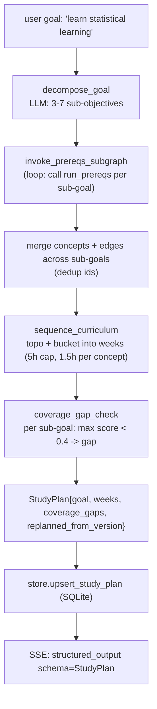

# 17 — Mode 10 study path (M7)

## Purpose

Most complex mode. Multi-agent + cross-subgraph + persistence + replan. Decomposes a learning goal into sub-objectives, invokes the prereqs subgraph per sub-goal, sequences concepts into weekly buckets, checks coverage, persists to SQLite, supports replan + section delete.

## Flow



## Cross-mode subgraph invocation

```python
async def invoke_prereqs_subgraph(state: AgentState) -> AgentState:
    """Call M5's run_prereqs once per sub-goal; merge concepts + edges + cycles."""
    sub_goals = state.extras.get("sub_goals", [])
    seen_ids = set()
    for goal in sub_goals:
        try:
            dag = await run_prereqs(goal, state.book_slugs)  # fresh AgentState inside
        except Exception:
            continue
        for n in dag.nodes:
            if n.id not in seen_ids:
                seen_ids.add(n.id)
                state.concepts.append({"id": n.id, "label": n.label,
                                       "source": n.source.model_dump() if n.source else None})
        for e in dag.edges:
            state.edges.append({"from": e.from_id, "to": e.to_id, "weight": e.weight})
        state.extras.setdefault("cycles_broken", []).extend(dag.cycles_broken)
    return state
```

## Sequencing

```python
async def sequence_curriculum(state: AgentState) -> AgentState:
    # Topo via Kahn
    adj = {c["id"]: [] for c in state.concepts}
    indeg = {c["id"]: 0 for c in state.concepts}
    for e in state.edges:
        if e["from"] in adj and e["to"] in adj:
            adj[e["from"]].append(e["to"]); indeg[e["to"]] += 1
    queue = [n for n, d in indeg.items() if d == 0]
    ordering = []
    while queue:
        u = queue.pop(0); ordering.append(u)
        for v in adj[u]:
            indeg[v] -= 1
            if indeg[v] == 0: queue.append(v)
    # Bucket: 1.5h per concept, 5h/week
    weeks = []
    cur = {"week": 1, "sections": [], "hours_est": 0.0}
    for cid in ordering:
        c = next((x for x in state.concepts if x["id"] == cid), None)
        if not c: continue
        if cur["hours_est"] + 1.5 > 5.0 and cur["sections"]:
            weeks.append(cur)
            cur = {"week": len(weeks)+1, "sections": [], "hours_est": 0.0}
        if c.get("source"):
            cur["sections"].append(c["source"])
        cur["hours_est"] += 1.5
    if cur["sections"]: weeks.append(cur)
    state.extras["weeks"] = weeks
    return state
```

## Coverage gap check

```python
async def coverage_gap_check(state: AgentState) -> AgentState:
    gaps = []
    for goal in state.extras.get("sub_goals", []):
        srcs, _ = await asyncio.to_thread(hybrid_search, goal,
                                           book_slugs=state.book_slugs, top_k=3)
        top = max((s.score for s in srcs), default=0.0)
        if top < 0.4:
            gaps.append(goal)
    state.extras["coverage_gaps"] = gaps
    return state
```

## Persistence (`store.study_plans`)

```sql
CREATE TABLE IF NOT EXISTS study_plans (
    conv_id    TEXT PRIMARY KEY,
    state_json TEXT NOT NULL,
    version    INTEGER NOT NULL DEFAULT 1,
    updated_at TEXT NOT NULL
);
```

CRUD:
```python
def upsert_study_plan(conv_id: str, plan_json: dict, *, version: int) -> None: ...
def get_study_plan(conv_id: str) -> dict | None: ...     # {state_json, version, updated_at}
def delete_study_plan(conv_id: str) -> bool: ...
```

## REST routes (`api.py`)

| Method | Path | Purpose |
|---|---|---|
| GET | `/api/study_plans/{conv_id}` | fetch persisted plan |
| POST | `/api/study_plans/{conv_id}/replan` | run again w/ new context, version++ |
| DELETE | `/api/study_plans/{conv_id}/section/{ref}` | remove section by citation key, trigger replan |

## Replan semantics

```python
prev = get_study_plan(conv_id)
prev_version = prev["version"] if prev else 0
plan = await run_study_path(message, book_slugs,
                             replanned_from_version=prev_version)
upsert_study_plan(conv_id, plan.model_dump(), version=prev_version + 1)
```

`StudyPlan.replanned_from_version` lets UI show "v3 (replanned from v2)" in the timeline.

## Frontend view

`web/src/components/views/StudyPathView.tsx`:
- Goal + `replanned_from_version` label
- Vertical timeline of weeks (Week 1 → N)
- Each week: section citations + hours_est
- Coverage_gaps banner at bottom (italic red)

## Tests

`test_agents_study_path.py` — 14 tests:
- decompose_goal parses
- sequence_curriculum bucketing (6 concepts → 2 weeks of 3)
- run_study_path persistence (mock store)
- replan increments version
- delete_section triggers replan
- coverage_gaps populated when retrieval scores low

## Critical problems addressed

Per abstract.md §10:
- **Goal calibration**: explicit decompose step + per-sub-goal coverage check
- **Coverage gaps**: surfaced in StudyPlan.coverage_gaps + UI banner
- **Replanning**: replan endpoint + versioned state, UI shows diff
