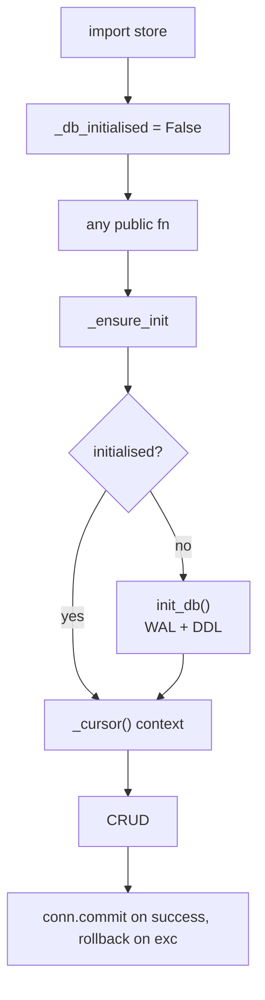

# 18 — SQLite conversation store

## Purpose

Local-first persistence for conversations, messages, prefs, and study plans. Thread-safe sync API. SQLite at `data/chat.db` w/ WAL. Lazy init via `_ensure_init()` so plain imports don't touch filesystem (test-friendly).

## Tables

```sql
CREATE TABLE conversations (
    id           TEXT PRIMARY KEY,
    title        TEXT NOT NULL,
    mode         TEXT NOT NULL DEFAULT 'tutor',
    model_id     TEXT NOT NULL,
    book_filter  TEXT NOT NULL,  -- JSON: list[str] or "ALL"
    created_at   TEXT NOT NULL,
    updated_at   TEXT NOT NULL
);

CREATE TABLE messages (
    id               TEXT PRIMARY KEY,
    conversation_id  TEXT NOT NULL REFERENCES conversations(id) ON DELETE CASCADE,
    role             TEXT NOT NULL,    -- user|assistant
    content          TEXT NOT NULL,    -- JSON
    sources          TEXT,             -- JSON
    figures          TEXT,             -- JSON
    metadata         TEXT,             -- JSON
    timestamp        TEXT NOT NULL
);

CREATE TABLE prefs (
    key   TEXT PRIMARY KEY,
    value TEXT NOT NULL
);

CREATE TABLE study_plans (        -- added by M7
    conv_id    TEXT PRIMARY KEY,
    state_json TEXT NOT NULL,
    version    INTEGER NOT NULL DEFAULT 1,
    updated_at TEXT NOT NULL
);

CREATE INDEX idx_messages_conv ON messages(conversation_id, timestamp);
```

## Flow



## Key code

`src/services/chat/store.py`:

```python
DB_PATH: Path = DATA_DIR / "chat.db"
_local = threading.local()
_db_initialised: bool = False


def _get_conn() -> sqlite3.Connection:
    """Per-thread connection. Opens on first use; PRAGMA WAL + foreign_keys."""
    conn = getattr(_local, "conn", None)
    if conn is None:
        conn = sqlite3.connect(str(DB_PATH), check_same_thread=False)
        conn.row_factory = sqlite3.Row
        conn.execute("PRAGMA journal_mode=WAL")
        conn.execute("PRAGMA foreign_keys=ON")
        _local.conn = conn
    return conn


def init_db() -> None:
    """Create tables. Idempotent. Tests call after monkeypatching DB_PATH."""
    DB_PATH.parent.mkdir(parents=True, exist_ok=True)
    _local.conn = None  # flush stale per-thread conn
    conn = _get_conn()
    conn.executescript(_DDL)
    conn.commit()
    global _db_initialised
    _db_initialised = True


@contextmanager
def _cursor():
    _ensure_init()
    conn = _get_conn()
    cur = conn.cursor()
    try:
        yield cur
        conn.commit()
    except Exception:
        conn.rollback(); raise
    finally:
        cur.close()
```

## Public API

```python
def create_conversation(*, title, mode="tutor", model_id, book_filter="ALL") -> ConversationDigest
def get_conversation(conv_id) -> ConversationDigest | None
def list_conversations() -> list[ConversationDigest]
def delete_conversation(conv_id) -> bool                    # cascade-deletes messages
def touch_conversation(conv_id) -> None                     # bump updated_at
def append_message(*, conversation_id, role, content, sources=None,
                   figures=None, metadata=None) -> str       # message id
def get_messages(conv_id) -> list[dict]                     # JSON-decoded payloads
def set_pref(key, value) -> None
def get_pref(key, default=None) -> Any
# M7:
def upsert_study_plan(conv_id, plan_json, *, version) -> None
def get_study_plan(conv_id) -> dict | None
def delete_study_plan(conv_id) -> bool
```

## REST routes

```
GET    /api/conversations                          → ConversationDigest[]
POST   /api/conversations                          → ConversationDigest (201)
GET    /api/conversations/{conv_id}                → digest + messages
DELETE /api/conversations/{conv_id}                → 204 (also drops Qdrant conv_<id>)
GET    /api/preferences                            → dict
PATCH  /api/preferences                            → updated dict
GET    /api/study_plans/{conv_id}                  → StudyPlan
POST   /api/study_plans/{conv_id}/replan           → new StudyPlan, version++
DELETE /api/study_plans/{conv_id}/section/{ref}    → triggers replan, returns new plan
```

DELETE conversation also calls `cleanup_conv_collection(conv_id)` (memory module) to drop the Qdrant memory collection.

## FastAPI 0.115+ compatibility

`@router.delete(..., status_code=204, response_class=Response)` w/ explicit `Response(status_code=204)` return — needed because FastAPI 0.115 disallows response body on 204.

## Tests

`test_store.py` — 13 tests:
- monkeypatch `DB_PATH` → `tmp_path/test_chat.db` before init_db
- create → get → list → append → cascade delete
- prefs round-trip with complex JSON
- touch bumps updated_at
- study_plans CRUD (added by M7's test_agents_study_path.py)

## Wall

Imports: `src.core.config.DATA_DIR`, `src.services.chat.schemas`, `src.services.chat.memory` (for cleanup), stdlib, fastapi. NO ingestion or other services.
