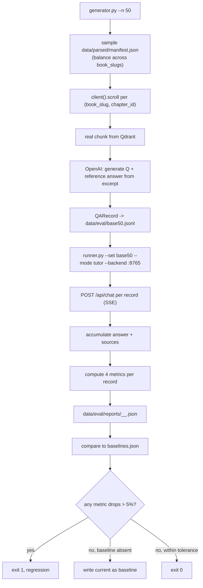

# 21 — Eval harness (M4)

## Purpose

Measure retrieval quality and answer faithfulness. Synthetic Q/A generator + 4 metrics + CLI runner + baseline regression gate. Lives at `src/services/eval/` — wall-isolated from chat service (eval invokes chat via HTTP only).

## 4 metrics

| Metric | Kind | Description |
|---|---|---|
| `context_precision` | sync | fraction of retrieved chunks whose `chunkId == gold_chunk_id` |
| `context_recall` | sync | 1 if gold chunk is in retrieved set, else 0 |
| `faithfulness` | async LLM-judge | 1 − unsupported_claims / total_claims |
| `answer_relevance` | async LLM-judge | 0..1 score for answer addressing question |

## Flow



## Key code

`src/services/eval/dataset.py`:

```python
class QARecord(BaseModel):
    id: str
    q: str
    gold_book: str
    gold_chapter: str       # e.g. "ch06"
    gold_section: str       # h2_path or last-segment
    gold_chunk_id: str | None = None
    gold_answer: str
    tags: list[str] = []

def load(path: Path) -> list[QARecord]: ...
def save(path: Path, records: list[QARecord]) -> None: ...
```

`src/services/eval/metrics.py`:

```python
def context_precision(retrieved_chunks: list[dict], gold_chunk_id: str | None) -> float:
    if not retrieved_chunks: return 0.0
    if not gold_chunk_id: return 1.0    # permissive when no gold
    hits = sum(1 for c in retrieved_chunks if c.get("chunkId") == gold_chunk_id)
    return hits / len(retrieved_chunks)


def context_recall(retrieved_chunks: list[dict], gold_chunk_id: str | None) -> float:
    if not gold_chunk_id: return 1.0
    return 1.0 if any(c.get("chunkId") == gold_chunk_id for c in retrieved_chunks) else 0.0


async def faithfulness(answer: str, contexts: list[str]) -> float:
    """LLM-judge: 1 − unsupported / total_claims."""
    prompt = ("Given an ANSWER and a list of CONTEXTS, count how many distinct "
              "factual claims in ANSWER are NOT directly supported by any CONTEXT. "
              'Return ONLY JSON: {"total_claims": int, "unsupported": int}.\n\n'
              f"ANSWER:\n{answer}\n\nCONTEXTS:\n{chr(10).join(contexts[:5])}")
    j = await _judge(prompt)
    total = max(int(j.get("total_claims", 0)), 1)
    return 1.0 - (int(j.get("unsupported", 0)) / total)


async def answer_relevance(answer: str, question: str) -> float:
    """LLM-judge: 0..1 score for how well answer addresses question."""
    ...
```

`src/services/eval/runner.py` — async CLI orchestrator. Sequential record-by-record (concurrency=1) to bound API spend.

## Baseline gate

```python
baseline_path = Path("data/eval/baselines.json")
if baseline_path.exists():
    baselines = json.loads(baseline_path.read_text())
    for k, v in current_metrics.items():
        if v < baselines.get(k, 0) * 0.95:
            print(f"REGRESSION: {k} dropped from {baselines[k]} to {v}")
            sys.exit(1)
else:
    baseline_path.write_text(json.dumps(current_metrics, indent=2))
```

## CLI

```bash
# Generate 50 Q/A pairs (costs ~$0.50 in OpenAI nano calls)
python -m src.services.eval.generator --n 50 --out data/eval/base50.jsonl

# Run a mode against the set
python -m src.services.eval.runner --set base50 --mode tutor --backend http://localhost:8765

# Toy fixture (already present, 3 records) for smoke testing without real LLM spend
python -m src.services.eval.runner --set base50_toy --mode tutor
```

## Status

- Toy `data/eval/base50_toy.jsonl` (3 records) shipped — works as smoke fixture.
- Full `base50.jsonl` NOT generated yet (avoids $$ spend until manually triggered).
- `baselines.json` will be populated on first runner invocation against a live backend.

## Tests

`src/services/eval/tests/test_eval.py` — 14 tests:
- dataset roundtrip
- context_precision hit/miss/empty/no-gold-permissive
- context_recall present/absent
- empty file load
- missing parent dir creation
- complex JSON in QARecord

LLM judges NOT exercised in tests — mocked or skipped.

## Wall check

```bash
grep -rE "from src\.services\.chat" src/services/eval/  # returns nothing
```

Eval invokes chat over HTTP only.

## Gate usage in plan

After M1 ships, eval `--mode tutor` w/ vs without rerank: expect ≥10% lift on T2 metric. If lift confirmed, flip `RetrievalFlags.rerank=True` for tutor's `ModeSpec`. Currently gated False.
