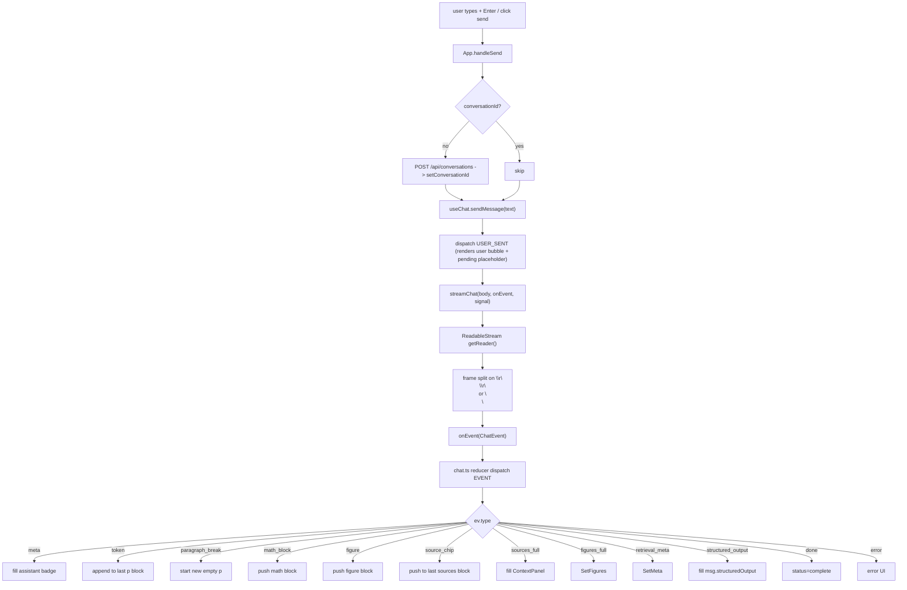

# 23 — Frontend chat UI + SSE client + KaTeX

## Purpose

Translates SSE events into the rendered thread. Auto-expanding input. KaTeX inline + display math. Source chips clickable. Fork-to-temp-chat affordance. Status dot health poll.

## Flow



## SSE client

`web/src/api/sse.ts`:

```ts
export async function streamChat(
  body: ChatRequestBody,
  onEvent: (e: ChatEvent) => void,
  signal?: AbortSignal,
): Promise<void> {
  const res = await fetch("/api/chat", {
    method: "POST",
    headers: { "content-type": "application/json", accept: "text/event-stream" },
    body: JSON.stringify(body),
    signal,
  });
  if (!res.ok || !res.body) throw new Error(`chat http ${res.status}`);

  const reader = res.body.getReader();
  const decoder = new TextDecoder();
  let buf = "";

  while (true) {
    const { done, value } = await reader.read();
    if (done) break;
    buf += decoder.decode(value, { stream: true });

    // SSE frames separated by \r\n\r\n (sse-starlette) OR \n\n.
    while (true) {
      const crlf = buf.indexOf("\r\n\r\n");
      const lf = buf.indexOf("\n\n");
      let idx = -1; let sep = 0;
      if (crlf !== -1 && (lf === -1 || crlf <= lf)) { idx = crlf; sep = 4; }
      else if (lf !== -1) { idx = lf; sep = 2; }
      else break;
      const frame = buf.slice(0, idx);
      buf = buf.slice(idx + sep);
      const dataLine = frame.split(/\r?\n/).find(l => l.startsWith("data:"));
      if (!dataLine) continue;
      const json = dataLine.slice(5).trim();
      try { onEvent(JSON.parse(json) as ChatEvent); }
      catch { /* ignore malformed */ }
    }
  }
}
```

**Why custom (not EventSource)**: `EventSource` does GET only. We need POST body for the chat request. `fetch + ReadableStream` is the standard workaround.

**Phase 0 bug fixed**: sse-starlette emits `\r\n\r\n` (not `\n\n`). Parser must accept both.

## Chat reducer

`web/src/state/chat.ts`:

```ts
function chatReducer(state: ChatState, action: Action): ChatState {
  switch (action.type) {
    case "USER_SENT": ... // append user msg + pending assistant placeholder
    case "EVENT": switch (action.ev.type) {
      case "meta": ... // fill mode/model/books/sourceCount/latencyMs
      case "token": ... // appendToken(msg.blocks, text)
      case "paragraph_break": ... // push empty p; skip if last p is already empty
      case "math_block": ... // push { type: "math", tex }
      case "figure": ... // push inline figure block
      case "source_chip": ... // append to last sources block
      case "sources_full": ... // set msg.sources + state.sources
      case "figures_full": ... // set msg.figures + state.figures
      case "retrieval_meta": ... // set msg.retrievalMetadata + state.metadata
      case "structured_output": ... // set msg.structuredOutput = { schema, data }
      case "done": ... // status=complete, strip trailing empty p
      case "error": ... // status=error
    }
    case "RESET": return initialState;
    case "SET_CONV_ID": return { ...state, conversationId: action.id };
  }
}
```

`appendToken(blocks, text)` — if last block is a `p`, append to its text; otherwise push new `p`. Keeps streaming smooth.

## KaTeX integration

`web/src/components/Math.tsx`:

```tsx
export function MathBlock({ tex }: { tex: string }) {
  const ref = useRef<HTMLDivElement>(null);
  useEffect(() => {
    if (!ref.current) return;
    try { katex.render(tex, ref.current, { displayMode: true, throwOnError: false }); }
    catch { if (ref.current) ref.current.textContent = tex; }
  }, [tex]);
  return <div className="math-block"><div ref={ref} aria-label={tex} /><span className="math-block__tag">MATH</span></div>;
}

export function MathInline({ tex }: { tex: string }) { ... }
```

Inline math in paragraphs: `MessageThread.renderInline(text)` splits on `$...$` and `**...**` first, renders `MathInline` / `<strong>` / plain text in order.

## App-level pieces

`web/src/App.tsx`:

```tsx
export default function App() {
  const [tweaks, setTweak] = useTweaks(TWEAK_DEFAULTS);
  const [sidebarCollapsed, setSidebarCollapsed] = useState(!tweaks.sidebarOpen);
  const [contextCollapsed, setContextCollapsed] = useState(!tweaks.contextOpen);
  const [books, setBooks] = useState<Book[]>([]);
  const [providers, setProviders] = useState<ModelProvider[]>(FALLBACK_PROVIDERS);
  const [convGroups, setConvGroups] = useState<ConvGroups>(emptyGroups);
  const [booksModalOpen, setBooksModalOpen] = useState(false);
  const [openSource, setOpenSource] = useState<Source | null>(null);
  const [tempChatOpen, setTempChatOpen] = useState(false);
  const [activeMode, setActiveMode] = useState("tutor");
  const [activeModel, setActiveModel] = useState("gpt-4o");

  const { messages, sources, figures, metadata, isStreaming,
          sendMessage, resetThread, conversationId, setConversationId } =
    useChat({ mode: activeMode, model: activeModel, bookFilter });

  // Status dot 10s health poll
  const [online, setOnline] = useState(false);
  useEffect(() => {
    const ping = () => fetch("/api/health").then(r => setOnline(r.ok)).catch(() => setOnline(false));
    ping();
    const id = window.setInterval(ping, 10000);
    return () => window.clearInterval(id);
  }, []);

  // Lazy create conversation on first send
  const handleSend = useCallback(async (text: string) => {
    if (!conversationId) {
      try {
        const conv = await createConversation({
          title: text.slice(0, 60), mode: activeMode,
          model_id: activeModel, book_filter: bookFilter,
        });
        if (conv?.id) setConversationId(conv.id);
      } catch {}
    }
    sendMessage(text);
  }, [conversationId, activeMode, activeModel, bookFilter, sendMessage, setConversationId]);

  // ... ⌘B opens BookModal; renders Topbar + Sidebar + Main + ContextPanel + Modals
}
```

## Tests

No unit tests on frontend (manual browser smoke). TypeScript `tsc --noEmit` enforces type contracts against `types.ts` which mirrors backend Pydantic.

## Bugs fixed in Phase 0

1. SSE frame delimiter `\r\n\r\n` not recognized — parser updated to handle both.
2. Stale `.js` files shadowing `.tsx` — deleted + `noEmit` in tsconfig.
3. `source_chip` events not emitted by backend — orchestrator now emits per source.
4. Chip → SourceModal lookup mismatched chapter+section forms — App now tries multiple match forms.
5. Conversation never persisted — App.handleSend wraps with `createConversation` on first send.
6. Status dot always grey — added 10s `/api/health` poll.
7. Figure search 404s for fields without image collections — `search_figures` pre-flights `get_collections`.
8. Payload mapping used `section_path` (didn't exist) — now uses real `h2_path` + `h1` + `page_from`.
