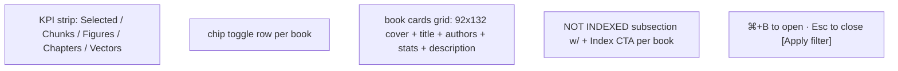

# 24 — Frontend modals: BookModal + SourceModal

## Purpose

Two focus modals over a `FocusModal` wrapper. Esc-close, body-scroll lock, backdrop click. Animated entrance.

## FocusModal (generic wrapper)

`web/src/components/modals/FocusModal.tsx`:

```tsx
type Props = {
  open: boolean;
  onClose: () => void;
  size?: "default" | "md" | "lg";   // 720 / 760 / 1020px
  children: React.ReactNode;
};

export function FocusModal({ open, onClose, size = "default", children }: Props) {
  useEffect(() => {
    if (!open) return;
    const onKey = (e: KeyboardEvent) => { if (e.key === "Escape") onClose(); };
    document.addEventListener("keydown", onKey);
    document.body.style.overflow = "hidden";
    return () => {
      document.removeEventListener("keydown", onKey);
      document.body.style.overflow = "";
    };
  }, [open, onClose]);

  if (!open) return null;
  return (
    <div className="fm" onClick={onClose} role="dialog" aria-modal>
      <div className={`fm__panel fm__panel--${size}`} onClick={e => e.stopPropagation()}>
        {children}
      </div>
    </div>
  );
}
```

Animations defined in CSS:

```css
.fm__panel { animation: fm-in 180ms cubic-bezier(0.2, 0.8, 0.2, 1); }
@keyframes fm-in {
  from { opacity: 0; transform: scale(0.96) translateY(8px); }
  to   { opacity: 1; transform: scale(1) translateY(0); }
}
```

## BookModal

`web/src/components/modals/BookModal.tsx` — library/corpus selector. Anatomy:



```tsx
export default function BookModal({ open, onClose, books, onToggle }: Props) {
  const selected = books.filter(b => b.selected && b.indexed !== false);
  const indexed = books.filter(b => b.indexed !== false);
  const totals = {
    chunks: selected.reduce((a, b) => a + b.chunks, 0),
    figures: selected.reduce((a, b) => a + b.figures, 0),
    chapters: selected.reduce((a, b) => a + b.chapters, 0),
  };
  return (
    <FocusModal open={open} onClose={onClose} size="lg">
      <header className="fm__hd fm__hd--kpi">
        <BMKpi label="Selected" value={`${selected.length}`} sub={`/${indexed.length}`} />
        <BMKpi label="Chunks" value={totals.chunks.toLocaleString()} accent />
        <BMKpi label="Figures" value={totals.figures.toLocaleString()} />
        <BMKpi label="Chapters" value={totals.chapters} />
        <BMKpi label="Vectors" value="3072d" />
      </header>
      <div className="bm-chip-row">
        {indexed.map(b => (
          <button key={b.id} className={`bm-chip ${b.selected ? "is-on" : ""}`}
                  onClick={() => onToggle(b.id)}>
            <span className="dot" style={{ background: b.color }} />
            {b.short}
            <span className="bm-chip__count">{b.chunks.toLocaleString()}</span>
          </button>
        ))}
      </div>
      <div className="fm__body">
        {selected.length === 0 ? <BMEmpty /> : <div className="bm-grid">{selected.map(b => <BookCard ... />)}</div>}
        {notIndexed.length > 0 && <NotIndexedSection books={notIndexed} />}
      </div>
    </FocusModal>
  );
}
```

Cover SVGs are inline placeholders keyed by `book.cover` slug. Replace with rendered cover assets when available.

## SourceModal

`web/src/components/modals/SourceModal.tsx` — shows full chunk text w/ highlighted spans.

```tsx
export default function SourceModal({ open, onClose, source, books }: Props) {
  if (!source) return null;
  return (
    <FocusModal open={open} onClose={onClose} size="md">
      <header className="fm__hd fm__hd--source">
        <div className="src-modal__top">
          <BookTag book={source.book} /> #{source.rank} <ScoreBadge score={source.score} />
          <code>{source.chunkId}</code>
        </div>
        <h2 className="src-modal__title">{source.title}</h2>
        <div className="src-modal__path">
          {source.book.toUpperCase()} / {source.chapter} / {source.section}
          {source.page && ` · p.${source.page}`}
        </div>
      </header>
      <div className="fm__body">
        <div className="src-modal__legend">
          Highlighted spans were used as the matching basis for retrieval.
        </div>
        <div className="src-modal__chunk">
          {renderHighlights(source.chunk, source.highlights)}
        </div>
        <div className="src-modal__meta">
          <span>Embedding</span><span>{source.embedding}</span>
          <span>Score</span><span><ScoreBadge score={source.score} /></span>
          <span>Chunk ID</span><code>{source.chunkId}</code>
          <span>Highlighted spans</span><span>{source.highlights.length}</span>
        </div>
      </div>
      <footer className="fm__ft">
        <button onClick={onClose}>Close</button>
        <button disabled>Open in reader →</button>
      </footer>
    </FocusModal>
  );
}

function renderHighlights(chunk: string, highlights: HighlightRange[] | string[]) {
  // Accepts both char-range objects (preferred) and substrings (legacy fallback).
  if (highlights.length > 0 && typeof highlights[0] === "object") {
    const ranges = (highlights as HighlightRange[]).sort((a, b) => a.start - b.start);
    const out: React.ReactNode[] = [];
    let cursor = 0;
    for (const r of ranges) {
      if (r.start > cursor) out.push(chunk.slice(cursor, r.start));
      out.push(<mark key={r.start} className="src-hl">{chunk.slice(r.start, r.end)}</mark>);
      cursor = r.end;
    }
    if (cursor < chunk.length) out.push(chunk.slice(cursor));
    return out;
  }
  // Substring fallback ...
}
```

## Highlight style

```css
.src-hl {
  background: linear-gradient(180deg, transparent 50%, rgba(255, 179, 107, 0.42) 50%);
  /* Light theme: rgba(184, 134, 11, 0.35) — gold underline */
  border-radius: 1px;
  padding: 0 1px;
}
```

Fluorescent yellow/amber under-bar in dark, gold in light.

## Keyboard

- Esc → close (handled by FocusModal)
- ⌘B / Ctrl+B → toggle BookModal (handled in App)

## Tests

Manual browser smoke only. TS contract tests via `tsc --noEmit`.
