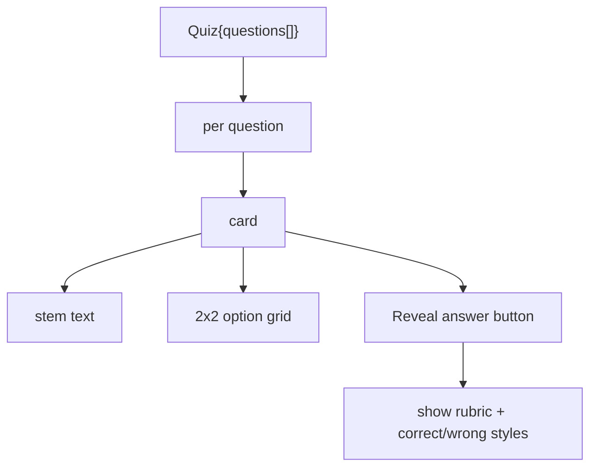
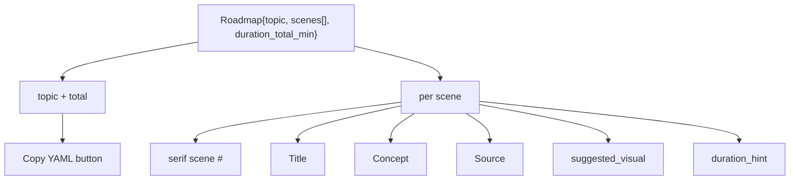

# 25 — Frontend mode views (M10)

## Purpose

Per-mode renderers for the `structured_output` SSE event. Tutor stays free-form prose; the other 10 modes get dedicated views. M10 ships 7 views (covering 8 schemas); CompareAnswer + MathAnswer + FiguresAnswer fall back to the default prose path.

## Wiring (MessageThread)

```tsx
{msg.structuredOutput && (
  <div className="msg__structured">
    {msg.structuredOutput.schema === "Quiz" && <QuizView data={msg.structuredOutput.data as Quiz} />}
    {msg.structuredOutput.schema === "DAG" && <DAGView data={msg.structuredOutput.data as DAG} />}
    {msg.structuredOutput.schema === "NavigationList" && <NavigationView data={msg.structuredOutput.data as NavigationList} onSourceClick={onSourceClick} />}
    {msg.structuredOutput.schema === "Report" && <ReportView data={msg.structuredOutput.data as Report} />}
    {msg.structuredOutput.schema === "StudyPlan" && <StudyPathView data={msg.structuredOutput.data as StudyPlan} />}
    {msg.structuredOutput.schema === "Roadmap" && <RoadmapView data={msg.structuredOutput.data as Roadmap} />}
    {msg.structuredOutput.schema === "AnnotatedReading" && <AnnotateView data={msg.structuredOutput.data as AnnotatedReading} />}
  </div>
)}
```

## Views

### QuizView

2-column grid of option cards per question. "Reveal answer" toggle per question shows the rubric + correct/incorrect color states. Difficulty badge.



### DAGView

Two tables side by side:
- **Concepts**: id · label · source citation
- **Prerequisites**: from_id → to_id with weight badge

Warning chip at top if `cycles_broken.length > 0`.

### NavigationView

Table of NavResult rows: Book · Chapter · Section · Title · score badge. Each row clickable → calls `onSourceClick(navResult)` to open SourceModal.

### ReportView

Split panel:
- **Left**: claims list. Stance pill: SUPPORTS (green), CONTRADICTS (red), BACKGROUND (amber). Confidence %. Evidence citations underneath.
- **Right**: synthesis paragraph + coverage_gaps list (italic red).

```css
.stance--SUPPORTS    { color: var(--accent-secondary); }
.stance--CONTRADICTS { color: var(--accent-danger); }
.stance--BACKGROUND  { color: var(--accent-tertiary); }
```

### StudyPathView

Goal header + `replanned_from_version` label. Vertical timeline of weeks (Week 1 → N). Each week card shows: section citations + hours_est. Bottom: coverage_gaps banner if non-empty.

### RoadmapView

Numbered scene cards (large serif scene number, title, concept, source, suggested_visual, duration_hint). Topic + duration_total_min at top. "Copy YAML" button uses zero-dep recursive ts-to-yaml stringifier.



### AnnotateView

Side-by-side:
- **Left**: original text with `<mark>` around each annotation's character range
- **Right**: definitions keyed by term. Click-to-scroll-to-definition.

## Type contracts (mirror backend)

`web/src/types.ts`:

```ts
export interface Citation { book: string; chapter: string; section: string; page?: number | null }
export interface Question {
  stem: string; options: string[]; answer_idx: number;
  rubric: string; source: Citation;
  difficulty: "easy" | "medium" | "hard";
}
export interface Quiz { questions: Question[] }
export interface ConceptNode { id: string; label: string; source: Citation | null }
export interface ConceptEdge { from_id: string; to_id: string; weight: number }
export interface DAG { nodes: ConceptNode[]; edges: ConceptEdge[]; cycles_broken: string[] }
// ... etc, exactly matching schemas/output.py field names (snake_case preserved)

// Extend ChatEvent union:
export type StructuredOutputEvent =
  | { type: "structured_output"; schema: "Quiz"; data: Quiz }
  | { type: "structured_output"; schema: "DAG"; data: DAG }
  // ... 7 more
  | { type: "structured_output"; schema: string; data: unknown };

export type ChatEvent = ... | StructuredOutputEvent;
```

## Reducer integration

`web/src/state/chat.ts`:

```ts
case "structured_output":
  return {
    ...state,
    messages: updateLastAssistant(state.messages, (msg) => ({
      ...msg,
      structuredOutput: { schema: ev.schema, data: ev.data },
    })),
  };
```

`AssistantMessage` gains optional `structuredOutput?: { schema: string; data: unknown }`.

## Status

| Mode | Schema | View component | Status |
|---|---|---|---|
| tutor | TutorAnswer | (free prose, no view) | ships |
| compare | CompareAnswer | none yet | falls back to prose |
| figures | FiguresAnswer | none yet | falls back to prose + inline figures |
| quiz | Quiz | QuizView | ships |
| navigate | NavigationList | NavigationView | ships |
| prereqs | DAG | DAGView | ships |
| annotate | AnnotatedReading | AnnotateView | ships |
| research | Report | ReportView | ships |
| math | MathAnswer | none yet | falls back to prose + KaTeX |
| path | StudyPlan | StudyPathView | ships |
| roadmap | Roadmap | RoadmapView | ships |

## Tests

TS contract via `tsc --noEmit`. Manual browser smoke for visual verification.
