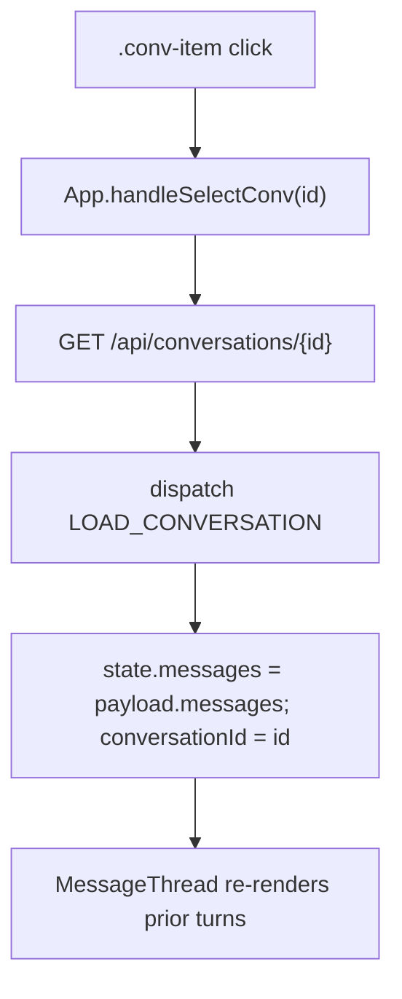

# 33 — Sidebar conversation loading

## Purpose

Sidebar conversation items are now functional. Clicking one fetches the full conversation from the backend and rehydrates the message thread, instead of being decorative.

## Where it lives

- `web/src/components/Sidebar.tsx` — `.conv-item` click handler wires up to `onSelectConv(id)`. Adds `is-active` class when `activeId === conv.id`.
- `web/src/App.tsx` — `handleSelectConv(id)` calls `GET /api/conversations/{id}`, then dispatches the new reducer action.
- `web/src/state/chat.ts` — new action `LOAD_CONVERSATION` payload `{ id, messages, mode, model_id, book_filter }`. Replaces `state.messages`, sets `conversationId`, resets `streamingPhase` to idle.
- Backend: existing `GET /api/conversations/{id}` returns digest + messages (no change).

## Flow



## Active highlight

The sidebar tracks the currently loaded conversation:

```tsx
<button
  className={`conv-item ${conv.id === activeId ? "is-active" : ""}`}
  onClick={() => onSelectConv(conv.id)}
>
```

`is-active` paints a red left border + slightly elevated background.

## User-facing behavior

- Click a past conversation in the sidebar → its messages load into the main thread.
- The clicked row stays visually pinned (red border) until another conversation is opened or "New conversation" is hit.
- New messages sent after loading continue against the same `conversation_id` (persistence preserved).
