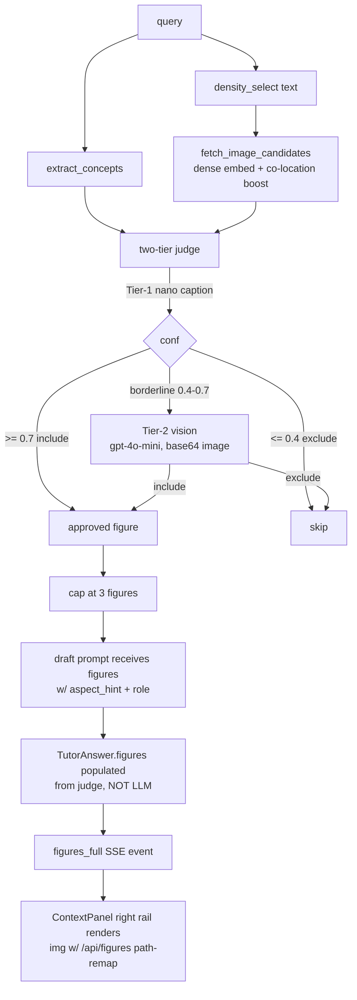

# 39 — Image pertinence judge + auto-figure inclusion

## Purpose

Deep tutor answers now include up to 3 textbook figures, chosen by a
two-tier agentic judge. Each figure gets an ``aspect_hint`` so it can
be rendered next to the right section of the answer.

## Pipeline



## Files

| Path | Role |
|---|---|
| `src/services/chat/retrievers/image_density.py` | `fetch_image_candidates` w/ co-location boost |
| `src/services/chat/agents/image_judge.py` | Tier-1 nano caption + Tier-2 vision orchestration; data-URI image base64 helper |
| `src/services/chat/schemas/output.py` | `FigureRef` adds `aspect_hint`, `figure_role`, `judge_confidence`, `judge_reason` |
| `src/services/chat/agents/deep_tutor.py` | Image branch wired between density and draft; emits `figures_full` SSE event |
| `src/services/chat/prompts/deep_tutor.py` | `<figures>` block contract for `[F1]`/`[F2]` markers |
| `src/services/chat/api.py` | `/api/figures` does path-remap (`/Documents/Books/` → `/Documents/Converters/Books/`) so legacy ingest paths still serve |

## SSE protocol

New event after `sources_full`:

```json
{
  "type": "figures_full",
  "figures": [
    {
      "ref": "<chunkId>",
      "book": "islp",
      "chapter": "ch02",
      "caption": "...",
      "chart": "/api/figures?path=...",
      "vision_used": true,
      "aspect_hint": "examples",
      "figure_role": "diagram",
      "judge_confidence": 0.9
    }
  ]
}
```

The existing `ContextPanel` consumes `chart`. No frontend changes
required for legacy renderers.

### Always-emit semantics (updated 2026-05-19)

`figures_full` is now emitted **even when `approved_figures` is empty**
so the frontend can distinguish "image branch produced nothing" from
"event never arrived". A companion `figures_meta` event follows on
every tutor turn:

```json
{
  "type": "figures_meta",
  "status": "no_candidates",
  "reason": "No image candidates returned — likely the selected books have no image collection ingested",
  "candidateCount": 0,
  "approvedCount": 0
}
```

`status` values:

| status | when |
|---|---|
| `ok` | At least one figure approved |
| `disabled` | `TUTOR_DEEP_IMAGES=0` |
| `no_sources` | Text retrieval returned no sources |
| `no_candidates` | `fetch_image_candidates` returned `[]` |
| `all_rejected` | Candidates existed but judge rejected all |
| `error` | Exception inside the image branch (caller continues without figures) |

Frontend surface (in `web/src/components/ContextPanel.tsx`): renders a
dashed-border chip under the Figures section when status is non-ok and
`figures.length === 0`. Also logs a `console.warn` for ops visibility.

### Inline figure rendering

LLM `[F<n>]` markers are NOT relied upon. Figures are injected
server-side into the relevant aspect's markdown (lead → image →
explanation) by ``_convert_to_tutor_answer`` (see feature 36). TutorView
renders the markdown `` as an `<figure id="fig-N">`, and
`[F<n>]` / `[Figure <n>]` / `[Image #<n>]` tokens become clickable
anchor pills that auto-open every collapsed section and scroll to the
target via a hashchange handler.

## Env knobs

| Var | Default | Meaning |
|---|---|---|
| `TUTOR_DEEP_IMAGES` | `1` | master on/off |
| `TUTOR_DEEP_IMAGES_MAX` | `3` | max figures per answer |
| `TUTOR_DEEP_IMAGE_POOL` | `6` | candidates before judge |
| `TUTOR_DEEP_TIER1_INCLUDE` | `0.7` | confidence to include w/o vision |
| `TUTOR_DEEP_TIER1_EXCLUDE` | `0.4` | confidence below which exclude is solid |
| `TUTOR_DEEP_VISION_DISABLE` | `0` | `1` skips Tier-2 entirely (cheap mode) |
| `TUTOR_DEEP_VISION_MAX` | `2` | hard cap on Tier-2 calls per query |
| `TUTOR_DEEP_VISION_MODEL` | `gpt-4o-mini` | Tier-2 model id |

## Tests

`src/services/chat/tests/test_image_judge.py` — 13 systematic tests
(mocked, fast).

`src/services/chat/tests/test_image_judge_quality.py` — gated
``-m quality_images`` lane (live API):
- Reads `data/eval/image_label_set.csv` (32 rows, auto-labelled by
  GPT-4o-mini via `ops/scripts/auto_label_images.py`).
- Runs full Tier-1 + Tier-2 against each row.
- Reports precision / recall / F1 / placement (exact + soft) / latency.
- 2.2s pacing between calls to stay within TPM budget.
- Vision API also has 4-attempt 429 backoff.

## Latest live KPIs (32-row eval)

| metric | result | target |
|---|---|---|
| precision | **1.000** | ≥ 0.80 ✅ |
| recall | **0.864** | ≥ 0.70 ✅ |
| F1 | **0.927** | ≥ 0.74 ✅ |
| placement_exact | 0.421 | ≥ 0.40 ⚠ |
| placement_soft (adjacent OK) | **1.000** | ≥ 0.80 ✅ |
| median latency / call | 2899 ms | informational |
| vision calls / query | 1 | ≤ 2 ✅ |

## Path-remap (legacy ingest)

Stored Qdrant image payloads point at
`/home/iohan/Documents/Books/...` which has since moved to
`/home/iohan/Documents/Converters/Books/...`. Two layers handle this:

1. `_resolve_figure_path` in `api.py` rewrites at serve time.
2. `_resolve_image_for_vision` in `image_judge.py` rewrites before
   base64-encoding for the vision API.

Frontend URLs never change; the rewrite is transparent.

## Auto-labeling oracle

`ops/scripts/auto_label_images.py` uses GPT-4o-mini vision to fill
`label_include` + `label_aspect` columns. Treat as a baseline —
override individual rows by hand. 4-attempt 429 backoff.

## Rollback

Set `TUTOR_DEEP_IMAGES=0` in `.env` → image branch skipped entirely.
Sources remain text-only. No other changes needed.

## Known limitations

- LLM does not always insert `[F1]`/`[F2]` markers in body prose
  (figures still render in the right rail via the `figures_full`
  event). To force inline placement, would need a post-pass that
  injects markers at sentence boundaries by `aspect_hint`.
- Captions in Qdrant payload are frequently empty. Tier-1 routes
  empty-caption candidates to Tier-2 vision instead of hard-excluding.
- Cost: ~3s of vision latency + ~$0.001 per call on borderline
  candidates. Cap of 2 vision calls / query keeps the worst-case
  bounded.


---

**2026-05-20 update — figure vision explanations ON by default**

`TUTOR_DEEP_VISION_EXPLAIN` now defaults to `1` (was `0`). Tutor figures get a grounded gpt-4o-mini vision explanation (axes/curves/trend tied to the concept) instead of caption+judge_reason fallback. ≤3 calls/turn, parallel, graceful fallback. Set in docker-compose + scripts/dev.sh. See changelog 2026-05-20 §2.
