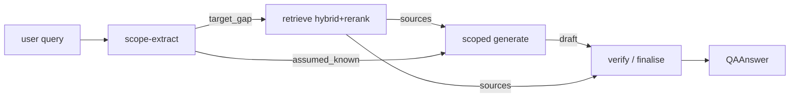

# Feature 51 — Q&A Mode (punctual answers)

**Branch:** `feat/qa-mode`
**Date:** 2026-05-31
**Spec:** [`docs/superpowers/specs/2026-05-31-qa-mode-design.md`](../../superpowers/specs/2026-05-31-qa-mode-design.md)
**Plan:** [`docs/superpowers/plans/2026-05-31-qa-mode.md`](../../superpowers/plans/2026-05-31-qa-mode.md)

---

## Purpose

Tutor mode teaches a topic *globally* — multi-aspect, scaffolded, long (6 aspects, figures, author-diversity, coverage check). Q&A answers *one specific doubt and nothing else*.

**Driving example:**

> "What is the bias–variance tradeoff? I know what the elements are, except the tradeoff."

Expected Q&A output: a direct explanation of *the tradeoff only* — no definition of bias, no definition of variance, no applications, no examples — because the user stated they already know those.

Two failure modes matter equally:

1. **Scoping** — re-explaining what the user already knows is a failure.
2. **Grounding** — a punctual answer has no scaffolding to hedge behind, so a hallucinated direct answer is nakedly wrong. Answers must be corpus-grounded and cited.

Q&A is a complement to tutor, not a replacement. It does not run the deep-tutor pipeline (synthesis plan, orchestrator-workers, author-diversity, coverage check, figure judge) — it is a lean 4-node graph optimised for speed and precision.

---

## Pipeline — four nodes

```
scope → retrieve → generate(scoped) → verify/finalise
```



### Per-node reference

| Node | Input | Output | Model | Fail-open behaviour |
|---|---|---|---|---|
| **scope** | raw user query | `QAScope{target_gap, assumed_known[], answer_form}` | nano | parse fail → `target_gap = whole query`, `assumed_known = []`, `answer_form = "explanation"` |
| **retrieve** | `target_gap` (sharper than raw query) | top-k `Source` list (hybrid + rerank, k = `QA_TOP_K`, default 4) | none (embeddings only) | 0 hits → honest "not covered in selected books", skip generate, no fabricated citation |
| **generate** | `target_gap` + `assumed_known` + sources | `QAAnswer` draft (terse markdown, inline `[n]` markers) | nano | `ValidationError` → one schema-repair retry (ADR-005) |
| **verify** | draft + sources | grounded answer + `grounding{ok, unsupported[], confidence}` | nano | verify error → keep draft, set `grounding.ok = false`, `confidence` low; never blocks output |

- The **scope node** parses assumed knowledge explicitly so generation can be hard-instructed to skip those items.
- The **verify node** is the grounding half: advisory, never suppresses the answer, degrades the badge instead.

---

## Schemas

Defined in `src/services/chat/schemas/output.py`, re-exported from `schemas/__init__.py`.

```python
class QAScope(BaseModel):
    target_gap: str
    assumed_known: list[str] = Field(default_factory=list)
    answer_form: Literal[
        "explanation", "definition", "comparison",
        "derivation", "yes_no", "list",
    ] = "explanation"


class QAAnswer(BaseModel):
    text: str                # terse markdown, inline [n] markers
    scope: QAScope           # echoed for UI transparency
    citations: list[TutorCitation] = Field(default_factory=list)  # REUSE
    math_blocks: list[str] = Field(default_factory=list)
    grounding: dict = Field(default_factory=dict)  # {ok: bool, unsupported: [str], confidence: float}
```

Deliberately leaner than `TutorAnswer`: no `sections`, `figures`, or `aspects`. Reuses `TutorCitation` so existing frontend citation cards render unchanged.

TypeScript mirrors in `web/src/types.ts` (`QAScope`, `QAAnswer` interfaces, `ModeId = "tutor" | "qa"`).

---

## Env flags

| Flag | Default | Meaning |
|---|---|---|
| `QA_TOP_K` | `4` | Retrieved sections (narrow for precision vs tutor's wider pool) |
| `QA_SCOPE` | `1` | Enable scope-extraction node (0 = treat raw query as gap, no LLM call) |
| `QA_VERIFY` | `1` | Enable grounding-verify node (0 = emit draft as-is with `confidence=0.7`) |
| `QA_SCOPE_MODEL` | nano | Per-node model env override for scope node |
| `QA_GENERATE_MODEL` | nano | Per-node model env override for generate node |
| `QA_VERIFY_MODEL` | nano | Per-node model env override for verify node |

`stageModels` request field (already in `ChatRequest`) overrides env flags per-call using stage keys `"scope"`, `"generate"`, `"verify"`.

`"qa"` is added to `settings.use_v2_modes` (default `["tutor", "qa"]`); the router dispatches it when present.

---

## Model cost-benefit

Workload: generate node ≈ 1800 input / 250 output tokens (short vs tutor's ~2800 output).

| Model | Provider | in/out $/1M | $/call | Notes |
|---|---|---|---|---|
| **gpt-5.4-nano** | OpenAI | 0.10 / 0.40 | **0.00028** | best instruction-adherence + reliable structured JSON; project default; native (not chat-only) |
| llama-4-scout | Groq | 0.11 / 0.34 | 0.00028 | tied cheapest, fast; Groq chat-only, weaker strict-scope + JSON |
| gpt-oss-20b | Groq | 0.10 / 0.50 | 0.00031 | cheap/fast; same Groq caveats |
| gpt-4o-mini | OpenAI | 0.15 / 0.60 | 0.00042 | solid, no upside over nano here |
| gemini-2.5-flash | Google | ~0.15 / 0.60 | ~0.00042 | 1M ctx wasted on short Q&A; extra key |
| qwen-plus | Alibaba | ~0.40 / 1.20 | ~0.00102 | won tutor *draft* battle (long-output consistency — irrelevant for short Q&A); 3.6× nano |
| deepseek-chat | DeepSeek | 0.27 / 1.10 | 0.00076 | fine, 2.7× nano |
| deepseek-v4-pro / gemini-pro / qwen-max | — | $$+ | 5–10×+ | overkill |
| gpt-5.4 full | OpenAI | 5.0 / 15.0 | 0.01275 | 45× nano — never for punctual |

**Verdict:** default all four LLM nodes to `gpt-5.4-nano-2026-03-17`. Cheapest tier and best at strict scope-obedience + reliable structured output — native OpenAI (no extra provider key, not chat-only). Qwen-plus's advantage is long-output consistency, which a 250-token answer never exercises.

---

## SSE event sequence

```
meta → structured_output{schema:"QAAnswer"} → sources_full → retrieval_meta → usage → done
```

Corpus-miss path (0 retrieved sources):

```
meta → structured_output{schema:"QAAnswer", data:{citations:[], text:"not covered…"}} → sources_full{sources:[]} → done
```

Both paths emit the same event types ending in `done` — the frontend never needs to special-case corpus miss.

---

## Frontend

| Component | Path | Role |
|---|---|---|
| `QAAnswerCard` | `web/src/components/QAAnswerCard.tsx` | Renders terse answer body + scope line ("Answering: *target_gap* · assuming you know: *assumed_known*") + grounding badge (✓ grounded / ⚠ partial) |
| `QAPipeline` | `web/src/components/QAPipeline.tsx` | Read-only 4-node diagram for the Q&A (i) modal |
| `qaPipeline` data | `web/src/data/qaPipeline.ts` | Static node/edge definitions (`QA_PIPELINE`) |
| `MessageThread` | `web/src/components/MessageThread.tsx` | Render branch on `schema === "QAAnswer"` → `<QAAnswerCard>` |
| `ModePicker` | `web/src/components/ModePicker.tsx` | Q&A chip beside the tutor chip |

---

## Synced-artifacts checklist

A logic change to Q&A is incomplete until **all** of these reflect it:

| Aspect | Path |
|---|---|
| Agent logic | `src/services/chat/agents/qa.py` |
| Prompts | `src/services/chat/prompts/qa.py` |
| Output schema | `src/services/chat/schemas/output.py` (+ `__init__` re-export) |
| Mode id | `src/services/chat/schemas/_core.py` |
| Mode registration | `src/services/chat/modes.py` |
| Dispatch | `src/services/chat/router.py` |
| Cost table | `src/services/chat/cost.py` (gemini + qwen prices) |
| Frontend types | `web/src/types.ts` |
| Mode selector | `web/src/components/ModePicker.tsx` |
| Renderer | `web/src/components/QAAnswerCard.tsx` + `MessageThread.tsx` wiring |
| Pipeline diagram | `web/src/data/qaPipeline.ts` + `QAPipeline.tsx` |
| Invariants + changelog | `docs/system/invariants.md`, `docs/system/changelog.md` |
| Service doc | `docs/services/chat.md` |
| This doc | `docs/services/chat-features/51-qa-mode.md` |
| Tests | `test_qa_schema.py`, `test_qa_nodes.py`, `test_qa_run.py`, `test_qa_mode_registry.py`, `QAAnswerCard.test.tsx`, `qaPipeline.test.ts` |
