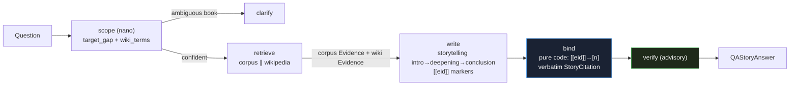

# Feature 51 — Q&A Mode (storytelling depth on one gap)

**Branch:** `feat/qa-story-wiki`
**Date:** 2026-06-11
**Spec:** [`docs/superpowers/specs/2026-06-11-qa-story-wiki-design.md`](../../superpowers/specs/2026-06-11-qa-story-wiki-design.md)
**Plan:** [`docs/superpowers/plans/2026-06-11-qa-story-wiki.md`](../../superpowers/plans/2026-06-11-qa-story-wiki.md)

---

## Purpose

**Tutor** mode teaches a topic *globally* — multi-aspect, scaffolded, broad (definition, formal statement, example, applications, further reading). **Q&A** digs *deep on one specific gap* with a storytelling rhetorical arc.

**Driving example:**

> "What is the bias–variance tradeoff? I know what the elements are, except the tradeoff."

Expected Q&A output: a three-act narrative (intro → deepening → conclusion) that explains *the tradeoff only* — no definition of bias, no definition of variance, no applications — because the user stated they already know those. The answer is grounded in corpus sources *and* Wikipedia context for naming/history/connections.

**Three failure modes matter:**

1. **Scoping** — re-explaining what the user already knows is a failure.
2. **Grounding** — a punctual answer has no scaffolding to hedge behind, so hallucinated claims are nakedly wrong. Every citation is verbatim from retrieved payload (never model-authored).
3. **Form** — headings and list structure fragment a short answer that should read as prose; the storytelling shape enforces continuity.

### Anti-tutor guarantee

Q&A is anti-tutor *by construction*, not by instruction:

| Property | Mechanism |
|---|---|
| Output schema: `QAStoryAnswer{intro, deepening, conclusion}` | 3 fixed string fields — no `sections`, `aspects`, `figures`, `text`, or `citations` fields EVER |
| Writer schema `QAStoryDraft` has NO citation field | Model cannot author citations even under prompt drift |
| Citations built by pure-code `qa_bind` from `Evidence.meta` | Verbatim payload only, never model-generated |
| Heading lint in `qa_bind` | `### ` headings stripped — enforces prose shape |
| Isolation test: `test_qa_isolation.py` | AST-based, comment-immune: asserts zero imports from `deep_tutor`, `orchestrator_workers`, `ow_deepagents`, `ow_skills` |

The following outputs are structurally impossible from Q&A:

| Tutor output | Why impossible in Q&A |
|---|---|
| `sections: list[Section]` | No such field in `QAStoryAnswer` |
| `figures: list[Figure]` | No such field |
| `aspects: dict` | No such field |
| Model-authored citation text | Writer schema has no citation field; `qa_bind` is pure code |
| `### ` headings in answer | `qa_bind` strips them |

---

## Pipeline — five nodes

```
scope → retrieve(corpus ∥ wiki) → write → bind(pure code) → verify
                     ↕ clarify (if ambiguous book)
```



### Per-node reference

| Node | Kind | Input | Output | Model | Fail-open behaviour |
|---|---|---|---|---|---|
| **scope** | LLM (nano) | raw user query | `QAScope{target_gap, assumed_known[], answer_form, wiki_terms[]}` | nano | parse fail → `target_gap = whole query`, `assumed_known = []`, `wiki_terms = []` |
| **retrieve** | Pure code (asyncio.gather) | `target_gap`, `wiki_terms` | corpus `Evidence[]` + wiki `Evidence[]` | none (embeddings + Wikipedia REST) | 0 corpus hits → honest "cannot answer" path; wiki fetch fail → corpus-only, never blocks |
| **write** | LLM (nano) | target_gap + assumed_known + Evidence[] | `QAStoryDraft{intro, deepening, conclusion}` with inline `[[eid]]` tokens | nano | `ValidationError` → one schema-repair (ADR-005); persist regardless |
| **bind** | Pure code | `QAStoryDraft` + `Evidence[]` map | `QAStoryAnswer{intro, deepening, conclusion}` + `list[StoryCitation]` | none | invalid `[[eid]]` → strip marker, keep prose; `### ` headings stripped; mid-line `$$`→`$` |
| **verify** | LLM (nano) | draft + sources | `grounding{ok, unsupported[], confidence}` | nano | verify error → keep draft, `grounding.ok = false`, `confidence` low; never aborts |
| **clarify** | Pure code | `BookResolution` | chips + message (SSE event) | none | N/A |

The **scope node** extracts `wiki_terms` so retrieve can fan out to matching Wikipedia articles. The **bind node** is the trust boundary — it never calls an LLM. The **verify node** is advisory — it softens unsupported claims and sets the grounding badge but never suppresses the answer.

---

## Wiki strategy

Wiki augments without replacing corpus. Rules:

- **Always** 1 `wiki_evidence(target_gap)` fetch, run in parallel with `corpus_evidence(target_gap)`.
- **Up to 2** `wiki_evidence(wiki_terms[i])` fetches (capped by `QA_WIKI_TERMS_MAX=2`).
- Total wiki fetches: `min(1 + len(wiki_terms), 3)` — never more than 3.
- All fetches run via `asyncio.gather` (parallel, non-blocking).
- Wiki evidence appears in the writer context labelled as `w{n}` evidence ids.
- **Corpus-primary**: the writer is instructed that corpus sources are the main grounding; Wikipedia provides context, history, and naming only.
- **Frontend**: Wikipedia sources surface as 🌐 chips only; corpus sources appear as full citation rows (📕).
- Disabled by `QA_WIKI=0` (corpus-only mode).

Wiki retrieval uses the shared `src/services/chat/research.py` module (borrowed from Extension v2 — same `wiki_evidence`/`StoryCitation`/`qa_bind` primitives).

---

## Verbatim-binder trust boundary

The binder (`qa_bind`) is pure code. No LLM is called. Rules:

1. **Valid `[[eid]]`** — rewritten to sequential `[n]` (1-based, appearance order); a `StoryCitation` is built verbatim from `Evidence.meta`: `book`, `authors`, `year`, `page_from`, `page_to`, `section_id`, `url` fields are copied as-is from the retrieval payload.
2. **Invalid `[[eid]]`** (eid not in evidence map) — marker stripped; prose kept unchanged. No fabricated citation.
3. **`### ` headings** — stripped unconditionally (enforces narrative prose shape).
4. **Mid-line `$$...$$`** — converted to `$...$` (inline math; display math only when on its own line).
5. **Paragraph caps** — `deepening` capped at `≤3` paragraphs after binder cleanup.

If the bound result has zero `[n]` markers (writer emitted no `[[eid]]` tokens at all), **one silent redraft** is triggered before persisting — the fallback `_fallback_story` (corpus-only, never regresses) is the safety net if the redraft also fails.

---

## Degradation

| Condition | Behaviour |
|---|---|
| 0 corpus evidence items | Honest "cannot answer" `QAStoryAnswer` with all three fields filled; `grounding.ok = False` |
| Writer emits 0 bound `[[eid]]` markers | One silent redraft; ship regardless after 1 retry |
| Writer raises exception | `_fallback_story` — assembles a minimal answer from corpus sources directly; never regresses to an empty answer |
| Wiki fetch fails | Corpus-only (wiki evidence = `[]`); pipeline continues |
| Verify raises exception | Keep draft; `grounding.ok = False`, `confidence` low |

---

## Schemas

Defined in `src/services/chat/schemas/output.py`, re-exported from `schemas/__init__.py`.

```python
class QAScope(BaseModel):
    target_gap: str
    assumed_known: list[str] = Field(default_factory=list)
    answer_form: Literal[
        "explanation", "definition", "comparison",
        "derivation", "yes_no", "list",
    ] = "explanation"
    wiki_terms: list[str] = Field(default_factory=list)  # NEW: Wikipedia lookup terms


class QAStoryDraft(BaseModel):
    """Writer output — NO citation field by design."""
    intro: str
    deepening: str
    conclusion: str


class QAStoryAnswer(BaseModel):
    intro: str           # 1 paragraph — scene-setter
    deepening: str       # ≤3 paragraphs — core explanation with [n] markers
    conclusion: str      # 1 paragraph — take-away
    scope: QAScope       # echoed for UI transparency
    citations: list[StoryCitation] = Field(default_factory=list)  # verbatim from payload
    grounding: dict = Field(default_factory=dict)  # {ok: bool, unsupported: [], confidence: float}


# Legacy schema — kept for pre-rebuild conversations
class QAAnswer(BaseModel):
    text: str
    scope: QAScope
    citations: list[TutorCitation] = Field(default_factory=list)
    math_blocks: list[str] = Field(default_factory=list)
    grounding: dict = Field(default_factory=dict)
```

Legacy `QAAnswer{text}` conversations keep the legacy `QAAnswerCard` renderer — the frontend discriminates on `schema === "QAStoryAnswer"` vs `schema === "QAAnswer"`. No DB migration.

---

## Env flags

| Flag | Default | Meaning |
|---|---|---|
| `QA_TOP_K` | `4` | Corpus sections retrieved (hybrid + rerank, narrow for precision) |
| `QA_WIKI_TERMS_MAX` | `2` | Maximum extra Wikipedia fetches for `wiki_terms` beyond the target_gap fetch |
| `QA_SCOPE` | `1` | Enable scope-extraction node (0 = treat raw query as gap, no LLM call) |
| `QA_VERIFY` | `1` | Enable grounding-verify node (0 = emit draft as-is with `confidence=0.7`) |
| `QA_WIKI` | `1` | Enable Wikipedia evidence (0 = corpus-only mode) |
| `QA_SCOPE_MODEL` | nano | Per-node model env override for scope node |
| `QA_WRITE_MODEL` | nano | Per-node model env override for write node |
| `QA_VERIFY_MODEL` | nano | Per-node model env override for verify node |

`stageModels` request field overrides env flags per-call using stage keys `"scope"`, `"write"`, `"verify"`. The `bind` node is pure code — it has no model key and never accepts a model override.

---

## SSE event sequence

Normal path:

```
meta → progress("retrieving") → progress("writing") → progress("binding")
     → structured_output{schema:"QAStoryAnswer"} → sources_full(corpus rows only)
     → retrieval_meta → usage → done
```

Redraft path (writer emitted 0 bound markers):

```
meta → progress("retrieving") → progress("writing") → progress("binding")
     → progress("redraft") → structured_output{schema:"QAStoryAnswer"}
     → sources_full → retrieval_meta → usage → done
```

Corpus-miss path (0 retrieved sources):

```
meta → progress("retrieving") → structured_output{schema:"QAStoryAnswer",
       data:{intro:"…cannot answer…", deepening:"…", conclusion:"…", citations:[]}}
     → sources_full{sources:[]} → done
```

Clarify path (ambiguous book):

```
meta → clarify{candidates:[…], message:"…"} → done
```

All paths emit the same event types ending in `done` — the frontend never special-cases mid-stream.

**`sources_full` carries corpus `Source` rows only.** Wikipedia evidence surfaces as 🌐 chips (via `StoryCitation.url`) on the `QAStoryAnswerCard`, not as `Source` rows in `sources_full`.

---

## Frontend

| Component | Path | Role |
|---|---|---|
| `QAStoryAnswerCard` | `web/src/components/QAStoryAnswerCard.tsx` | Renders intro/deepening/conclusion prose + scope line + 📕 corpus / 🌐 wikipedia citation chips + grounding badge |
| `QAAnswerCard` (legacy) | `web/src/components/QAAnswerCard.tsx` | Legacy renderer for old `QAAnswer{text}` conversations |
| `QAPipelineDiagram` | `web/src/components/QAPipelineDiagram.tsx` | 5-node diagram for the Q&A (i) modal (scope/retrieve/write/bind/verify + clarify) |
| `qaPipeline` data | `web/src/data/qaPipeline.ts` | Static node/edge definitions (`QA_PIPELINE`, node ids: scope/retrieve/write/bind/verify/clarify) |
| `MessageThread` | `web/src/components/MessageThread.tsx` | Branches on `schema === "QAStoryAnswer"` → `<QAStoryAnswerCard>` vs legacy `<QAAnswerCard>` |
| `ModePicker` | `web/src/components/ModePicker.tsx` | Q&A chip beside the tutor chip |

---

## Isolation

Q&A maintains hard isolation from the tutor pipeline:

- `src/services/chat/agents/qa.py` imports **zero** modules from `deep_tutor`, `orchestrator_workers`, `ow_deepagents`, or `ow_skills`.
- `src/services/chat/agents/qa_skills/` and `src/services/chat/agents/qa_agents/` are the Q&A-only namespaces.
- Shared infra lives in `research.py` (wiki primitives, `qa_bind`, `StoryCitation`) — this is the **only** cross-mode file; it does NOT import from tutor modules.
- Verified by `src/services/chat/tests/test_qa_isolation.py` (AST-based walk, comment-immune).

---

## Synced-artifacts checklist

A logic change to Q&A is incomplete until **all** of these reflect it:

| Aspect | Path |
|---|---|
| Agent logic | `src/services/chat/agents/qa.py` |
| Shared research primitives | `src/services/chat/research.py` |
| Prompts | `src/services/chat/prompts/qa.py` |
| Output schema | `src/services/chat/schemas/output.py` (+ `__init__` re-export) |
| Mode id | `src/services/chat/schemas/_core.py` |
| Mode registration | `src/services/chat/modes.py` |
| Dispatch | `src/services/chat/router.py` |
| Frontend types | `web/src/types.ts` |
| Mode selector | `web/src/components/ModePicker.tsx` |
| Renderer | `web/src/components/QAStoryAnswerCard.tsx` + `MessageThread.tsx` wiring |
| Pipeline diagram | `web/src/data/qaPipeline.ts` + `QAPipelineDiagram.tsx` |
| Invariants + changelog | `docs/system/invariants.md`, `docs/system/changelog.md` |
| Service doc | `docs/services/chat.md` |
| This doc | `docs/services/chat-features/51-qa-mode.md` |
| HTML doc | `docs/common ground/Elements/modes/qa.html` |
| Tests | `test_qa_schema.py`, `test_qa_schemas.py`, `test_qa_nodes.py`, `test_qa_run.py`, `test_qa_write.py`, `test_qa_bind.py`, `test_qa_retrieve.py`, `test_qa_verify.py`, `test_qa_fallback.py`, `test_qa_degradation.py`, `test_qa_gate.py`, `test_qa_scope.py`, `test_qa_prompts.py`, `test_qa_isolation.py`, `test_qa_mode_registry.py`, `test_qa_clarify.py`, `QAStoryAnswerCard.test.tsx`, `qaPipeline.test.ts` |
