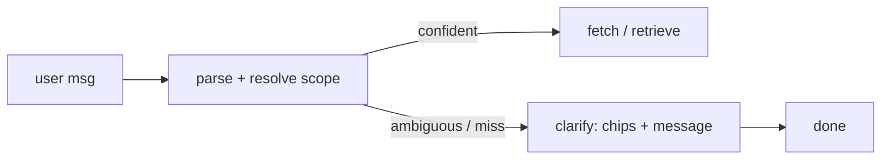

# Feature 52 — Book scope resolve + clarify

**Branch:** `feat/book-scope-resolve`
**Date:** 2026-06-01

---

## Purpose

Before this feature, chapter modes (`facilitate`, `resume`) and Q&A (`qa`) required the caller to supply a precise `book_slug` value matching the internal registry. A natural-language reference like:

> "Hansen's introduction to probability"

would fail with a lookup miss because `"Hansen's introduction to probability"` is not the slug. The fix injects a compact book catalog into the scope-parse LLM call so the model can resolve fuzzy book references deterministically, and adds a confirm gate that emits a `clarify` SSE event only when the match is ambiguous or absent.

---

## Catalog-in-prompt mechanism

`parse_catalog()` in `src/services/chat/books.py` builds a compact representation of every indexed book:

```
<slug> · <name> · <authors_short> · <field> · [ch1, ch2, …]
```

This catalog is injected verbatim into the `CHAPTER_PARSE_PROMPT` (`src/services/chat/prompts/chapter.py`) as context for the parse-scope LLM call. The model receives the full list and is asked to:

1. Identify which catalog entry best matches the user's book reference (by name, author name, field, or partial phrase).
2. Return the matched `book_slug`, a `book_confidence` score (0–1), and up to three `book_candidates` when ambiguous.
3. Identify the chapter and any requested subtopics.

Numeric section references like `"7.2 up to 7.4"` are expanded deterministically by `expand_section_refs` (no LLM needed).

---

## `resolve_book()` and `BookResolution`

**Location:** `src/services/chat/agents/_scope.py`

`resolve_book(user_message, catalog)` calls the parse-scope LLM with the catalog injected and returns a `BookResolution` Pydantic model:

| Field | Type | Description |
|---|---|---|
| `book_slug` | `str \| None` | Matched slug from the catalog, or `None` on miss |
| `book_confidence` | `float` | 0–1 confidence in the slug match |
| `book_candidates` | `list[CandidateBook]` | Up to three alternatives when ambiguous; each has `slug`, `name`, `authors_short`, `chapters` |
| `chapter_id` | `str \| None` | Matched chapter id within the book (or `None`) |
| `requested_subtopics` | `list[str]` | Named subtopic phrases extracted from the query |

A `SINGLE` selected book (the user already chose one, e.g. by clicking a chip) is always returned with `book_confidence=1.0` — it never triggers the clarify gate.

---

## Confirm gate — `maybe_clarify()`

**Location:** `src/services/chat/agents/_scope.py`

After `resolve_book()` returns, `maybe_clarify(res, catalog)` decides whether to proceed silently or emit a `clarify` event. The gate triggers on three reasons:

| Reason | Condition |
|---|---|
| `book_unknown` | `book_slug is None` — no catalog entry matched at all |
| `book_ambiguous` | `book_confidence < BOOK_CONFIRM_CUTOFF` (default `0.6`) **or** `len(book_candidates) >= 2` |
| `chapter_missing` | A chapter was named in the query but does not appear in the matched book's chapter list |

A confident single match (`book_confidence >= 0.6` and exactly one candidate) runs the pipeline immediately with no extra turn. The kill-switch env `CHAPTER_CLARIFY=0` reverts to old fail-open behaviour (no clarify emitted, scope resolved best-effort).

---

## `clarify` SSE event

The `clarify` event is **terminal for the turn** — after it, only `done` follows. No `structured_output` event is emitted on a clarify turn.

Shape:

```json
{
  "type": "clarify",
  "reason": "book_ambiguous",
  "message": "I found two possible books. Which one did you mean?",
  "candidates": [
    {"slug": "hansen-prob", "name": "Introduction to Probability", "authors_short": "Hansen", "chapters": ["ch1","ch2","ch3"]},
    {"slug": "blitzstein-prob", "name": "Introduction to Probability", "authors_short": "Blitzstein & Hwang", "chapters": ["ch1","ch2"]}
  ],
  "chapter_guess": "ch2",
  "sections_guess": ["7.2", "7.3", "7.4"]
}
```

| Field | Description |
|---|---|
| `reason` | One of `book_unknown`, `book_ambiguous`, `chapter_missing` |
| `message` | Human-readable clarification prompt |
| `candidates` | 1–3 candidate books (empty on `book_unknown` with zero near-matches) |
| `chapter_guess` | Chapter id the model inferred (may be `null`) |
| `sections_guess` | Numeric section ids expanded from the query (may be `[]`) |

The SSE sequence on a clarify turn:

```
meta → clarify → done
```

The frontend renders the `clarify` event as a card with candidate chips and the `message` text. Clicking a chip re-sends the original message with the selected slug injected, which sets `book_confidence=1.0` and never re-triggers the gate.

---

## Modes that use it

All three non-tutor modes run through `resolve_book()` + `maybe_clarify()`:

| Mode | Entry point |
|---|---|
| `facilitate` | `src/services/chat/agents/_scope.py` → chapter pipeline |
| `resume` | same |
| `qa` | same |

The tutor mode (`tutor`) does **not** use this gate — it takes a `book_filter` field directly.

---

## Pipeline diagram



---

## Env flags

| Var | Default | Effect |
|---|---|---|
| `BOOK_CONFIRM_CUTOFF` | `0.6` | min `book_confidence` to auto-run without emitting `clarify` |
| `CHAPTER_CLARIFY` | `1` | `0` = kill-switch, old fail-open (no clarify emitted) |

---

## Synced-artifacts checklist

A change to the scope-resolve logic is incomplete until all of these reflect it:

| Aspect | Path |
|---|---|
| Resolve + gate logic | `src/services/chat/agents/_scope.py` |
| Catalog builder | `src/services/chat/books.py` (`parse_catalog`) |
| Scope prompt | `src/services/chat/prompts/chapter.py` (`CHAPTER_PARSE_PROMPT`) |
| `BookResolution` schema | `src/services/chat/schemas/output.py` |
| Frontend `clarify` handler | `web/src/components/MessageThread.tsx` |
| Pipeline diagrams (modal) | `web/src/data/qaPipeline.ts`, `web/src/data/chapterPipeline.ts` |
| Feature doc | `docs/services/chat-features/52-book-scope-resolve.md` (this file) |
| Q&A feature doc | `docs/services/chat-features/51-qa-mode.md` |
| Service doc (SSE table) | `docs/services/chat.md` |
| Invariants | `docs/system/invariants.md` |
| Changelog | `docs/system/changelog.md` |
| Reference graph | `docs/common ground/Elements/chat.html` |
