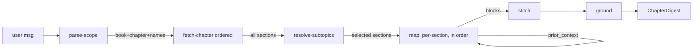

# Feature 52 — Chapter Modes (facilitate / resume)

**Branch:** `feat/chapter-modes`
**Date:** 2026-05-31

---

## Purpose

Two structural chat modes that traverse a chapter's intrinsic section order instead of search relevance:

- **`facilitate`** — teach a chapter span in order, one section at a time, building prior context across sections.
- **`resume`** — compress the same span, condensing each section into a dense summary while preserving order.

Unlike tutor (which searches globally across all books for the most relevant sources) or Q&A (which retrieves by gap/grounding), chapter modes are **order-preserving**: sections are fetched by structural position (`page_from`, then `section_id`) and blocks are emitted in exactly that order, never re-sorted. Scope is constrained to named subtopics within a single chapter; an empty subtopic list expands to the whole chapter.

---

## Pipeline



The implemented pipeline fetches the full ordered chapter **before** resolving subtopics so the resolver has structural context (page numbers, `h2_path` labels) for fuzzy matching.

---

## Nodes

| Node | Role | Notes |
|---|---|---|
| **parse-scope** | Extract `book`, `chapter`, and `subtopic_names[]` from the user message; identify mode (`facilitate` vs `resume`) | Fail-open: on parse error, `subtopic_names = []` (whole chapter), mode defaults to `facilitate` |
| **fetch-chapter** | Qdrant scroll for all sections in `book + chapter`; sort by `page_from`, then `section_id` | Structural — no embeddings, no hybrid search; order reflects the chapter's own reading sequence |
| **resolve-subtopics** | Match `subtopic_names` to fetched section `h2_path` labels: substring match first, then `gpt-5.4-nano` fallback for fuzzy | Empty `subtopic_names` → all fetched sections; no match → skip silently (never hallucinate a section) |
| **map** | Per-section LLM call in order: teach (`facilitate`) or compress (`resume`); threads `prior_context` forward across calls so each block can reference what was explained before | Fail-open: on LLM or parse error, fall back to raw excerpt; never blocks the pipeline |
| **stitch** | Compose resolved blocks into a single `ChapterDigest` with a brief intro and outro; never reorders blocks | Connective tissue only — section order from `map` is authoritative |
| **ground** | Advisory grounding-verify pass over the final digest | Never suppresses output; degrades the grounding badge on failure |

---

## Env flags

| Flag | Default | Meaning |
|---|---|---|
| `CHAPTER_RESOLVE` | `1` | Fuzzy subtopic→`h2_path` resolve via nano (0 = exact substring match only) |
| `CHAPTER_MAX_SECTIONS` | `30` | Cap on sections processed per run |
| `CHAPTER_STITCH` | `1` | Connective intro/outro pass (0 = concatenate raw blocks) |
| `CHAPTER_GROUND` | `1` | Grounding-verify node (0 = emit digest as-is with advisory skipped) |
| `CHAPTER_PARSE_MODEL` | nano | Per-node model override for parse-scope |
| `CHAPTER_RESOLVE_MODEL` | nano | Per-node model override for resolve-subtopics |
| `CHAPTER_MAP_MODEL` | nano | Per-node model override for map (dominates cost — one call per section) |
| `CHAPTER_STITCH_MODEL` | nano | Per-node model override for stitch |
| `CHAPTER_GROUND_MODEL` | nano | Per-node model override for ground |

`stageModels` request field (already in `ChatRequest`) overrides env flags per-call using stage keys `"parse"`, `"resolve"`, `"map"`, `"stitch"`, `"ground"`.

---

## Models

All nodes default to `gpt-5.4-nano-2026-03-17`. The **map** node dominates cost because it issues one LLM call per selected section; a 10-section chapter span costs ~10× a single-section call. Per-node override via `stageModels` / `CHAPTER_*_MODEL` lets callers upgrade the map node alone (e.g. to `qwen-plus` for richer prose) while leaving bookkeeping nodes on nano.

---

## Schemas

Defined in `src/services/chat/schemas/output.py`, re-exported from `schemas/__init__.py`.

```python
class ChapterBlock(BaseModel):
    section_id: str
    h2_path: str
    page_from: int
    text: str                    # taught or compressed section text
    prior_context_used: bool     # True if prior_context influenced this block

class ChapterDigest(BaseModel):
    mode: Literal["facilitate", "resume"]
    book: str
    chapter: str
    subtopics: list[str]         # resolved subtopic names (empty = whole chapter)
    blocks: list[ChapterBlock]   # in chapter reading order — NEVER re-sorted
    grounding: dict              # {ok: bool, unsupported: [str], confidence: float}
    citations: list[TutorCitation] = Field(default_factory=list)
```

TypeScript mirrors in `web/src/types.ts` (`ChapterBlock`, `ChapterDigest` interfaces; `ModeId` extended to include `"facilitate"` and `"resume"`).

---

## SSE event sequence

```
meta → structured_output{schema:"ChapterDigest"} → sources_full → retrieval_meta → usage → done
```

Corpus-miss path (chapter not found / 0 sections fetched):

```
meta → structured_output{schema:"ChapterDigest", data:{blocks:[], text:"chapter not found…"}} → sources_full{sources:[]} → done
```

Both paths emit the same event types ending in `done` — the frontend does not special-case corpus miss.

---

## Frontend

| Component | Path | Role |
|---|---|---|
| `ChapterDigestCard` | `web/src/components/ChapterDigestCard.tsx` | Renders ordered `blocks[]` with section headings; teach vs compress visual distinction (expand vs compact layout); grounding badge |
| `ChapterPipeline` | `web/src/components/ChapterPipeline.tsx` | Read-only 6-node diagram for the chapter-modes (i) modal |
| `chapterPipeline` data | `web/src/data/chapterPipeline.ts` | Static node/edge definitions (`CHAPTER_PIPELINE`) |
| `MessageThread` | `web/src/components/MessageThread.tsx` | Render branch on `schema === "ChapterDigest"` → `<ChapterDigestCard>` |
| `ModePicker` | `web/src/components/ModePicker.tsx` | Facilitate and Resume chips |

---

## Synced-artifacts checklist

A logic change to chapter modes is incomplete until **all** of these reflect it:

| Aspect | Path |
|---|---|
| Agent logic | `src/services/chat/agents/chapter.py` |
| Prompts | `src/services/chat/prompts/chapter.py` |
| Output schema | `src/services/chat/schemas/output.py` (+ `__init__` re-export) |
| Mode ids | `src/services/chat/schemas/_core.py` (`ModeId` Literal) |
| Mode registration | `src/services/chat/modes.py` |
| Dispatch | `src/services/chat/router.py` |
| Frontend types | `web/src/types.ts` |
| Renderer | `web/src/components/ChapterDigestCard.tsx` + `MessageThread.tsx` wiring |
| Pipeline diagram | `web/src/data/chapterPipeline.ts` + `web/src/components/ChapterPipeline.tsx` |
| Mode selector | `web/src/components/ModePicker.tsx` |
| Invariants + changelog | `docs/system/invariants.md`, `docs/system/changelog.md` |
| Service doc | `docs/services/chat.md` |
| This doc | `docs/services/chat-features/52-chapter-modes.md` |
| Tests | `src/services/chat/tests/test_chapter_schema.py`, `test_chapter_nodes.py`, `test_chapter_run.py`, `web/src/components/ChapterDigestCard.test.tsx`, `web/src/data/chapterPipeline.test.ts` |
