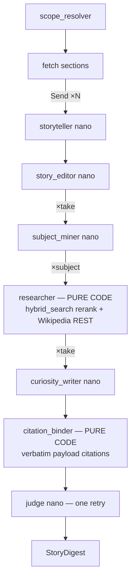

# Feature 54 — Extension Mode (story timeline + curiosity boxes)

**Branch:** `feat/extension-v2-story-curiosity` → merged into `feat/component-equation-enforcement` at `e2a7ae2` (2026-06-10/11)
**Status:** ✅ COMPLETE — all 15 tasks + post-verify batch (T-A/T-B/T-C) done; ~896 backend / 261 frontend tests green, tsc clean; live-verified on :5175.
**Date:** 2026-06-10 (initial); post-verify batch 2026-06-11
**Spec:** [`docs/superpowers/specs/2026-06-10-extension-v2-story-curiosity-design.md`](../../superpowers/specs/2026-06-10-extension-v2-story-curiosity-design.md)
**Plan:** [`docs/superpowers/plans/2026-06-10-extension-v2-story-curiosity.md`](../../superpowers/plans/2026-06-10-extension-v2-story-curiosity.md)

---

## Purpose

Extension mode takes a chapter (or named section) already in the corpus and produces a **story timeline**: one "take" per source section (following the author's sequence), each with a collapsed **curiosity box** of expansion bullets drawn from the wider corpus and Wikipedia. Every citation is copied verbatim by code from retrieval payloads — LLMs never produce source text.

**Core principle:**

> Story first, curiosity optional. The timeline is the reading surface; curiosity boxes are collapsed by default and toggled per take.

---

## Architecture — v2 deterministic pipeline

Extension v2 replaces the v1 deepagents core with a deterministic async orchestration in `graph.py`. Two pure-code stages (researcher + citation binder) carry the trust; LLM stages are small, structured-output-enforced, and English-pinned. Parallel fan-out via `asyncio.gather`.



### Agent roster

| Agent | Harness | Model (default) | Temp |
|---|---|---|---|
| `scope_resolver` | `aresolve_scope_or_clarify` + `_needle_matches` section matching; runner stamps authoritative `digest.book`/`digest.chapter` | nano | 0.0 |
| `storyteller` ×section | Input: section text + previous take heading. Output: `TakeDraft{heading, story, key_items[]}`. Story = 2–4 **short paragraphs** (`\n\n`-separated, 2–4 sentences each); headings are **plain text** (no `$`-math); opens each take with a bridge from the previous take. ENGLISH pinned. Degradation: parse failure → raw section summary (flagged). | nano, parallel | 0.4 |
| `story_editor` | Stitches takes into one continuous voice with an explicit **narrative through-line and transitions** between takes. Hard rules: NO new facts; ≤10% length growth; paragraph breaks preserved. Editor failure → keep drafts. | nano | 0.3 |
| `subject_miner` ×take | Curiosity subjects from take + key_items. Gap taxonomy: `formal-def / derivation / comparative / application / history`. Output: `Subject{title, queries[2–3], tag}`. | nano, parallel | 0.0 |
| `researcher` ×subject | **Pure code — no LLM.** Multi-query `hybrid_search` cross-book (exclude target book, rerank ON, `EXTENSION_MIN_SCORE` floor, `seen_ids` dedupe) + Wikipedia REST (search → summary; title + URL + extract). Output: `Evidence{id, kind, text, meta}`. | — | — |
| `curiosity_writer` ×take | Writes bullets FROM evidence only; each bullet lists `evidence_ids`; bullet body may be 1–2 short paragraphs; forbidden to write citation text. | nano, parallel | 0.2 |
| `citation_binder` | **Pure code — no LLM.** Maps `evidence_ids` → `StoryCitation` objects copied **verbatim** from `Evidence.meta` (book_name/authors/year/chapter/section_id/pages for corpus; title+URL for Wikipedia) + `chunk_id` provenance. Bullets with zero valid ids dropped → `unfilled_subjects`. | — | — |
| `judge` ×take | Coverage check (each subject answered, ≥1 bullet). ONE bounded retry of miner→researcher→writer for failed takes, then accept with gaps listed. | nano; env override: `EXTENSION_JUDGE_MODEL` | 0.0 |

### Env flags

| Flag | Default | Meaning |
|---|---|---|
| `EXTENSION_JUDGE_MODEL` | `""` (→ nano) | Override judge stage model independently. |
| `EXTENSION_MIN_SCORE` | `0` (disabled) | Researcher corpus evidence score floor; float, e.g. `0.5`. |

---

## Output schema

```python
class StoryCitation(BaseModel):
    kind: Literal["corpus", "wikipedia"]
    label: str                    # binder-built render string (verbatim payload fields)
    book_slug: str | None = None
    book_name: str | None = None
    authors: str | None = None
    year: int | None = None
    chapter: str | None = None
    section_id: str | None = None
    pages: str | None = None
    title: str | None = None      # wikipedia
    url: str | None = None        # wikipedia
    chunk_id: str | None = None   # corpus provenance

class CuriosityItem(BaseModel):
    subject: str
    body: str                     # prose w/ $-math; from evidence only
    citations: list[StoryCitation]  # ≥1, binder-enforced

class Take(BaseModel):
    heading: str
    story: str                    # justified prose, KaTeX-ready
    items: list[CuriosityItem]    # may be []

class StoryDigest(BaseModel):
    book: str                     # runner-stamped (authoritative)
    chapter: str                  # honest narrowed label (e.g. "ch07 · 7.4–7.5")
    takes: list[Take]
    unfilled_subjects: list[str]  # subjects binder could not cite
```

Legacy `ExtensionDigest` is retained for pre-v2 conversations (schema-keyed dispatch).

**Citation verifiability:** every non-null `StoryCitation` field is copied verbatim from a retrieval payload or Wikipedia REST response by `binder.py` — LLMs never produce citation text. The invariant is property-tested: `test_extension_binder.py::test_binder_property_no_field_outside_evidence`. See invariants.md §41.

---

## SSE event sequence

```
meta {mode:"extension", model, books}              ← always first (badge)
stage {stage:"parse"}    stage {stage:"fetch"}
stage {stage:"story", label:"Take k/N — <heading>"}   ×N  (streamed as each lands)
stage {stage:"edit"}     stage {stage:"research"}
stage {stage:"write"}    stage {stage:"bind"}     stage {stage:"judge"}
structured_output {schema:"StoryDigest", data}
sources_full {sources:[…]}
usage    done
```

Clarify-gate path (scope ambiguous):

```
meta → stage{parse} → clarify{type:"clarify", options:[…]} → usage → done
```

Token accounting: `usage` emits `durationMs` only (token counts are placeholder zeros in v2 step 1; callback-based accounting removed).

---

## Frontend

| Component | Path | Role |
|---|---|---|
| `StoryDigestCard` | `web/src/components/StoryDigestCard.tsx` | Timeline rail (numbered nodes + connecting line, alignment tightened), per-take **full-width header-bar toggle button** (`aria-label`, `aria-expanded`), justified story + curiosity bodies split on `\n\n` into separate `<div class="story-para">` blocks (math-safe split skips blank lines inside `$$...$$`), take headings rendered through inline math renderer (defensive), citation chips (📕 corpus, 🌐 wiki), expand/collapse-all, Download ZIP. Wrapped in `StructuredErrorBoundary`. |
| `renderMathText` | `web/src/lib/renderRichText.tsx` | Shared renderer: KaTeX math + markdown (bold/italic). Used by both `StoryDigestCard` and `ExtensionDigestCard`. |
| `ExtensionDigestCard` | `web/src/components/ExtensionDigestCard.tsx` | Legacy v1 card — still active for `schema === "ExtensionDigest"` conversations. |
| `MessageThread` | `web/src/components/MessageThread.tsx` | Dispatches `StoryDigestCard` when `structuredOutput.schema === "StoryDigest"`. |

Streaming skeleton: `stage{story}` events populate `msg.pendingExtensionPoints` (same reducer branch as `stage{point}` from v1) so take headings appear live before the full digest arrives.

Persistence: content stored as `StoryDigest` JSON + `_schema:"StoryDigest"` tag; `mapConversationMessages` revives by `_schema` — old `ExtensionDigest` conversations auto-route to the legacy card.

---

## Export endpoint

`POST /api/export` accepts either `StoryDigest` (detected by `"takes"` key) or legacy `ExtensionDigest`. ZIP contains:

- **`extension.html`** — self-contained styled HTML: justified story prose, KaTeX (CDN), per-take `<ol class="footnotes">` (curiosity items as numbered footnotes; corpus chip = label text, Wikipedia chip = `<a href>`).
- **`sources.json`** — evidence list (citations flattened).

`Content-Disposition` filename sanitized end-to-end: `_sanitize_slug` in `export.py` (backend) + mirrored `sanitizeSlug` in `StoryDigestCard.tsx` (frontend `a.download` was overriding `Content-Disposition` — both must agree). Rules: ` · `→`-`, `–`/`—`→`-`, spaces→`-`, collapse `--`. Live example: `hansen-ch07-7.4-7.5-extended.zip`.

---

## File map

```
src/services/chat/agents/extension_agents/
  _models.py        Stage defaults: scope/storyteller/editor/miner/writer/judge (all nano)
  research.py       Evidence + corpus_evidence() + wiki_evidence()  — pure code
  binder.py         bind_citations() — pure code, verbatim payload citations
  prompts.py        5 XML-scaffold prompts (storyteller/editor/miner/writer/judge)
  nodes.py          LLM node functions + _ainvoke helper + TakeDraft/Subject/WriterOut/JudgeOut
  graph.py          run_pipeline() — asyncio.gather orchestration
  runner.py         run_extension() SSE wrapper (scope → pipeline → emit); also
                    _filter_subtopics(), _needle_matches(), _scope_label() helpers
  export.py         render_story_html() + zip_filename() + legacy ExtensionDigest path
  scope.py          aresolve_scope_or_clarify(), build_structure_files()
src/services/chat/schemas/output.py
  StoryCitation, CuriosityItem, Take, StoryDigest   (new v2 models)
  ExtensionDigest, ExtensionPoint, ExtensionFootnote (legacy, retained)
src/services/chat/tests/
  test_story_schema.py, test_extension_models.py, test_extension_research.py,
  test_extension_binder.py, test_extension_prompts.py, test_extension_nodes.py,
  test_extension_graph.py, test_extension_runner.py, test_extension_export.py
web/src/
  lib/renderRichText.tsx          shared renderMathText + stripLeadingMarker
  components/StoryDigestCard.tsx  timeline rail + toggle curiosity boxes
  components/StoryDigestCard.test.tsx
  types.ts                        StoryCitation, CuriosityItem, StoryTake, StoryDigest
  styles/app.css                  rail/toggle/justify/chips styles
```

---

## 2026-06-11 — Post-verify batch (T-A / T-B / T-C)

Applied after Task 15 live verify passed on :5175. No schema changes — behavioral and rendering only.

**T-A — multi-paragraph prose + research diagnostics:**
- Storyteller: story = 2–4 short paragraphs (`\n\n`-separated, 2–4 sentences each); take headings plain text (no `$`-math); each take opens with a bridge from the previous take (narrative through-line seeded at generation time). Editor: preserves paragraph breaks, adds explicit transitions between takes.
- Curiosity writer: bullet bodies may be 1–2 short paragraphs (was single-paragraph).
- `graph.py` `_research_subject` + `_box_for_takes`: log INFO per-subject corpus/wiki evidence counts and cited-kind counts (`corpus=N wiki=M`).

**T-B — card rendering + toggle polish:**
- Story and curiosity bodies split on `\n\n` into `<div class="story-para">` blocks; the split is math-safe (skips blank lines inside `$$...$$`) so display-math fences are never broken.
- Take headings rendered through `renderMathText` (defensive — guards rare LLM `$` in heading text).
- Curiosity toggle redesigned as a full-width header-bar `<button>` with `aria-label`; rail node/heading vertical alignment tightened.

**T-C — ZIP filename + package logger:**
- `_sanitize_slug` in `export.py` + mirrored `sanitizeSlug` in `StoryDigestCard.tsx`; live result: `hansen-ch07-7.4-7.5-extended.zip`.
- `_ensure_pkg_logging()` in `runner.py`: lazily sets `extension_agents` package logger to INFO + `StreamHandler` only when uvicorn root has no real handler (prevents INFO being silently dropped by `lastResort` in dev; avoids duplicate output in prod).

**Live verify results (Task 15):** corpus 📕 + wikipedia 🌐 chips render in curiosity boxes; wiki chip opens article in new tab; no black-screen on completion; ZIP valid (per-take numbered footnotes, clickable wiki anchors); reload persistence confirmed; zero console errors. Final opus whole-impl review: READY TO MERGE.

---

## v1 (replaced — historical stub)

Extension v1 used a **deepagents topology-C** architecture: a deterministic runner (scope → fetch → hard-capped round loop) wrapping an agentic core (`agent.py`) with orchestrator + 3 subagents (analyst → polish → augmentor), producing an `ExtensionDigest` (curated_text + footnotes). Its prompts, skills (`extension_skills/`), `agent.py`, and `tools.py` were deleted when v2 shipped.

**v1 artifacts are in git history on branch `feat/extension-mode`** (merged into `feat/component-equation-enforcement` 2026-06-10). The original doc 54 text was the v1 description; this file replaces it.

Key v1 files removed: `agents/extension_agents/agent.py`, `agents/extension_skills/{curate-structure,gap-augment,judge-coverage}/SKILL.md`, `tests/test_extension_agent.py`, `tests/test_extension_skills.py`.

v1 invariants (38/39/40) are retired by v2 — see `docs/system/invariants.md`.
