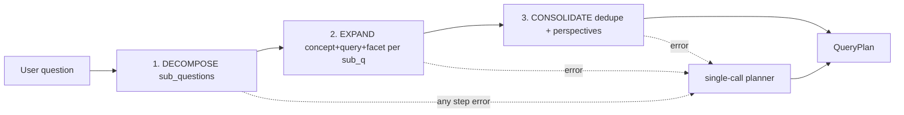

# 54 — Chained question-decomposition query planner

## Why

The single-call planner (doc 45) crams concepts + perspectives + facets + queries
into one nano JSON reply. Splitting it into an explicit prompt chain makes the
question-decomposition step first-class and lets each stage be judged and swapped.

## Flow (TUTOR_PLANNER_CHAIN=1)

3 nano calls (`max_completion_tokens=300` each), plain JSON + `strip_fences` (no
`response_format` — keeps qwen working). Default OFF; single-call planner is the
default and the fallback.

## Artifacts

- Backend: `extract_concepts_chain`, `_planner_{decompose,expand,consolidate}`,
  `_parse_{decompose,expand,consolidate}`, dispatcher `extract_concepts_ex`,
  `_extract_concepts_single`, flag `_PLANNER_CHAIN_ON` — `agents/deep_tutor.py`.
- Prompts: `PLANNER_{DECOMPOSE,EXPAND,CONSOLIDATE}_PROMPT` — `prompts/deep_tutor.py`.
- Env: `TUTOR_PLANNER_CHAIN` (doc 36 env table).
- Modal: planner node desc — `web/src/data/tutorPipeline.ts`.
- Tests: `tests/test_planner_chain.py`.
- Eval: `eval/planner_chain_compare.py` → `docs/superpowers/eval/2026-06-04-planner-chain-model-compare.md`.
