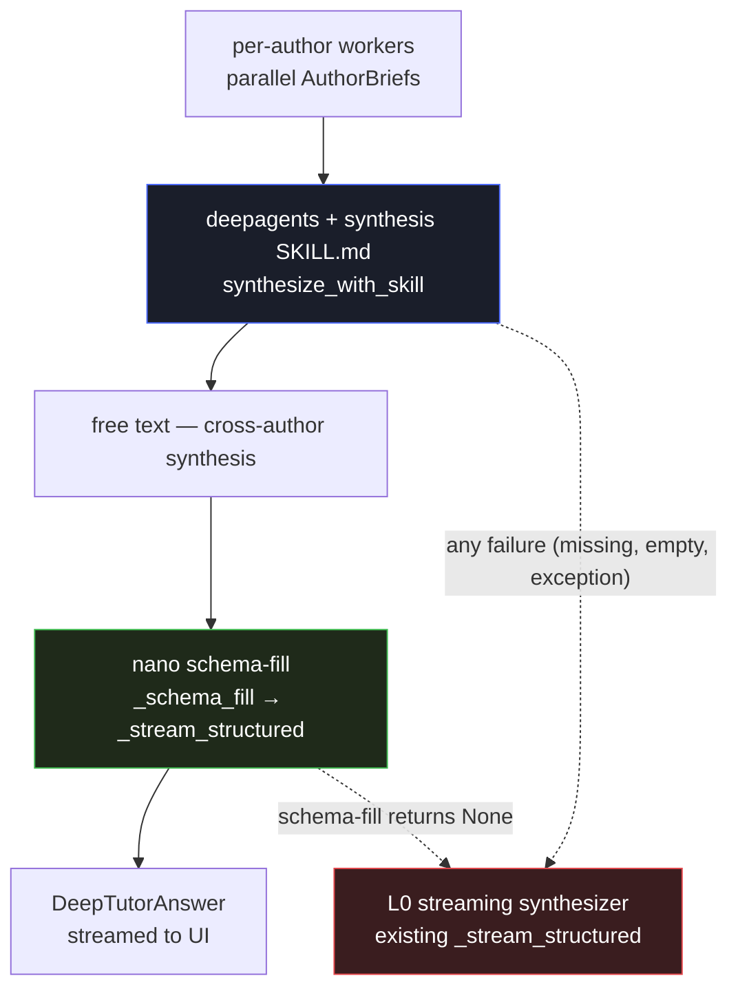

# Feature 56 — Deep synthesis (L3b / Plan D)

**Branch:** `feat/ow-harness-pland`
**Date:** 2026-06-04
**Spec:** [`docs/superpowers/specs/2026-06-04-ow-harness-pland-design.md`](../../superpowers/specs/2026-06-04-ow-harness-pland-design.md)
**Plan:** [`docs/superpowers/plans/2026-06-04-ow-harness-pland.md`](../../superpowers/plans/2026-06-04-ow-harness-pland.md)
**Verdict it builds on:** [`docs/superpowers/eval/2026-06-04-ow-deepagents-compare.md`](../../superpowers/eval/2026-06-04-ow-deepagents-compare.md)

---

## What it is

The Plan C ablation compared four synthesizer arms over 72 runs (6 questions × 3 runs each):

| Arm | Description | Quality | Fidelity | $/answer |
|---|---|---|---|---|
| **L0** | current streaming synthesizer (baseline) | 3.96 | 3.39 | ~$0.0014 |
| L3a | bare deepagents agent | — | — | — |
| **L3b** | deepagents + written synthesis `SKILL.md` | **4.39** | **4.50** | **~$0.0046** |
| L4 | deepagents + subagents-per-author | worse than L3b | — | ~$0.0073 (1.6× L3b) |

**L3b wins** on all 6 questions; the written synthesis skill is the active ingredient (L3b ≫ L3a bare). **L4 subagents were rejected** (worse quality, 1.6× cost).

Plan D productionizes L3b as an opt-in "deep synthesis" path in the orchestrator-workers stage.

---

## Triggers and gate

Two triggers feed a single `deep_synth` flag inside `run_orchestrator_workers`:

| Trigger | Mechanism | Audience |
|---|---|---|
| Per-request | `tutorWorkflow="orchestrator-deep"` — selectable in the pipeline (i) modal as **Deep synthesis (slower ~45 s)** | End-users at :5175 |
| Ops override | `TUTOR_OW_HARNESS=5` — activates L5 on any `orchestrator` request without a per-request workflow | Operators via `.env` |

The gate: `if deep_synth or ow_harness_level() == 5:` inside `run_orchestrator_workers`.

Default behavior (`tutorWorkflow="single"` / `"orchestrator"`, `TUTOR_OW_HARNESS=0`) is byte-for-byte unchanged.

---

## Flow

```
per-author workers (parallel)
       │
       ▼ (2+ AuthorBrief objects)
deepagents + synthesis SKILL.md
  (synthesize_with_skill — ow_deepagents.py)
       │
       ▼ free text (cross-author synthesis)
nano schema-fill pass
  (_schema_fill → _stream_structured)
       │
       ▼ streamed DeepTutorAnswer
SSE token* / structured_output / done
```

On any failure at either step the path falls through to the L0 streaming synthesizer with no user-visible error.

### Mermaid



---

## L3b path in detail

1. **Per-author workers** run in parallel, producing one `AuthorBrief` per author — same as the standard `orchestrator` workflow.
2. **`synthesize_with_skill`** (`src/services/chat/agents/ow_deepagents.py`) launches a `deepagents` agent with `ow_skills/synthesis/SKILL.md` loaded. The agent reads the author briefs, applies the written synthesis skill, and returns **free text** — a cross-author synthesis that may cite `[N]` markers, include LaTeX, and compare perspectives directly. This is where the quality gain lives.
3. **Nano schema-fill pass** (`_schema_fill` in `orchestrator_workers.py`): one additional nano call receives the free text + the original question and distributes the content across the `DeepTutorAnswer` fields (`tldr / definition / formal_statement / example_intuition / applications / further_reading`) without adding or removing claims. Reuses `_stream_structured` so the SSE delta stream is identical to the existing render path.
4. The result is a normal `DeepTutorAnswer` rendered by the existing frontend `TutorView`.

---

## Latency

The `synthesize_with_skill` call is a **blocking `agent.invoke`** — approximately 30–57 s before any streaming tokens appear. The schema-fill stream then starts; the first tokens arrive after the full deepagents synthesis completes.

**UX:** while `tutorWorkflow === "orchestrator-deep"` is active and no tokens have arrived yet, the UI shows:

```
Synthesizing across authors… (~45 s)
```

`web/src/App.tsx` computes the label and passes it as the `thinkingLabel` prop; `web/src/components/MessageThread.tsx` renders it in the thinking indicator.

---

## Fallback chain

Any failure degrades silently to the L0 streaming synthesizer:

| Condition | Fallback |
|---|---|
| `deepagents` not installed (`ImportError`) | L0 synthesizer |
| `synthesize_with_skill` raises any exception | L0 synthesizer |
| `synthesize_with_skill` returns empty string | L0 synthesizer |
| `_schema_fill` returns `None` | L0 synthesizer |

The default paths (`single`, `orchestrator`, `TUTOR_OW_HARNESS=0`) are byte-for-byte unchanged regardless of whether `deepagents` is installed.

---

## Synthesis model (selectable)

The deep-synthesis model is user-selectable via the `stageModels` request dict under stage key `"synth"`. Default: `gpt-5.4-nano-2026-03-17` (nano).

The selected model drives **both** steps of the deep path:
- the `synthesize_with_skill` deepagents call (ChatOpenAI backend), and
- the follow-on nano schema-fill pass (`_schema_fill`).

**Non-OpenAI coercion:** if a non-OpenAI model id is passed (e.g. `deepseek-v4-pro`, `gemini-2.5-flash`, `qwen-plus`, any Groq id), the backend coerces it to nano. Both steps require the OpenAI structured-output API; deepagents also runs on `ChatOpenAI` — routing non-OpenAI ids there would fail silently, so nano is always substituted.

**Backend resolve:** `_resolve_stage_model("synth", settings.openai_model_nano, sm)` in `deep_tutor.py`; the resolved id is passed to `run_orchestrator_workers` as `deep_synth_model`.

**Pipeline (i) modal behaviour:**
- Under `tutorWorkflow="orchestrator-deep"`: the **Synthesizer** node shows an **editable model dropdown** (default nano). Selecting a non-OpenAI id is accepted in the UI but coerced to nano by the backend.
- Under plain `"orchestrator"` (the L0 path): the Synthesizer node shows the **draft model read-only** — the L0 streaming synthesizer uses the draft model, so `stageModels.synth` is not applicable there.

---

## Env flags and request knobs

| Knob | Type | Effect |
|---|---|---|
| `tutorWorkflow="orchestrator-deep"` | per-request | Activates the deep synthesis path for this request; selectable in the pipeline (i) modal |
| `TUTOR_OW_HARNESS=5` | env | Ops override: activates L5 on any `orchestrator` request (same path as `orchestrator-deep`) |
| `stageModels.synth` | per-request | Deep-synthesis model (deepagents + schema-fill); default nano; non-OpenAI ids coerced to nano; deep path only |

See doc 36 ([36-deep-tutor.md](36-deep-tutor.md)) for the full env table.

---

## Dependency

`deepagents==0.6.8` (the version proven in Plan C) added to `requirements.txt`. It is lazy-imported inside the L5/deep_synth branch only — its absence never breaks default paths or CI.

---

## Synced artifacts

A logic change to the deep synthesis path is incomplete until **all** of these reflect it:

| Aspect | Path |
|---|---|
| Synthesizer agent | `src/services/chat/agents/ow_deepagents.py` — `synthesize_with_skill` |
| Synthesis skill | `src/services/chat/agents/ow_skills/synthesis/SKILL.md` |
| OW stage wiring | `src/services/chat/agents/orchestrator_workers.py` — `_schema_fill`, `deep_synth` param |
| Schema-fill prompt | `src/services/chat/prompts/deep_tutor.py` — `SCHEMA_FILL_PROMPT` |
| Harness level parse | `src/services/chat/agents/ow_harness.py` — `_MAX_IMPLEMENTED_LEVEL=5` |
| Dispatch | `src/services/chat/agents/deep_tutor.py` — `_resolve_workflow`, `_draft_coro`, `_resolve_stage_model("synth", …)` → `deep_synth_model` param |
| Request schema | `src/services/chat/schemas/_core.py` — `tutorWorkflow` Literal includes `"orchestrator-deep"`; `stageModels.synth` |
| Dep | `requirements.txt` — `deepagents==0.6.8` |
| Modal card data | `web/src/data/tutorPipeline.ts` — drafting-workflow node desc |
| Modal card render | `web/src/components/PipelineDiagram.tsx` — `orchestrator-deep` option; Synthesizer node editable dropdown (deep mode) / draft-model read-only (plain orchestrator) |
| Progress copy | `web/src/App.tsx` — computes `thinkingLabel`; `web/src/components/MessageThread.tsx` — renders it in the thinking indicator |
| Env table + graph | `docs/services/chat-features/36-deep-tutor.md` |
| Ablation doc | `docs/services/chat-features/55-ow-harness-ablation.md` — L3b shipped note |
| Invariants | `docs/system/invariants.md` — invariant 35 |
| Changelog | `docs/system/changelog.md` — 2026-06-04 Plan D entry |
| Tests | `src/services/chat/tests/test_ow_harness.py`, `src/services/chat/tests/test_orchestrator_workers.py`, `web/src/components/PipelineDiagram.test.tsx` |
