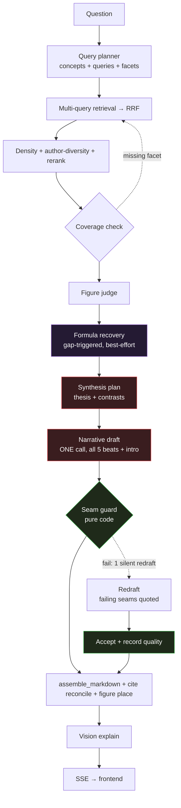

# Feature 57 — Tutor narrative rebuild (single woven synthesizer)

**Branch:** `worktree-tutor-narrative-rebuild` (based on `feat/component-equation-enforcement`)
**Date:** 2026-06-11
**Spec:** [`docs/superpowers/specs/2026-06-11-tutor-narrative-rebuild-design.md`](../../superpowers/specs/2026-06-11-tutor-narrative-rebuild-design.md)
**Plan:** [`docs/superpowers/plans/2026-06-11-tutor-narrative-rebuild.md`](../../superpowers/plans/2026-06-11-tutor-narrative-rebuild.md)

---

## What it is

The tutor mode had accreted **7 synthesis variants** — `single`, `orchestrator`, `orchestrator-deep`, `organize`, and deepagents harness levels L1–L7 — selected by the `tutorWorkflow` request knob and `TUTOR_OW_HARNESS` / `TUTOR_WORKFLOW` env flags. Answers rendered as **6 disjoint aspect blocks** with no narrative connection between them.

This rebuild:
1. **Collapses 7 synthesis variants to ONE** — a single narrative-draft call.
2. **Threads the body beats with a continuous narrative arc** — each beat opens carrying the prior thread forward and closes setting up the next. Transitions live in prose; no new schema field and no new frontend element.
3. **Carves the intro (TL;DR) out of the thread** — it stands alone, outside the 5-beat arc, so the tutor speaks *to* the reader before the story begins.
4. **Adds a pure-code seam validator** (`agents/seams.py`) — post-draft check with ONE bounded silent redraft on failure. Zero LLM overhead on happy path.
5. **Rewires formula recovery** from the deleted orchestrator-workers onto the single narrative draft.

The retrieval front (concept→query-plan→retrieval→density/rerank→author-diversity→coverage→synthesis-plan→image-judge) is **unchanged**.

---

## Pipeline

> Everything left of the narrative-draft node is the unchanged retrieval front. The synthesis tail is now ONE path.

---

## The 5-beat narrative arc

### Intro carve-out

The `tldr` field (rendered as the **Introduction** heading) stands alone, **outside** the 5-beat thread. It answers the question directly, then ends with a one-sentence roadmap of the beats that follow. Beat ① must not reference back to the intro.

### Beat → field mapping

| Beat | Existing `DeepTutorAnswer` field | In thread? | Opens carrying… | Closes setting up… |
|---|---|---|---|---|
| Intro / TL;DR | `tldr` | **No** (standalone) | — | — |
| ① Define | `definition` | Yes | thesis from the synthesis plan | formalize beat |
| ② Formalize | `formal_statement` | Yes (auto-drop when empty) | the definition just established | see-it-work beat |
| ③ See it work | `example_intuition` | Yes | formalize (or define when ② dropped) | use-it beat |
| ④ Use it | `applications` | Yes | the example just worked | go-further beat |
| ⑤ Go further | `further_reading` | Yes | the applied thread | open horizon |

**No schema renames** — the existing 6-aspect set (`tldr`, `definition`, `formal_statement`, `example_intuition`, `applications`, `further_reading`) is unchanged. Frontend rendering, `assemble_markdown`, figure placement, and citation reconcile are all unaffected.

### Formalize auto-drop

`formal_statement` is **conditionally absent**: when no source states a numbered/labelled theorem, the model emits `""`. `assemble_markdown` skips empty bodies. The seam validator detects this and replaces the ②→③ seam with a ①→③ seam; beat ③ opener must not contain theorem/formal lexemes.

### Thesis injection

The synthesis-plan `thesis` is injected by code as a `<thesis>…</thesis>` block at the top of the narrative-draft user message before the LLM call. Beat ① opens on this thesis.

---

## Seam validator (`agents/seams.py`)

Pure code — zero LLM calls, no env flag. Runs after `_post_process_draft` (midline-$$ fix, LaTeX repair) but before `assemble_markdown`.

### Rules checked per seam

| Rule | What is checked |
|---|---|
| **Lemma overlap** | First sentence of beat k+1 shares ≥1 content-lemma (stopword-stripped, lowercased, LaTeX stripped from prose) with the last sentence of beat k **or** with `plan.thesis`. |
| **Boilerplate opener guard** | ≥2 beats open with the same leading 3-gram → fail. Canned-phrase blocklist ("Now that we…") also triggers fail. |
| **Language-drift guard** | English stopword-ratio floor per beat (catches the known Polish-drift bug). |
| **Formalize-drop re-link** | When `formal_statement == ""`, the ②→③ seam is replaced by a ①→③ seam; beat ③ opener is additionally checked against a theorem-lexeme blocklist. |
| **No `$$` in seam prose** | Seam sentences (first/last of each beat) must not contain `$$…$$` blocks — the existing `_inline_midline_display` pass guarantees this; the test suite confirms it. |

### Quality scores (written into `TutorAnswer.quality`)

| Score key | Type | Meaning |
|---|---|---|
| `seam_continuity` | float 0–1 | Fraction of seams that passed the lemma-overlap check. |
| `lang_ok` | bool | All beats passed the English stopword-ratio floor. |
| `thesis_adherence` | float 0–1 | Lemma overlap of `thesis` with `tldr` + ≥2 beats. **Report-only — not a hard gate** (overlap too noisy to gate on). |

---

## Bounded redraft

On seam failure (any rule above), ONE silent, non-streamed redraft is triggered:

1. The failing seams are **quoted verbatim** in the retry user message.
2. The redraft runs via the same single-call path with the same prompt (no second LLM model).
3. **Composite acceptance**: the redraft is accepted only if it does not regress `seam_continuity` or `lang_ok` vs the first draft, and introduces no new boilerplate patterns.
4. On composite-acceptance failure (or any exception), the **first draft is kept**. The pipeline never aborts.
5. `quality` scores reflect the final accepted draft.

**Why silent is valid:** `TutorView` renders the final `structured_output.data.text` payload — the streamed deltas are a live preview. The redraft overwrites `structured_output` before the `done` event is emitted, so the redraft result is what the user sees.

---

## Formula recovery rewire

Formula recovery (`formula_gaps.py` / `formula_recovery.py` / `formula_cache.py`) was previously wired inside `run_orchestrator_workers`. With orchestrator-workers deleted, it is **re-attached to the single narrative draft** via `_recover_equations_block`, computed once before the draft call and reused by both the draft and the redraft.

Flow unchanged from invariant 37:
- `detect_formula_gaps` scans sources for OCR-dropped defining equations.
- `recover_formulas` runs per gap in parallel: global `formula_cache` → vision off figure (gpt-4o) → text re-query.
- Recovered LaTeX injected as `<recovered_equations>` block into the draft user message (used VERBATIM).
- Any failure → empty block → no regression vs pre-recovery behavior.

---

## Cut list (deleted in this rebuild)

| Deleted | What it was |
|---|---|
| `src/services/chat/agents/orchestrator_workers.py` | Per-author worker dispatch + synthesizer + `_schema_fill` |
| `src/services/chat/agents/ow_deepagents.py` | deepagents synthesizer (`synthesize_with_skill`, L5/6/7) |
| `src/services/chat/agents/ow_harness.py` | Harness-level parse + LangSmith tracing hook |
| `src/services/chat/agents/ow_skills/` | Synthesis `SKILL.md` + formula references |
| `_resolve_workflow` in `deep_tutor.py` | Workflow selector branching to 7 paths |
| `TUTOR_WORKFLOW` env flag | Default drafting-workflow override |
| `TUTOR_OW_HARNESS` env flag | Ablation harness level (0–7) |
| `TUTOR_ORGANIZE_MODEL`, `TUTOR_ORGANIZE_MAX_TOKENS`, `TUTOR_ORGANIZE_POOL` env flags | `organize` long-context workflow config |
| `TUTOR_WORKER_MODEL` env flag | Per-author worker model override |
| `tutorWorkflow` request knob | Per-request workflow selector (frontend + backend schema) |
| `plan.tasks` population | Orchestrator-only — stripped from `SYNTHESIS_PLAN_PROMPT`; `SynthesisPlan.tasks` field kept, defaulting empty |
| Harness levels L1–L7 | Ablation arms (L0=baseline; L1 LangSmith; L2 structured briefs; L3 deepagents; L4 subagents-per-author; L5 deepagents+skill+schema-fill; L6/7 structured deepagents agents) |
| `orchestrator-deep` mode in frontend modal | Workflow dropdown option removed; Synthesizer node model dropdown (deep-only) removed |
| `organize` mode in frontend modal | Workflow dropdown option removed |

**Not deleted:** the `formula_cache` Qdrant collection, `formula_gaps.py`, `formula_recovery.py`, `formula_cache.py` — these are rewired, not removed.

---

## Synced artifacts

A change to the narrative draft or seam validator is incomplete until ALL of these reflect it:

| Aspect | Path |
|---|---|
| Draft + seam guard + redraft wiring | `src/services/chat/agents/deep_tutor.py` |
| Seam validator | `src/services/chat/agents/seams.py` |
| Prompts (narrative `DEEP_TUTOR_INSTRUCTIONS`, per-beat `Field` descriptions) | `src/services/chat/prompts/deep_tutor.py` |
| Request schema (`tutorWorkflow` removed) | `src/services/chat/schemas/_core.py` |
| Schema field descriptions | `src/services/chat/schemas/output.py` |
| Modal pipeline diagram | `web/src/data/tutorPipeline.ts` + `web/src/components/PipelineDiagram.tsx` |
| Backend mermaid + env table | `docs/services/chat-features/36-deep-tutor.md` |
| HTML pipeline diagram | `docs/common ground/Elements/modes/tutor.html` |
| Invariants | `docs/system/invariants.md` — invariant 42 |
| Changelog | `docs/system/changelog.md` — 2026-06-11 narrative rebuild entry |
| Tests | `src/services/chat/tests/test_seams.py`, `test_deep_tutor.py`, `web/src/components/PipelineDiagram.test.tsx` |
