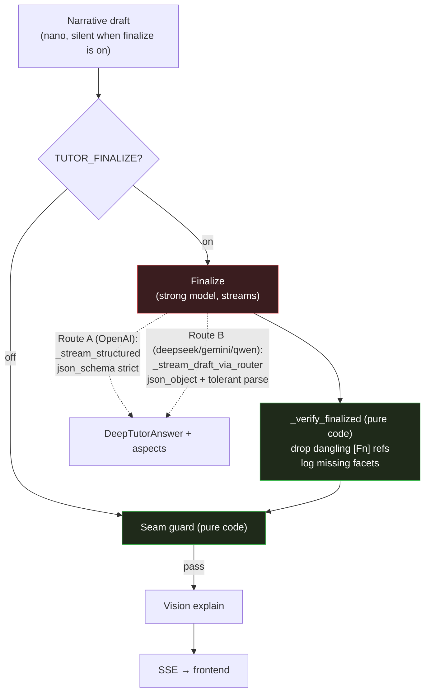

# Feature 59 — Tutor finalize + verify stage

**Branch:** `tutor-finalize-stage`
**Date:** 2026-06-18

---

## What it is

The tutor pipeline's narrative draft is produced by a cheap model (`TUTOR_DRAFT_MODEL`, default nano). On multi-faceted questions the draft can miss sub-questions, cram multiple definitions into one `formal_statements[]` box, or produce weak/incomplete math. The finalize+verify stage runs **after** the draft (and after the seam guard) and **before** vision explain: a stronger model rewrites the draft while the cheap nano draft runs silent, and the finalizer streams the result to the user.

Three problems it fixes:

1. **Multi-question completeness** — a multi-faceted question ("What are strict and weak stationarity?") often gets a draft that covers only one facet. The finalizer receives the explicit `<facets_to_cover>` list and the draft, and must cover every facet.
2. **One box per definition** — the draft can cram two definitions (strict + weak stationarity) into one `formal_statements[]` entry. The finalizer prompt's hard rule: ONE `formal_statements[]` entry per definition.
3. **Weak finalizer** — some models produce weaker math or prose; the finalizer uses the full model (`TUTOR_FINALIZE_MODEL`, default `gpt-5.4-2026-03-05`) to clean up.

---

## Pipeline



> When `TUTOR_FINALIZE` is off, the draft is the user-facing answer unchanged (current default). When on, the nano draft runs silent (no token streaming) and the finalizer is what streams to the user, so the user sees one clean, complete answer appear.

---

## Two routes, same output

The finalize stage reuses the same capability-based routing as the draft:

| Route | Models | Mechanism | Output |
|---|---|---|---|
| **A — structured** | OpenAI family (`gpt-*`) | `_stream_structured` — strict `json_schema` via `beta.chat.completions.parse()` | `DeepTutorAnswer` + `aspects` dict |
| **B — tolerant** | deepseek, gemini, qwen, groq | `_stream_draft_via_router` — `json_object` + `<output>` contract + `_loads_tolerant_json_object` parse | `DeepTutorAnswer` + `aspects` dict |

**Key design insight (bake-off finding):** only `gpt-5.4` worked out-of-the-box with strict `json_schema` for the finalize prompt. deepseek/gemini/qwen produced malformed or wrapped JSON when given the same schema. The fix: `DEEP_TUTOR_FINALIZE_INSTRUCTIONS` includes an explicit `<output>` block listing the exact `DeepTutorAnswer` JSON keys, so Route-B models emit the correct shape even without strict schema enforcement. Both routes return the same `(DeepTutorAnswer, aspects)` tuple; downstream code is route-agnostic.

---

## Best-effort fallback

If the finalizer returns `None` or empty aspects, the **draft answer is kept** — the pipeline never blanks a user-facing answer. `finalize_applied` in `retrieval_meta` reflects whether the finalizer's output was adopted (`True`) or the draft was kept (`False`).

```python
# deep_tutor.py — best-effort adoption
if fin_deep is not None and (set(fin_aspects or {}) & set(ASPECT_HEADINGS)):
    deep, aspects = fin_deep, fin_aspects
    finalize_applied = True
else:
    logger.info("finalize degraded (%s); keeping draft answer", m_finalize)
```

---

## Pure-code verify guards (`_verify_finalized`)

After the finalizer overwrites the draft, `_verify_finalized` runs two checks before the seam guard:

1. **Drop dangling `[Fn]` figure references** — any `[Fn]` marker whose figure has no URL (empty or whitespace `url`) is stripped from the aspect text. Prevents broken inline figure references.
2. **Log missing facets** — each facet from the planner's `facets` list that does not appear (case-insensitive) in the joined aspect text is logged at `INFO`. This is advisory; it never blocks or modifies the answer.

Both guards are pure code (no LLM calls, no env flags).

---

## Environment variables

| Var | Default | Meaning |
|---|---|---|
| `TUTOR_FINALIZE` | `0` (OFF) | Enable the finalize+verify stage. When `0` or `false` or empty, the draft answer is the final answer (no finalize hop). Any other value enables it. |
| `TUTOR_FINALIZE_MODEL` | `gpt-5.4-2026-03-05` (full model) | Model used for the finalize call. Per-request `stageModels["finalize"]` overrides this. Set to `"off"` to disable finalize for that request even when `TUTOR_FINALIZE=1`. |
| Per-request `stageModels.finalize` | — | A model id (routes via Route A or B) or `"off"` to skip per-request. |

---

## SSE meta fields

The `retrieval_meta` event now carries three finalize-specific fields:

| Field | Type | Meaning |
|---|---|---|
| `finalizeModel` | `string \| null` | The model id used for the finalize call, or `null` when finalize is off. |
| `finalizeRoute` | `"structured" \| "tolerant" \| null` | Which route was used: `"structured"` for OpenAI-family (json_schema), `"tolerant"` for deepseek/gemini/qwen (json_object + tolerant parse), `null` when finalize is off. |
| `finalizeApplied` | `boolean` | `true` when the finalizer's output was adopted as the user-facing answer; `false` when the draft was kept (finalizer failed/empty). |

---

## Frontend badge

When `finalizeApplied` is `true` and `finalizeModel` is non-null, the `MessageThread` renders a badge:

```
Finalized · gpt-5.4 · structured
```

This appears in the per-message footer alongside the existing MODE · sources · latency badges. Hidden when finalize is off or the finalizer degraded to draft.

---

## Files

| Path | Role |
|---|---|
| `src/services/chat/agents/deep_tutor.py` | `_stream_finalize`, `_build_finalize_message`, `_verify_finalized`, `FINALIZE_ON`, best-effort adoption logic, `retrieval_meta` fields |
| `src/services/chat/prompts/deep_tutor.py` | `DEEP_TUTOR_FINALIZE_INSTRUCTIONS` — system prompt for the finalizer |
| `src/services/chat/schemas/_core.py` | `stageModels` finalize key |
| `web/src/data/tutorPipeline.ts` | Pipeline diagram node (`finalize`, generation phase) |
| `web/src/components/PipelineDiagram.tsx` | Node height for finalize |
| `web/src/components/MessageThread.tsx` | `Finalized · model · route` badge |
| `web/src/types.ts` | `finalizeModel`, `finalizeRoute`, `finalizeApplied` on `RetrievalMetadata` |

---

## Tests

- `test_deep_tutor.py` — `_build_finalize_message` includes draft + facets; `_verify_finalized` strips dangling `[Fn]` and logs missing facets; `_stream_finalize` returns `(None, {})` on failure (best-effort); retrieval_meta carries `finalizeModel`/`finalizeRoute`/`finalizeApplied` matching route.
- `PipelineDiagram.test.tsx` — finalize node present, wired `draft → finalize → vision_explain`, swappable model.
- `MessageThread.test.tsx` — badge shown when applied; hidden when not applied or model is null.