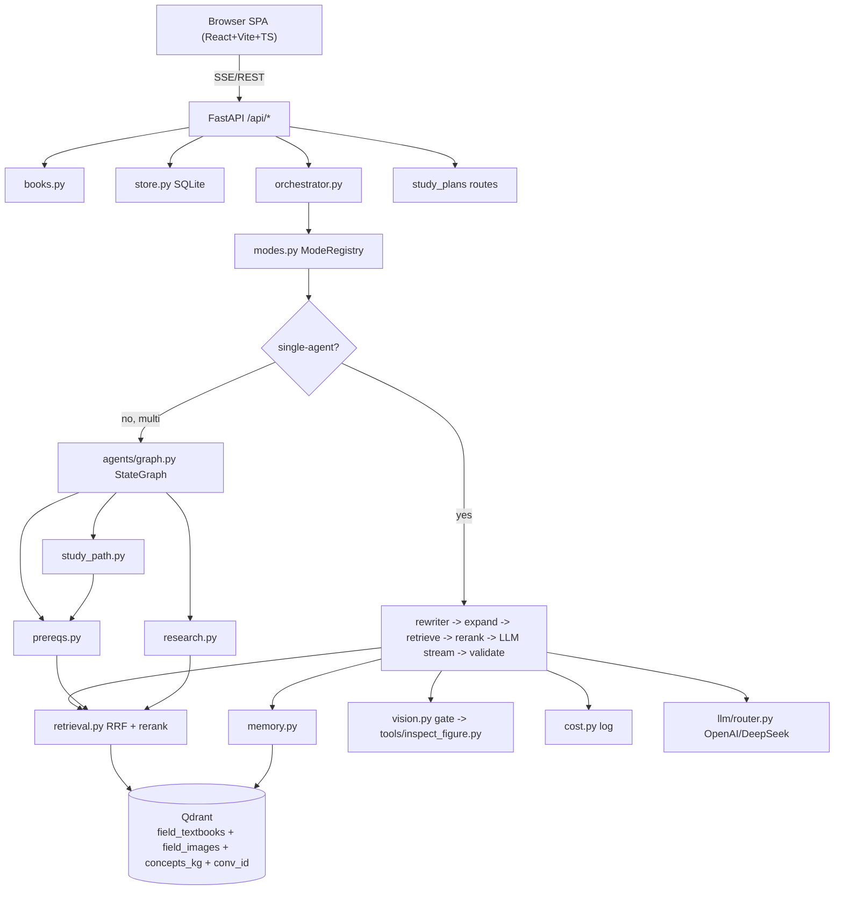

# Chat service — feature catalogue

Index of every feature built across Part 2 (Phase 0 + Waves 1-4 = 10 milestones).

Each doc: purpose, code snippet, flow graph (mermaid), tests, files touched.

## Backend infra

| Doc | Feature | Path |
|---|---|---|
| [01](01-book-registry.md) | Book registry + `/api/books` | `src/services/chat/books.py` |
| [02](02-retrieval-rrf.md) | Hybrid RRF retrieval | `src/services/chat/retrieval.py` |
| [03](03-highlights.md) | Sentence-level highlight reranker | `src/services/chat/highlights.py` |
| [04](04-reranker.md) | Cross-encoder reranker (M1) | `src/services/chat/rerankers.py` |
| [05](05-query-expansion.md) | HyDE + multi-query + decompose (M3) | `src/services/chat/query_expansion.py` |
| [06](06-llm-router.md) | OpenAI + DeepSeek async streaming | `src/services/chat/llm/` |
| [07](07-mode-registry.md) | 11 modes + ModeSpec + schemas (M2) | `src/services/chat/modes.py`, `schemas/output.py` |
| [08](08-schema-repair.md) | Pydantic validate + 1 repair retry | `schemas/output_repair.py` |
| [09](09-memory.md) | Sliding/summary/vec memory (M9) | `src/services/chat/memory.py` |
| [10](10-multi-agent-runner.md) | Roll-own state graph runner (M5 ADR-001) | `src/services/chat/agents/graph.py` |
| [11](11-prereqs-mode.md) | Mode 6 prereqs DAG (M5) | `src/services/chat/agents/prereqs.py` |
| [12](12-kg-persistence.md) | `concepts_kg` Qdrant collection (M5) | `src/services/chat/kg.py` |
| [13](13-research-mode.md) | Mode 8 research stance (M6) | `src/services/chat/agents/research.py` |
| [14](14-vision-gate.md) | Caption-score vision gate (M8) | `src/services/chat/vision.py` |
| [15](15-inspect-figure.md) | gpt-4o vision tool (M8) | `src/services/chat/tools/inspect_figure.py` |
| [16](16-cost-log.md) | LLM cost estimator + log (M8) | `src/services/chat/cost.py` |
| [17](17-study-path.md) | Mode 10 multi-agent + persist + replan (M7) | `src/services/chat/agents/study_path.py` |
| [18](18-store.md) | SQLite conversations + messages + prefs + study_plans | `src/services/chat/store.py` |
| [19](19-sse-orchestrator.md) | SSE event pipeline | `src/services/chat/orchestrator.py` |
| [20](20-api.md) | FastAPI app + routes | `src/services/chat/api.py` |
| [21](21-eval.md) | Eval harness + 4 metrics (M4) | `src/services/eval/` |

## Frontend

| Doc | Feature | Path |
|---|---|---|
| [22](22-frontend-shell.md) | Tokens + Topbar/Sidebar/ContextPanel | `web/src/{styles,components}` |
| [23](23-frontend-chat-ui.md) | MessageThread + InputBar + SSE client + KaTeX | `web/src/{state,components,api}` |
| [24](24-frontend-modals.md) | BookModal + SourceModal + FocusModal | `web/src/components/modals/` |
| [25](25-frontend-mode-views.md) | 7 per-mode views (M10) | `web/src/components/views/` |

## Cross-cutting

| Doc | Feature |
|---|---|
| [26](26-chinese-wall.md) | Wall enforcement + import rules |
| [27](27-config.md) | `src/core/config.py` settings reference |
| [28](28-tests.md) | 212 backend + 14 eval tests + how to run |
| [29](29-sse-protocol.md) | SSE event types reference (10 event kinds) |

## Frontend polish (2026-05-18)

| Doc | Feature | Path |
|---|---|---|
| [30](30-stats-pill.md) | Stats pill in topbar (phase + duration + tokens) | `web/src/components/Topbar.tsx` |
| [31](31-streaming-motion.md) | Thinking pill + caret + formatting shimmer | `web/src/components/MessageThread.tsx`, `styles/app.css` |
| [32](32-config-button.md) | Config button + red-accent popover | `web/src/components/SettingsPicker.tsx`, `styles/tutor.css` |
| [33](33-sidebar-conv-load.md) | Sidebar conversation load (`LOAD_CONVERSATION`) | `web/src/components/Sidebar.tsx`, `state/chat.ts`, `App.tsx` |
| [34](34-figure-image-serving.md) | `/api/figures` route + real image previews | `src/services/chat/api.py`, `retrieval.py`, `MessageThread.tsx` |
| [35](35-strict-red-dark-mode.md) | Strict-red dark mode + IconBook swap | `web/src/styles/{neon,app}.css`, `Topbar.tsx`, `ContextPanel.tsx`, `MessageThread.tsx` |
| [36](36-tutor-restyle.md) | Tutor view restyle: red accents, collapsible sources, Claude-Code thinking | `web/src/styles/{tutor,app}.css`, `TutorView.tsx`, `MessageThread.tsx` |
| [37](37-conv-load-fix.md) | Conversation load fix: persistence + active title + empty-state hint | `web/src/state/chat.ts`, `App.tsx`, `MessageThread.tsx` |
| [38](38-tutor-layout.md) | Tutor view layout: justified text, centered headings, math cleanup, per-section toggle | `TutorView.tsx`, `Math.tsx`, `web/src/styles/{tutor,app}.css` |
| [39](39-image-judge.md) | Image pertinence judge + auto-figure inclusion (Tier-1 caption / Tier-2 vision); ``figures_full`` SSE event | `agents/image_judge.py`, `retrievers/image_density.py`, `agents/deep_tutor.py`, `schemas/output.py` |
| [40](40-image-only-ingest.md) | Image-only ingest pipeline (VLM + EPUB formats, chunked upsert, preflight audit) | `src/ingestion/ingest_images_only.py`, `pipeline.py:_persist_images`, `ops/scripts/preflight_image_ingest.py` |

## Architecture (high level)

Generated 2026-05-17 from completed milestones. Update entries when behavior changes.
