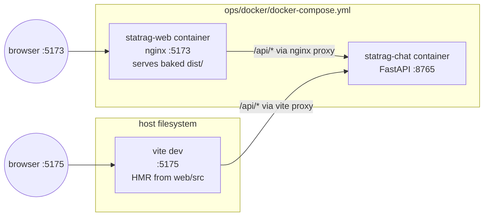
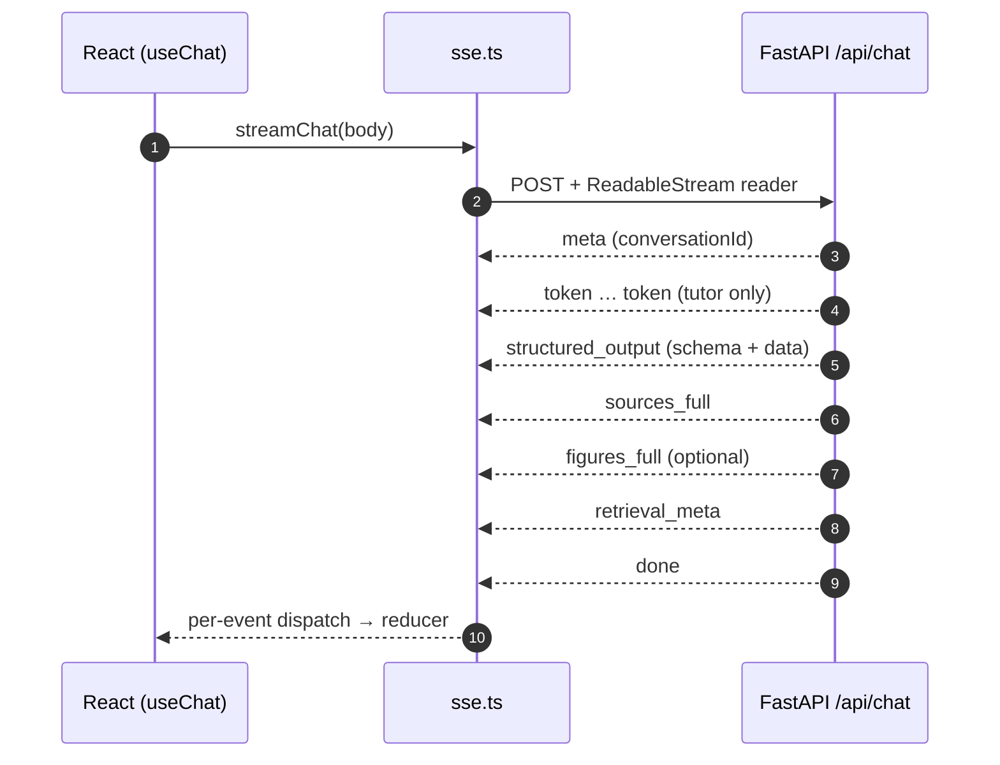

# Frontend — `statrag-chat` web SPA

The browser-facing client for the chat service. A small React + Vite + TypeScript
single-page app that talks to the FastAPI backend over a JSON POST + Server-Sent
Events response. Lives entirely under [`web/`](../../web/).

This document is the canonical reference for the frontend. For the backend
contract see [`chat.md`](chat.md); for per-feature deep-dives see
[`chat-features/`](chat-features/README.md).

---

## 1. Stack

| Layer | Choice | Notes |
|---|---|---|
| Framework | React 18 (function components + hooks) | `useReducer` for chat state |
| Build / dev server | Vite 5 | `web/vite.config.ts` |
| Language | TypeScript (strict) | `web/tsconfig.json` |
| Math rendering | KaTeX | inline `$...$` and display `$$...$$` blocks |
| Markdown | Hand-rolled minimal parser in `TutorView` | no `react-markdown` dependency |
| SSE transport | `fetch` + `ReadableStream` reader | `web/src/api/sse.ts` |
| State | Local `useReducer` in `useChat` | no Redux / Zustand |

No global state library, no routing library (single view). The whole app boots
from `web/src/main.tsx` → `App.tsx`.

---

## 2. Source map

```
web/
├── index.html                         Vite entry HTML
├── vite.config.ts                     dev server (:5173) + /api proxy
├── package.json
├── public/                            static assets served as-is
└── src/
    ├── main.tsx                       ReactDOM.createRoot bootstrap
    ├── App.tsx                        top-level layout (Sidebar | main | ContextPanel)
    ├── types.ts                       shared TS types (Message, ChatEvent, TutorAnswer, …)
    │
    ├── api/
    │   ├── client.ts                  non-SSE REST helpers (conversations CRUD, books)
    │   └── sse.ts                     streamChat() — POST /api/chat, parse SSE frames
    │
    ├── state/
    │   ├── chat.ts                    useChat() hook + reducer + ChatSettings
    │   └── tweaks.ts                  UI tweak knobs (theme etc.)
    │
    ├── components/
    │   ├── Topbar.tsx                 header
    │   ├── Sidebar.tsx                conversation list
    │   ├── ContextPanel.tsx           right rail (sources + figures)
    │   ├── InputBar.tsx               textarea + send + toolbar
    │   ├── ModePicker.tsx             mode dropdown
    │   ├── ModelPicker.tsx            model dropdown
    │   ├── SettingsPicker.tsx         T20 — temperature / top_k / rerank popover
    │   ├── SettingsDrawer.tsx         legacy floating drawer (replaced by Picker)
    │   ├── MessageThread.tsx          renders the message list
    │   ├── Math.tsx                   KaTeX wrappers
    │   ├── Icons.tsx                  inline SVGs
    │   ├── TempChat.tsx               welcome / empty-state pane
    │   ├── modals/                    confirm + book picker dialogs
    │   └── views/                     one component per structured_output schema
    │       ├── TutorView.tsx          T19 — TutorAnswer renderer
    │       └── (non-tutor view files removed 2026-05-31)
    └── styles/                        CSS modules / globals
```

The single most important boundary in the tree is `views/` — each file there is
a self-contained renderer for one backend schema and is selected by
`MessageThread.tsx` based on `structuredOutput.schema`.

---

## 3. Two dev modes (`:5173` Docker vs `:5175` Vite)

The dev machine runs *two* frontends that look identical in the browser but
serve very different bytes. Pick the right one or you will spend an afternoon
debugging code that is not actually deployed.

### Topology



### Comparison

| Property | `:5173` Docker (`statrag-web`) | `:5175` local Vite |
|---|---|---|
| Source of truth | `dist/` baked into image at build | `web/src/` on disk |
| Hot reload | No | Yes (HMR) |
| Updated by | `docker compose build web && docker compose up -d web` | save the file |
| Process | nginx serving static assets | `npm run dev` |
| Defined in | `ops/docker/Dockerfile.web` + `ops/docker/nginx.conf` | `web/vite.config.ts` |
| `/api/*` proxy | nginx `proxy_pass` → `statrag-chat:8765` | Vite proxy → `http://localhost:8765` |
| Use when | Verifying the actual prod image | Day-to-day frontend dev |

### Quick checks

```bash
# Docker frontend is up
curl -fsS http://localhost:5173/ | head -3

# Vite dev frontend is up
curl -fsS http://localhost:5175/ | head -3

# Backend reachable through Vite proxy
curl -fsS http://localhost:5175/api/health

# Backend reachable through nginx proxy
curl -fsS http://localhost:5173/api/health
```

### Rebuild the Docker frontend after edits

```bash
cd /home/iohan/Documents/toolbox/AI_models/RAG
docker compose -f ops/docker/docker-compose.yml build web
docker compose -f ops/docker/docker-compose.yml up -d web
```

There is no volume mount on `statrag-web`; without a rebuild, `:5173` is stale.

### Run local Vite dev

```bash
cd /home/iohan/Documents/toolbox/AI_models/RAG/web
npm install      # one-time
npm run dev      # serves :5173 by default; override with --port 5175 if conflict
```

`scripts/dev.sh` from the repo root launches both backend (`:8000`/`:8765`) and
frontend together — see [`chat.md`](chat.md).

---

## 4. Component reference

### 4.1 `TutorView` — `web/src/components/views/TutorView.tsx`

Renderer for `structured_output.schema === "TutorAnswer"`. The TutorAnswer
payload has the shape:

```ts
interface TutorAnswer {
  text: string;                 // markdown w/ H2 sections + [N] citation markers
  citations: TutorCitation[];   // sources to render in the panel
  figures?: TutorFigure[];      // optional
}
```

Key behaviours:

| Concern | Implementation |
|---|---|
| Markdown parsing | Hand-rolled: splits on `^## ` for sections, paragraphs by blank line, math by `$$…$$` and `$…$`. No external markdown lib. |
| Truncation | Parsing **stops at the `## Sources` heading**. Anything below is ignored — the panel comes from `citations[]`, not from the markdown. |
| Inline citations | `[N]` tokens inside paragraph text become `<a href="#cite-N">[N]</a>` pills. |
| Sources panel | At the bottom of the view, one card per `TutorCitation`, anchored at `id="cite-N"`. |
| APA formatting | `formatApa(c: TutorCitation)` builds an APA-ish string. **Null fields are omitted entirely** — no `"null"`, `"n.d."`, or `"Unknown"` placeholders ever appear. |
| Figure handling | Optional inline `[FIG:id]` markers resolve against `data.figures`. |

The view is **deterministic w.r.t. citation indices**: see §6 on the backend
reconciler contract — the frontend assumes `text` markers and
`citations[].index` already match and does not renumber.

### 4.2 `SettingsPicker` — `web/src/components/SettingsPicker.tsx`

Per-message override knobs (temperature, top_k, rerank). Replaces the earlier
floating FAB / drawer (`SettingsDrawer.tsx`, still in the tree but unmounted).

UX mirrors `ModelPicker`:

- **Trigger** lives inside the `InputBar` toolbar.
- **Button label** is a one-line summary chip, e.g. `⚙ T:auto · k:auto` or
  `⚙ T:0.7 · k:5 · rr`.
- **Card** opens upward above the button.
- **Dismiss** on click-outside or `Esc`.

Controls:

| Control | Range | `null` semantics |
|---|---|---|
| `temperature` | slider, 0 – 2 step 0.1 | unset → backend mode default |
| `top_k` | number input, 1 – 20 | unset → backend mode default |
| `rerank` | checkbox (tri-state via clear) | unset → backend mode default |

A "Reset" link in the card sets all three back to `null`.

### 4.3 `MessageThread` — `web/src/components/MessageThread.tsx`

Renders the linear list of `Message` objects. Per assistant message:

```
if (msg.structuredOutput) {
    // hide raw token stream (msg.blocks)
    route by msg.structuredOutput.schema → matching view in views/
} else {
    // legacy path — render msg.blocks (text / math / list / …)
}
```

Schema → view mapping (lines ~329–360):

| `schema` | View |
|---|---|
| `TutorAnswer` | `TutorView` |

(Non-tutor schema→view mappings removed 2026-05-31.)

---

## 5. State management

### `useChat` — `web/src/state/chat.ts`

Single hook that owns the chat reducer. Signature:

```ts
useChat({
  mode: string;
  model: string;
  bookFilter: string[] | "ALL";
  settings?: ChatSettings;
}): {
  state: ChatState;
  sendMessage(text: string): Promise<void>;
  resetThread(): void;
  loadConversation(id: string, messages: Message[]): void;
}
```

`ChatSettings` (lines 334–338):

```ts
interface ChatSettings {
  temperature?: number | null;
  top_k?: number | null;
  rerank?: boolean | null;
}
```

Plumb-through (lines 366–375): `sendMessage` builds a `ChatRequestBody` with
`temperature: settings?.temperature ?? null` and the same for `top_k` /
`rerank`. The body goes straight to `streamChat()` and from there to
`POST /api/chat`. The backend `ChatRequest` reads these three fields; if `null`,
the mode's preset takes over.

State shape highlights:

- `messages: Message[]` — full thread, user + assistant
- `sources: Source[]` / `figures: Figure[]` — last assistant turn's retrieval
- `metadata: RetrievalMetadata | undefined`
- `status: "idle" | "streaming" | "error"`
- `streamingPhase: "idle" | "thinking" | "writing"`
- `conversationId: string | null` — set on first `meta` event

The reducer reacts to a single `EVENT` action whose payload is a `ChatEvent` —
see §6.

---

## 6. API contract

### Request: `ChatRequestBody` (`web/src/api/sse.ts`)

```ts
interface ChatRequestBody {
  conversationId?: string | null;
  message: string;
  mode: string;                       // "tutor"
  model: string;                      // backend-recognised id
  bookFilter: string[] | "ALL";       // book slugs or sentinel
  temperature?: number | null;        // T20 settings
  top_k?: number | null;
  rerank?: boolean | null;
}
```

POSTed to `/api/chat` with `accept: text/event-stream`. The Vite/nginx layer
proxies to `http://localhost:8765/api/chat`.

### Response: SSE event order

Standard (single-agent) flow:

```
meta → token* → structured_output → sources_full → figures_full? → retrieval_meta → done
```

On failure (any phase):

```
error → done
```

Each frame is `data: <json>\n\n` where `<json>` is a `ChatEvent` discriminated
union from `web/src/types.ts`. Frame parsing handles both `\n\n` and
`\r\n\r\n` separators (sse-starlette emits CRLF).



### structured_response invariants

The backend's `_reconcile_tutor_citations` (in
`src/services/chat/router.py`) guarantees, for `TutorAnswer` payloads:

1. Every `[N]` marker in `text` appears in `citations[].index`.
2. Every `citations[].index` is referenced by at least one `[N]` marker in
   `text` (orphans are dropped).
3. Indices are 1-based and contiguous in render order.

**The frontend does not renumber, dedupe, or repair citations.** `TutorView`
reads `text` and `citations` as already consistent. If a citation pill looks
wrong, the bug is in the reconciler, not in the view.

---

## 7. Build & deploy

### Local dev (recommended)

```bash
cd web && npm run dev    # :5173 (or :5175 if 5173 is taken by Docker)
```

Edits to `web/src/**` reload instantly. The backend in `statrag-chat` is
unaffected.

### Rebuild the production image after frontend edits

```bash
cd /home/iohan/Documents/toolbox/AI_models/RAG
docker compose -f ops/docker/docker-compose.yml build web
docker compose -f ops/docker/docker-compose.yml up -d web
```

`Dockerfile.web` is a multi-stage build:

1. `node:20-alpine` runs `npm ci && npm run build` → emits `dist/`.
2. `nginx:alpine` copies `dist/` and `ops/docker/nginx.conf`.

`nginx.conf` serves `dist/` and reverse-proxies `/api/*` to the
`statrag-chat` service over the compose network.

### One-line full-stack dev launcher

```bash
./scripts/dev.sh
```

Starts FastAPI (`uvicorn`) and `npm run dev` together.

---

## 8. Known limitations / Phase 2 candidates

| Item | Notes |
|---|---|
| `SettingsPicker` chip always visible | `SettingsPicker` is mounted unconditionally. The chip shows "T:0.7" even when temperature is irrelevant — consider hiding or annotating it contextually. |
| `SettingsDrawer.tsx` is dead code | Replaced by `SettingsPicker`. Safe to delete after one more release. |
| Markdown parser in `TutorView` is hand-rolled | Adequate for the constrained TutorAnswer format, but does not handle nested lists, tables, or fenced code. A future schema needing those should adopt `react-markdown` + remark-math. |
| No global error boundary | A render exception in any view crashes the whole tree. Wrap each `views/*` in a small error boundary. |
| No client-side routing | URL never reflects `conversationId`. Deep-linking requires adding `react-router` or equivalent. |
| `:5173` vs `:5175` is implicit | The two servers are easy to confuse. Consider renaming the Docker exposure to `:5180` to disambiguate. |
| SSE reconnection | `streamChat` does not retry on transient network drops. A long pause kills the stream silently. |
| Citation pill scroll-into-view | Clicking `[N]` jumps via anchor; no smooth scroll or highlight pulse. |

---

## See also

- Backend contract: [`chat.md`](chat.md)
- Per-feature mode docs: [`chat-features/`](chat-features/README.md)
- Architecture overview: [`../system/architecture.md`](../system/architecture.md)
- Invariants (incl. citation reconciler): [`../system/invariants.md`](../system/invariants.md)
