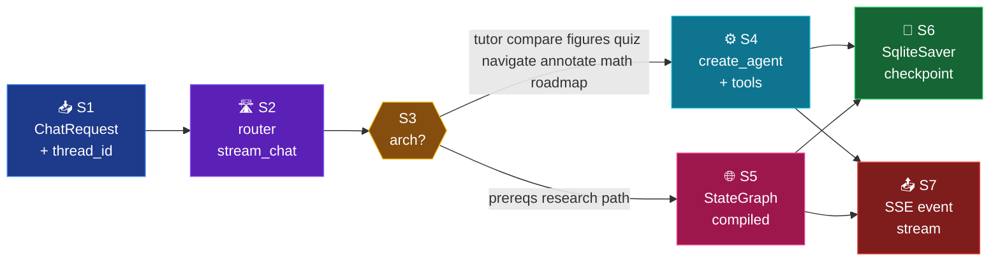

# Chat Modes — Developer Documentation (v2)

Per-mode reference for the 11 chat modes implemented in `src/services/chat/`.
**Phase 1 complete (2026-05-18)** — all modes now run on LangChain 1.0 +
LangGraph 1.2. ADR-001 (roll-own runner) superseded by ADR-006.

Each per-mode file contains: TL;DR card, ModeSpec, dependency pipeline, the
actual `create_agent` / `StateGraph` call, tool list, schema, synopsis.

---

## TL;DR

```
11 modes  •  2 architectures  •  6 LangChain tools  •  1 SqliteSaver checkpointer
```

| Arch | Modes | Runner | Source |
|------|-------|--------|--------|
| `single` | tutor · compare · figures · quiz · navigate · annotate · math · roadmap | `langchain.agents.create_agent` | `src/services/chat/mode_impls/*.py` |
| `multi`  | prereqs · research · path | `langgraph.graph.StateGraph` | `src/services/chat/agents/{prereqs,research,study_path}_lg.py` |

---

## System pipeline



---

## Mode index

| # | Mode | Arch | Model tier | Schema | Doc |
|---|------|------|------------|--------|-----|
| 1 | tutor    | single | nano        | *free text* (no schema) | [tutor.md](tutor.md) |
| 2 | compare  | single | full        | `CompareAnswer`         | [compare.md](compare.md) |
| 3 | figures  | single | full+vision | `FiguresAnswer`         | [figures.md](figures.md) |
| 4 | quiz     | single | nano        | `Quiz`                  | [quiz.md](quiz.md) |
| 5 | navigate | single | nano        | `NavigationList`        | [navigate.md](navigate.md) |
| 6 | prereqs  | multi  | nano        | `DAG`                   | [prereqs.md](prereqs.md) |
| 7 | annotate | single | nano        | `AnnotatedReading`      | [annotate.md](annotate.md) |
| 8 | research | multi  | nano        | `Report`                | [research.md](research.md) |
| 9 | math     | single | full+vision | `MathAnswer`            | [math.md](math.md) |
| 10 | path    | multi  | nano        | `StudyPlan`             | [path.md](path.md) |
| 11 | roadmap | single | full        | `Roadmap`               | [roadmap.md](roadmap.md) |

---

## LangChain layer — what each piece is

### `create_agent` — single-agent modes

`src/services/chat/mode_impls/<mode>.py` calls
`langchain.agents.create_agent(...)` with five args:

```python
create_agent(
    model=f"openai:{settings.openai_model_nano}",   # or full / pro_vision
    tools=[retrieve, retrieve_per_book, ...],        # @tool functions
    system_prompt=INSTRUCTIONS,                       # mode-specific prompt
    response_format=Quiz,                             # Pydantic schema; omitted for tutor
    checkpointer=get_checkpointer(),                  # shared SqliteSaver
)
```

LangChain compiles this into a LangGraph w/ two nodes — `agent` (LLM call)
and `tools` (ToolNode) — with conditional edges that loop until the LLM
emits a final answer. We never write that graph by hand.

### Tool surface

`src/services/chat/tools/`:

| Tool | Args | Returns | Used by |
|------|------|---------|---------|
| `retrieve` | `query, k, book_filter, rerank, adjacent_sections` | JSON list of sources | all single-agent |
| `retrieve_per_book` | `query, books, k_per_book, rerank` | JSON dict[book → sources] | compare |
| `retrieve_figures` | `query, k, book_filter` | JSON list of figures | figures, math |
| `inspect_figure_tool` | `figure_ref, chart_url, caption, query, book, chapter` | str (gpt-4o description) | figures, math |
| `extract_terms` | `text, max_terms` | JSON list[str] | annotate |
| `kg_neighbors` | `label, k` | JSON list of concepts | (Phase 3) prereqs, annotate, path |

All are `@tool`-decorated. `args_schema` exposes the JSON-Schema for OpenAI
function-calling — confirmed by `tests/test_t08_tools.py`.

### `response_format` — structured-output (ADR-008)

For every mode except tutor, the agent declares
`response_format=<PydanticSchema>`. OpenAI enforces the schema at decode
time. The legacy `_validate_and_repair` (ADR-005) effectively never fires
for OpenAI providers and is now a DeepSeek-only fallback.

### `SqliteSaver` checkpointer

`src/services/chat/checkpointer.py` exposes a process-singleton
`SqliteSaver` at `data/checkpoints.db`. `thread_id` = `conversationId`.

- v1's `memory.py` (sliding / summary / vec) is now unused for v2 modes.
- Multi-turn memory comes for free: LangGraph re-loads thread state on
  every `invoke` / `astream`.
- `data/chat.db` (SQLite) still holds the canonical message log via
  `store.append_message` (B1 fix). One source of truth at the message
  level, one at the agent-state level — they no longer disagree.

#### Async checkpointer (T22)

The checkpointer module now exposes **two** factories that share the
same SQLite file (`src/services/chat/checkpointer.py:53-139`):

| Factory | Saver | Caller |
|---|---|---|
| `get_checkpointer()` | `SqliteSaver` (sync) | tests, sync graph paths, multi-agent setup |
| `get_async_checkpointer()` | `AsyncSqliteSaver` (aiosqlite) | router's `agent.astream(...)` paths |

`get_async_checkpointer()` is `async def` and **MUST be awaited from an
active event loop** — the underlying `AsyncSqliteSaver.__init__` binds
its internal `asyncio.Lock` to the running loop, and downstream
`aget_tuple` calls fail silently if invoked from a different loop. The
sync side owns table creation via `_ensure_tables_exist()`
(`checkpointer.py:82-96`); the async factory calls it before
constructing its aiosqlite connection so an async-only process still
bootstraps correctly.

#### Cold start caveat

The first request after container start takes **~50 s** because
fastembed (BM25 sparse encoder) and the BGE cross-encoder reranker
weights are lazy-loaded on first use. Subsequent requests on the same
process are warm. A Phase 2 ticket will preload both at FastAPI
startup; until then, treat the first hit as a one-off warm-up.

### Streaming + adapter

`stream_chat` in `src/services/chat/router.py`:

1. Look up `req.mode` in `_STRUCTURED_V2_MODES` or special-case `tutor` / multi-agent.
2. Build (or reuse cached) compiled agent / graph.
3. Call `agent.astream(input, config, stream_mode=["messages", "updates"])`.
4. Translate LangGraph events to v1 SSE schema so the frontend ships unchanged.

`stream_mode="messages"` → token deltas (yielded as `{"type":"token","text":...}`).
`stream_mode="updates"` → state deltas; we mine `messages` for `ToolMessage` results
(captures retrieved sources + figures) and pick up the terminal
`structured_response` for `structured_output` SSE.

---

## LangGraph layer — multi-agent modes

`src/services/chat/agents/{prereqs,research,study_path}_lg.py` each build
a `langgraph.graph.StateGraph` declaratively. Key constructs used:

| Construct | Where | Why |
|-----------|-------|-----|
| `StateGraph(<TypedDict>)` | all 3 | Declare typed state with reducers (`operator.add` for parallel collectors). |
| `add_edge(START, "node")` | all 3 | Linear flow. |
| `add_conditional_edges(node, fn, [...])` | research, path | Branch + fan-out. |
| `Send(node, payload)` | research, path | Spawn parallel workers per claim / sub-goal. |
| `RetryPolicy(max_attempts=N)` | prereqs (`retrieve` node) | Transient-failure retry. |
| `Annotated[list, operator.add]` | research (`classified`), path (`sub_concepts`) | Parallel reducer to merge worker output. |

Same `SqliteSaver` instance — replan / time-travel for `path` mode is now
free via `graph.get_state_history(config)`.

---

## SSE event order (unchanged from v1 for frontend compat)

| Arch | Sequence |
|------|----------|
| single | `meta → token* → [structured_output] → source_chip* → sources_full → [figures_full] → retrieval_meta → done` |
| multi  | `meta → structured_output → done` |

On exception: `error → done`.

---

## Source map (v2)

| Concern | v2 location |
|---------|-------------|
| Dispatcher (v1↔v2 feature flag + SSE adapter) | `src/services/chat/router.py` |
| Single-agent builders | `src/services/chat/mode_impls/<mode>.py` + `_common.py` |
| Tools | `src/services/chat/tools/*.py` |
| Multi-agent graphs (v2) | `src/services/chat/agents/{prereqs,research,study_path}_lg.py` |
| Multi-agent nodes (shared async fns) | `src/services/chat/agents/nodes.py` |
| Pydantic schemas | `src/services/chat/schemas/output.py` |
| Checkpointer factory | `src/services/chat/checkpointer.py` |
| Fence-strip helper | `src/services/chat/_fences.py` |
| Real LLM rewriter | `src/services/chat/rewriter.py:arewrite_query` |
| Retrieval (hybrid_search + cross-collection RRF + adjacent_sections) | `src/services/chat/retrieval.py` |
| Cross-encoder reranker | `src/services/chat/rerankers.py` |
| Legacy v1 (kept until Phase 2 cleanup) | `src/services/chat/orchestrator.py`, `memory.py`, `cost.py` |

---

## Feature flag — `USE_V2_MODES`

```bash
export USE_V2_MODES="*"          # default — all modes v2 (T12)
export USE_V2_MODES="tutor,quiz" # only these on v2, rest on legacy v1
export USE_V2_MODES=""           # roll back everything to v1
```

Per-mode rollback via `_v1_passthrough` in router. Zero-downtime.

---

## Traceability layer (T13)

Every retrieved chunk now carries its full provenance through to the LLM:

| Field | Set by | Visible to LLM via `retrieve` |
|-------|--------|------------------------------|
| `book_name` | ingestion `_flat_meta` → Qdrant payload | yes |
| `authors` (full) | ingestion YAML | yes |
| `authors_short` (`"Smith et al."`) | `retrieval._authors_short` | yes |
| `year` | ingestion YAML | yes |
| `page_from` / `page_to` | ingestion `_flat_meta` | yes |
| `chunk` (≤ 1500 chars) | ingestion document text | yes |

Tutor mode uses these fields to produce APA-style inline cites and a final
`## Sources` block. The `TutorAnswer` schema exposes per-claim spans as
`TutorCitation` objects with `index`, `quote`, `authors_short`, `year`,
`page_from`, `page_to`, `chunkId` — frontends render `[¹]` as a clickable
badge that opens the source card.

See [tutor.md §Provenance plumbing](tutor.md#provenance-plumbing-where-each-field-comes-from)
for the data flow diagram.

### Chat-UI controls (T13-F)

`ChatRequest` accepts three optional knobs:

```jsonc
{
  "message": "what is the DGP?",
  "mode": "tutor",
  "model": "gpt-5.4-nano-2026-03-17",
  "temperature": 0.0,   // 0.0 → 2.0; None = mode default
  "top_k": 8,            // 1 → 20; None = 5
  "rerank": true         // None = mode default
}
```

`temperature` threads into `config.configurable.model_kwargs`. `top_k` and
`rerank` are hints the LLM may use when calling the `retrieve` tool.

### Prompt scaffolding (T18 — XML tags)

All 11 mode prompts are XML-scaffolded since T18. The system message
isolates concerns into tags the LLM parses independently:

```xml
<role>You are statrag, a research-grade tutor …</role>
<task>Produce a structured markdown answer …</task>
<output_format>… `## Definition` … `## Sources` …</output_format>
<citation_template>[N] {authors_short} ({year}) …</citation_template>
<math_format>Inline $x \sim P$ …</math_format>
<rules>NEVER fabricate …</rules>
<failure_mode>If retrieval is empty, respond …</failure_mode>
<examples><example><question>…</question><answer>…</answer></example></examples>
```

Documented best practice from Anthropic + OpenAI prompt-engineering
guides. Improves format adherence vs free-form prompts; reduces drift
across long conversations.

The **output remains markdown** — only the system message is XML.

### Render preview

`data/preview/tutor_sample.html` is a static page rendering a sample
`TutorAnswer` so backend changes to the citation format / sectioning
contract can be eyeballed without spinning up the frontend. Serve it
with any static server:

```bash
.venv/bin/python -m http.server 8766 \
  --directory /home/iohan/Documents/toolbox/AI_models/RAG/data/preview
# then open http://127.0.0.1:8766/tutor_sample.html
```

The page uses `marked.js` for markdown + MathJax for LaTeX, mirrors the
expected production rendering: H2 sections, `[¹]` cite pills linking
to `#cite-N` list items, italic book titles, SVG-rendered equations.

### Rollback flags

| Flag | Effect |
|------|--------|
| `TUTOR_FREE_TEXT=1` | Tutor returns to v1 free-form prose (no `TutorAnswer` schema). |
| `SCHEMA_REPAIR_LEGACY=1` | Re-enable ADR-005 repair retry (instead of relying on native `response_format`). |
| `RETRIEVAL_LEGACY=1` | Revert to v1 concat-sort cross-collection RRF (B5). |
| `RERANKER_EXCERPT_ONLY=1` | Reranker uses 200-char excerpt again. |
| `REWRITER_MODE=concat` | Rewriter falls back to concat hack. |
| `USE_V2_MODES=""` | Whole-route rollback to v1 orchestrator. |

---

## Backend-only — frontend docs

This document covers the **backend** modes architecture only. For the
React/SSE consumer (event handling, citation pill rendering,
streaming UI), see [`docs/services/frontend.md`](../frontend.md).
