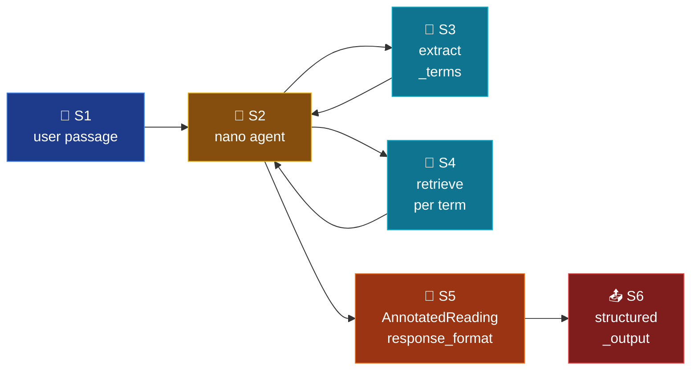

# Mode 6 — `annotate`

> **v2.** Two-tool agent: `extract_terms` finds glossable terms; `retrieve`
> grounds each term in the corpus. `response_format=AnnotatedReading`.

---

## Spec

| Field | Value |
|-------|-------|
| `id` / `icon` | `annotate` · `tag` |
| `arch` | `single` |
| Runner | `langchain.agents.create_agent` |
| Model | `nano` |
| `response_format` | `AnnotatedReading` |
| Tools | `[extract_terms, retrieve]` |
| Builder | `src/services/chat/mode_impls/annotate.py` |

---

## Pipeline



---

## Builder — `mode_impls/annotate.py`

```python
@lru_cache(maxsize=1)
def build_agent():
    return build_structured_agent(
        system_prompt=INSTRUCTIONS,
        tools=[extract_terms, retrieve],
        response_format=AnnotatedReading,
    )
```

---

## Tools

| Tool | Purpose |
|------|---------|
| `extract_terms(text, max_terms=20)` | Nano LLM call that returns a JSON list of technical terms found in the passage. Fixes the v1 "fictional tool" status — `extract_terms` is now a real callable. |
| `retrieve(query, k=5, ...)` | Per-term grounding lookup. The LLM typically calls this once per high-confidence term. |

---

## Output schema

`AnnotatedReading` (`schemas/output.py:174-188`):

```python
class Annotation(BaseModel):
    term: str
    definition: str
    source: Citation | None = None
    # T06: was tuple[int, int]; switched to list[int] for JSON-Schema compat
    position: list[int]  # [start, end] char offsets
    in_corpus: bool = True

class AnnotatedReading(BaseModel):
    annotations: list[Annotation]
    not_in_corpus: list[str] = []
```

`position` now serialises as `[start, end]` — Pydantic tuple support
doesn't round-trip through OpenAI's strict JSON Schema mode.

---

## Synopsis

`annotate` is the cleanest demonstration of agentic tool chaining: the LLM
calls `extract_terms` once, then `retrieve` per term, then emits a
schema-constrained reading. v1's `extract_terms` was a documentation lie
(no implementation existed); v2 makes it real. `position` field migrated
from `tuple` → `list[int]` for JSON-Schema compat (T06).
