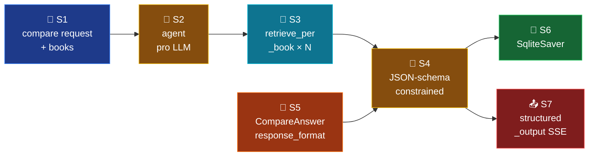

# Mode 2 — `compare`

> **v2.** Cross-book synthesis. Uses `retrieve_per_book` so each book gets
> its own retrieval pool (B9 fix from the diagnostic — one book no longer
> dominates). `response_format=CompareAnswer`.

---

## Spec

| Field | Value |
|-------|-------|
| `id` / `icon` | `compare` · `columns` |
| `arch` | `single` |
| Runner | `langchain.agents.create_agent` |
| Model | `full` (`openai_model_full`) |
| `response_format` | `CompareAnswer` |
| Tools | `[retrieve, retrieve_per_book]` |
| Checkpointer | shared `SqliteSaver` |
| Builder | `src/services/chat/mode_impls/compare.py` |

---

## Pipeline



---

## Builder — `mode_impls/compare.py`

```python
from src.services.chat.mode_impls._common import build_structured_agent
from src.services.chat.prompts.compare import INSTRUCTIONS
from src.services.chat.schemas.output import CompareAnswer
from src.services.chat.tools import retrieve, retrieve_per_book


@lru_cache(maxsize=1)
def build_agent():
    return build_structured_agent(
        system_prompt=INSTRUCTIONS,
        tools=[retrieve, retrieve_per_book],
        response_format=CompareAnswer,
        model=settings.openai_model_full,
    )
```

`build_structured_agent` (`mode_impls/_common.py`) wraps `create_agent` with
the shared checkpointer + model prefix.

---

## Tools

| Tool | Purpose |
|------|---------|
| `retrieve_per_book(query, books, k_per_book=3, rerank=True)` | Parallel fan-out: one `hybrid_search` per book via `asyncio.gather`. Returns `{book: [Source]}`. Implementation: `src/services/chat/tools/retrieve_per_book.py`. |
| `retrieve(query, k=5, ...)` | Available as escape hatch when the LLM wants a cross-book pool. |

The LLM is instructed (via `INSTRUCTIONS`) to call `retrieve_per_book`
first; the prompt mentions both tools so the LLM can pick.

---

## Output schema

`CompareAnswer` (`schemas/output.py:61-75`):

```python
class BookSection(BaseModel):
    book: str
    text: str
    citations: list[Citation]

class CompareAnswer(BaseModel):
    books: list[BookSection]
    synthesis: str
    divergences: list[str] = []
    citations: list[Citation]
```

OpenAI enforces the schema at decode time. No `_validate_and_repair`
retries.

---

## Adapter capture (router)

The `_structured_v2` adapter inspects `ToolMessage(name="retrieve_per_book")`
to populate `sources_full`. The dict-shaped tool result is flattened — every
book's hits land in one SSE `sources` list while the schema's `books` array
keeps the per-book grouping.

---

## Synopsis

`compare` is the first real test of the new tool surface. `retrieve_per_book`
guarantees balanced cross-book coverage even when one book's RRF score is
absolutely higher (impossible to compare without normalisation — see T04
B5 fix in retrieval). `response_format=CompareAnswer` removes the need for
ADR-005 repair retries. Use when the user asks "how does X treat Y?" or
"what's the difference between A and B?".
