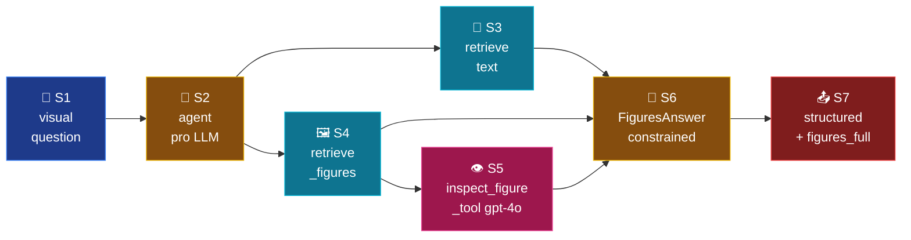

# Mode 3 — `figures`

> **v2.** Figure-centred answers. LLM decides when to call `retrieve_figures`
> + `inspect_figure_tool` (gpt-4o vision). No more hardcoded
> `_is_vision_mode` branch — figures are real LLM-callable tools.

---

## Spec

| Field | Value |
|-------|-------|
| `id` / `icon` | `figures` · `image` |
| `arch` | `single` |
| Runner | `langchain.agents.create_agent` |
| Model | `full` (`openai_model_full`) |
| `response_format` | `FiguresAnswer` |
| Tools | `[retrieve, retrieve_figures, inspect_figure_tool]` |
| Checkpointer | shared `SqliteSaver` |
| Builder | `src/services/chat/mode_impls/figures.py` |

---

## Pipeline



---

## Builder — `mode_impls/figures.py`

```python
from src.services.chat.mode_impls._common import build_structured_agent
from src.services.chat.prompts.figures import INSTRUCTIONS
from src.services.chat.schemas.output import FiguresAnswer
from src.services.chat.tools import (
    inspect_figure_tool,
    retrieve,
    retrieve_figures,
)


@lru_cache(maxsize=1)
def build_agent():
    return build_structured_agent(
        system_prompt=INSTRUCTIONS,
        tools=[retrieve, retrieve_figures, inspect_figure_tool],
        response_format=FiguresAnswer,
        model=settings.openai_model_full,
    )
```

---

## Tools

| Tool | Purpose |
|------|---------|
| `retrieve_figures(query, k=3, book_filter=None)` | Vector search over `<field>_images` collections via `search_figures`. Returns `[{ref, book, chapter, caption, chart}]`. |
| `inspect_figure_tool(figure_ref, chart_url, caption, query, book, chapter)` | gpt-4o vision call. Wraps the legacy `inspect_figure(Figure, *, query)` async helper. Takes string args (LLM-friendly) instead of a `Figure` object. |
| `retrieve` | Text fallback when the figure caption alone doesn't ground the answer. |

The vision gate (`vision.py`) is no longer in the hot path — `inspect_figure_tool`
short-circuits when `chart_url` is empty or non-http (returns `""`). The
LLM decides how many figures to inspect; `recursion_limit=10` caps the loop.

---

## Output schema

`FiguresAnswer` (`schemas/output.py:83-88`):

```python
class FiguresAnswer(BaseModel):
    figures: list[FigureRef]
    text: str
    citations: list[Citation]
```

---

## Adapter capture

`router._structured_v2` mines `ToolMessage(name="retrieve_figures")` for
the `figures_full` SSE event. `inspect_figure_tool` results are visible to
the LLM but not emitted separately — they shape the `text` field of the
final `FiguresAnswer`.

---

## Synopsis

`figures` exemplifies the v2 win: what was hardcoded vision-mode plumbing
in v1 becomes an LLM-agentic tool loop in v2. The LLM picks figures to
retrieve, calls vision on the ones whose captions are insufficient, and
emits a schema-constrained `FiguresAnswer` JSON. No more
`_is_vision_mode = spec.model == "pro_vision" and req.mode in (...)`
string-matching.
