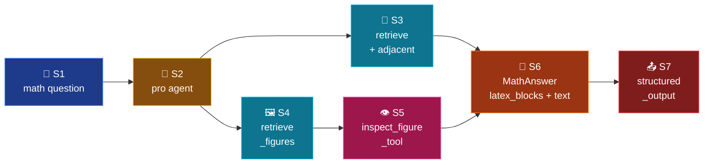

# Mode 7 — `math`

> **v2.** LaTeX-heavy answer w/ optional vision. Same tool set as `figures`
> (retrieve / retrieve_figures / inspect_figure_tool) but
> `response_format=MathAnswer` splits prose from LaTeX blocks.

---

## Spec

| Field | Value |
|-------|-------|
| `id` / `icon` | `math` · `function` |
| `arch` | `single` |
| Runner | `langchain.agents.create_agent` |
| Model | `full` (`openai_model_full`) |
| `response_format` | `MathAnswer` |
| Tools | `[retrieve, retrieve_figures, inspect_figure_tool]` |
| Builder | `src/services/chat/mode_impls/math.py` |

---

## Pipeline



---

## Builder — `mode_impls/math.py`

```python
@lru_cache(maxsize=1)
def build_agent():
    return build_structured_agent(
        system_prompt=INSTRUCTIONS,
        tools=[retrieve, retrieve_figures, inspect_figure_tool],
        response_format=MathAnswer,
        model=settings.openai_model_full,
    )
```

---

## Output schema

`MathAnswer` (`schemas/output.py:218-225`):

```python
class MathAnswer(BaseModel):
    latex_blocks: list[str]
    text: str
    figures: list[FigureRef] = []
    citations: list[Citation]
    latex_check_passed: bool = True
```

Two-channel math output:

- `latex_blocks` — bare LaTeX (no `$$`), standalone display equations.
- `text` — narrative w/ inline `$...$` + block `$$...$$` for math.

Frontend renders each `latex_blocks` entry as a standalone equation card
while the `text` flows through KaTeX inline.

---

## Memory + checkpointer

Same shared `SqliteSaver`. Multi-turn math sessions (e.g. proof-by-steps)
naturally accrete — LangChain reloads the thread state on every turn.

---

## Synopsis

`math` shares tools with `figures` but produces a structured answer that
isolates LaTeX from prose for clean rendering. The pro model + vision
chain handles equation plots / graphs / inequalities. Schema enforces the
two-channel split.


---

**2026-05-20 update — malformed-delimiter repair**

Inline LaTeX from the LLM sometimes arrives with malformed delimiters (e.g. `\$( x \)$`, or `$..$` nested inside `\(..\)`). `normalizeMathDelimiters()` in `web/src/components/views/TutorView.tsx` repairs these before KaTeX renders, and `MessageThread.parseInline` now handles inline `\(..\)`/`\[..\]`. See changelog 2026-05-20 §1.
