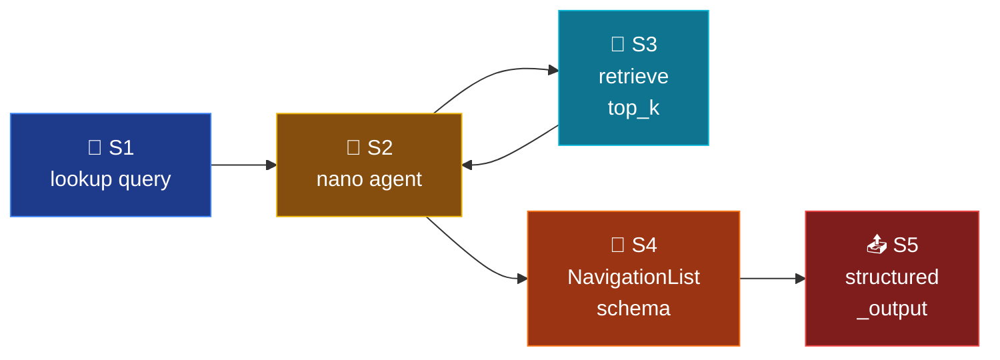

# Mode 5 — `navigate`

> **v2.** Pure ranked location list. Nano model + `retrieve` tool + native
> `response_format=NavigationList`. No prose answer — schema enforces
> structure.

---

## Spec

| Field | Value |
|-------|-------|
| `id` / `icon` | `navigate` · `map-pin` |
| `arch` | `single` |
| Runner | `langchain.agents.create_agent` |
| Model | `nano` |
| `response_format` | `NavigationList` |
| Tools | `[retrieve]` |
| Builder | `src/services/chat/mode_impls/navigate.py` |

---

## Pipeline



---

## Builder — `mode_impls/navigate.py`

```python
@lru_cache(maxsize=1)
def build_agent():
    return build_structured_agent(
        system_prompt=INSTRUCTIONS,
        tools=[retrieve],
        response_format=NavigationList,
    )
```

---

## Output schema

`NavigationList` (`schemas/output.py:119-135`):

```python
class NavResult(BaseModel):
    book: str
    chapter: str
    section: str
    title: str
    score: float
    page: int | None = None
    snippet: str = ""

class NavigationList(BaseModel):
    results: list[NavResult]
    expanded_terms: list[str] = []
```

---

## HyDE / query expansion

v1 used `query_expansion.expand_queries(..., flags=RetrievalFlags(hyde=True))`
upstream of retrieval. v2 leaves expansion **inside the `retrieve` tool**
(the LLM can pass already-expanded queries as multiple `retrieve` calls if
needed) — keeping the agent-loop in control of how many round-trips happen.

A Phase 2 ticket may re-introduce HyDE as an explicit `@tool hyde_expand`.

---

## Synopsis

Lightest mode. Nano model + one tool + schema-constrained list of
locations. Stateless. Used as the "where can I find X?" workflow — pair
with `tutor` for full prose answers.
