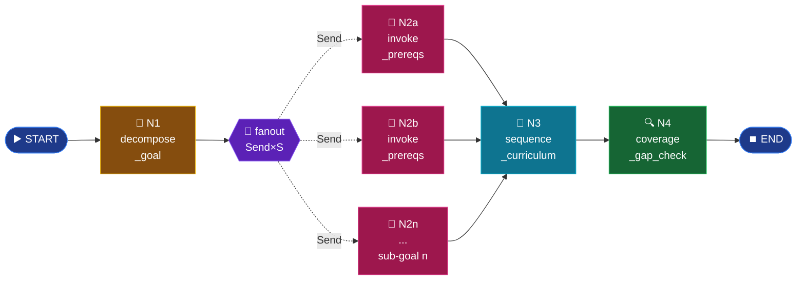

# Mode 11 — `path`

> **v2.** Multi-week study plan. **Multi-agent w/ `Send` fan-out + nested
> subgraph.** Per-sub-goal `run_prereqs_lg` calls now run in parallel.
> Plans are versioned and persisted to SQLite for replan workflows.

---

## Spec

| Field | Value |
|-------|-------|
| `id` / `icon` | `path` · `route` |
| `arch` | **`multi`** |
| Runner | `langgraph.graph.StateGraph` + `Send` |
| Model | `nano` (per-node) |
| Output schema | `StudyPlan` |
| Builder | `src/services/chat/agents/study_path_lg.py` |
| Entry point | `run_study_path_lg(query, book_slugs, replanned_from_version)` |
| Persistence | `store.upsert_study_plan(conv_id, plan, version)` |

---

## Graph topology



Each `invoke_prereqs` worker calls **the entire `prereqs_lg` subgraph** —
a graph-within-a-graph composition.

---

## Builder — `agents/study_path_lg.py`

```python
class _PathState(TypedDict, total=False):
    query: str
    book_slugs: list[str] | None
    sub_goals: list[str]
    sub_concepts: Annotated[list[dict], operator.add]   # parallel reducer
    sub_edges:    Annotated[list[dict], operator.add]
    cycles_broken: Annotated[list[str], operator.add]
    weeks: list[dict]
    coverage_gaps: list[str]


def fanout_subgoals(state):
    return [
        Send("invoke_prereqs", {"goal": g, "book_slugs": state["book_slugs"]})
        for g in state["sub_goals"]
    ]


def _build_graph():
    g = StateGraph(_PathState)
    g.add_node("decompose_goal",      decompose_goal)
    g.add_node("invoke_prereqs",      invoke_prereqs)         # ← calls subgraph
    g.add_node("sequence_curriculum", sequence_curriculum)
    g.add_node("coverage_gap_check",  coverage_gap_check)
    g.add_edge(START, "decompose_goal")
    g.add_conditional_edges("decompose_goal", fanout_subgoals, ["invoke_prereqs"])
    g.add_edge("invoke_prereqs",      "sequence_curriculum")
    g.add_edge("sequence_curriculum", "coverage_gap_check")
    g.add_edge("coverage_gap_check",  END)
    return g.compile()
```

---

## Worker — `invoke_prereqs` (calls prereqs subgraph)

```python
async def invoke_prereqs(payload: dict) -> dict:
    goal = payload["goal"]
    book_slugs = payload.get("book_slugs")
    dag = await run_prereqs_lg(goal, book_slugs)   # ← whole subgraph
    return {
        "sub_concepts": [...],   # merges via operator.add
        "sub_edges":    [...],
        "cycles_broken": [...],
    }
```

Sub-graphs share the **same `SqliteSaver` checkpointer**, so each
sub-goal's prereqs state is independently persisted.

---

## Week packing — `sequence_curriculum`

After all workers merge, the merged concept set is topo-sorted via Kahn's
algorithm, then packed into weeks (1.5 h per concept, 5 h/week cap) —
identical to v1 logic but now operating on the parallel-merged result.

---

## Replan lineage

```python
# router._multi_agent_v2 (path branch)
prev_version = 0
if req.conversationId:
    prev = get_study_plan(req.conversationId)
    if prev:
        prev_version = prev["version"]
plan = await run_study_path_lg(
    req.message, book_slugs, replanned_from_version=prev_version,
)
if req.conversationId:
    upsert_study_plan(req.conversationId, plan.model_dump(),
                       version=prev_version + 1)
```

Phase 3 will replace this hand-rolled lineage with LangGraph's
`get_state_history(config)` + `update_state(...)` for time-travel.

---

## Cost shape

For S sub-goals:

```
parallel branch =  S × (1 retrieve + 2 nano LLM)        # via Send
sequential ends =  1 (decompose) + S × 1 (coverage)
Wall-clock      ≈ max(sub_goal_latency) + decompose + coverage
```

v1: ~ 35s for 5 sub-goals (serial).
v2: ~ 10s for 5 sub-goals (parallel).

---

## Output schema

`StudyPlan` (`schemas/output.py:233-249`):

```python
class StudyWeek(BaseModel):
    week: int
    sections: list[Citation]
    goals: list[str] = []
    hours_est: float = 2.0

class StudyPlan(BaseModel):
    goal: str
    weeks: list[StudyWeek]
    total_weeks: int = 0
    coverage_gaps: list[str] = []
    replanned_from_version: int = 0
```

---

## Synopsis

`path` is the chain-of-graphs poster child: the top-level path graph fans
out via `Send` to N copies of the entire `prereqs_lg` subgraph, each
running in parallel. `operator.add` reducers merge sub-goal concepts and
edges back into one curriculum. Wall-clock for 5 sub-goals drops from
~35s (v1 serial) to ~10s (v2 parallel). Plans persist to SQLite with
version lineage so users can replan against the same conversation.
