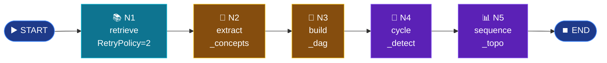

# Mode 9 — `prereqs`

> **v2.** Prerequisite concept DAG. **Multi-agent** mode on
> `langgraph.graph.StateGraph` — replaces the v1 roll-own runner. Reuses
> the existing async nodes from `agents/nodes.py`; only the orchestration
> changes.

---

## Spec

| Field | Value |
|-------|-------|
| `id` / `icon` | `prereqs` · `git-branch` |
| `arch` | **`multi`** |
| Runner | `langgraph.graph.StateGraph` |
| Model | `nano` *(per-node, not shared)* |
| Output schema | `DAG` |
| Builder | `src/services/chat/agents/prereqs_lg.py` |
| Entry point | `run_prereqs_lg(query, book_slugs)` |

---

## Graph topology



---

## Builder — `agents/prereqs_lg.py`

```python
from langgraph.graph import END, START, StateGraph
from langgraph.types import RetryPolicy
from typing_extensions import TypedDict

class _PrereqsState(TypedDict, total=False):
    query: str
    book_slugs: list[str] | None
    sources: list
    concepts: list[dict]
    edges: list[dict]
    extras: dict

def _build_graph():
    g = StateGraph(_PrereqsState)
    g.add_node("retrieve",        _wrap(retrieve_node),
               retry_policy=RetryPolicy(max_attempts=2))
    g.add_node("extract_concepts", _wrap(extract_concepts))
    g.add_node("build_dag",        _wrap(build_dag))
    g.add_node("cycle_detect",     _wrap(cycle_detect))
    g.add_node("sequence_topo",    _wrap(sequence_topo))
    g.add_edge(START,            "retrieve")
    g.add_edge("retrieve",       "extract_concepts")
    g.add_edge("extract_concepts","build_dag")
    g.add_edge("build_dag",      "cycle_detect")
    g.add_edge("cycle_detect",   "sequence_topo")
    g.add_edge("sequence_topo",  END)
    return g.compile()
```

`_wrap()` adapts each `(AgentState) -> AgentState` async node to LangGraph's
dict-state contract — the underlying logic in `agents/nodes.py` is reused
verbatim.

---

## Nodes (reused from v1 `agents/nodes.py`)

| Node | Reads | Writes | LLM |
|------|-------|--------|-----|
| `retrieve_node` | `query`, `book_slugs` | `sources` | no — `hybrid_search(top_k=8, rerank=True)` |
| `extract_concepts` | `sources[:5]` | `concepts` | nano |
| `build_dag` | `concepts` | `edges` (T07 normalises `from_id`/`to_id`) | nano |
| `cycle_detect` | `concepts`, `edges` | `edges` (cleaned), `extras["cycles_broken"]` | no — iterative DFS |
| `sequence_topo` | `concepts`, `edges` | `extras["ordering"]` | no — Kahn |

---

## LangGraph win — `RetryPolicy`

`retrieve` node gets `RetryPolicy(max_attempts=2)` for free. The v1 runner
needed bespoke retry logic (which had B8's logic hole) — LangGraph's
declarative policy fixes that at the framework level.

---

## Output schema

`DAG` (`schemas/output.py:143-166`):

```python
class DAG(BaseModel):
    target: str = ""
    nodes: list[ConceptNode]
    edges: list[ConceptEdge]
    order: list[str] = []
    cycles_broken: list[str] = []
```

`run_prereqs_lg` post-processes the final state into the Pydantic schema and
best-effort `upsert_concepts(...)` to the `concepts_kg` Qdrant collection.

---

## Router dispatch

```python
# router._multi_agent_v2
if req.mode == "prereqs":
    result = await run_prereqs_lg(req.message, book_slugs)
    yield {"type": "structured_output", "schema": "DAG", "data": result.model_dump()}
```

No token streaming — multi-agent modes emit `meta → structured_output → done`.

---

## Synopsis

Simplest multi-agent mode. 5 deterministic nodes, no branching, no fan-out.
LangGraph gives us retry policies, type-safe state, time-travel via the
checkpointer. The graph topology is identical to v1; the runner change
fixes B8 and unblocks future features (HITL, parallel sub-routes, streaming
intermediate steps).
