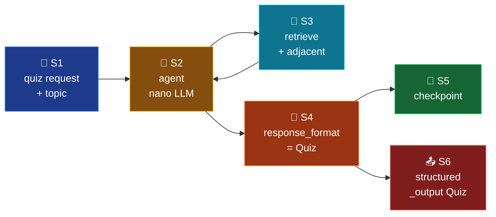

# Mode 4 — `quiz`

> **v2.** MCQ generation. Cheap nano model + `retrieve` tool + native
> `response_format=Quiz` constrained decoding. ADR-005 repair retry is now
> effectively a no-op for OpenAI providers.

---

## Spec

| Field | Value |
|-------|-------|
| `id` / `icon` | `quiz` · `check-square` |
| `arch` | `single` |
| Runner | `langchain.agents.create_agent` |
| Model | `nano` |
| `response_format` | `Quiz` |
| Tools | `[retrieve]` |
| Checkpointer | shared `SqliteSaver` |
| Builder | `src/services/chat/mode_impls/quiz.py` |

---

## Pipeline



---

## Builder — `mode_impls/quiz.py`

```python
@lru_cache(maxsize=1)
def build_agent():
    return build_structured_agent(
        system_prompt=INSTRUCTIONS,
        tools=[retrieve],
        response_format=Quiz,
    )
```

Default model = `settings.openai_model_nano` (no explicit `model=` override).

---

## Tools

| Tool | Purpose |
|------|---------|
| `retrieve(query, k=5, adjacent_sections=False, ...)` | The LLM is encouraged in `INSTRUCTIONS` to call `retrieve` with `adjacent_sections=True` for richer context per question — but the choice is the LLM's, not hardcoded. |

---

## Output schema

`Quiz` (`schemas/output.py:96-111`):

```python
class Question(BaseModel):
    stem: str
    options: list[str]
    answer_idx: int   # 0-based
    rubric: str
    source: Citation
    difficulty: Literal["easy", "medium", "hard"]
    self_check_passed: bool = True

class Quiz(BaseModel):
    questions: list[Question]
```

The `self_check_passed` server-side validator described in `INSTRUCTIONS`
is currently a soft contract (Phase 2 wires a real post-stream NLI check).

---

## Memory

`memory="off"` in v1 → equivalent in v2 by virtue of `Quiz` being stateless:
LangChain checkpointer holds the message history but the LLM is instructed
to ignore prior turns for quiz generation.

---

## Synopsis

Cheapest structured mode. The native `response_format=Quiz` removes ~1
LLM call per request (no repair retry). The `retrieve` tool is the only
tool, so the agent loop is a simple `retrieve → emit Quiz` cycle. Stateless
by convention.
