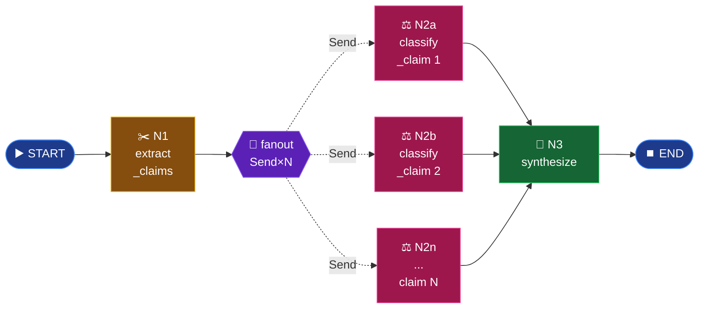

# Mode 10 — `research`

> **v2.** Claim stance analysis. **Multi-agent w/ `Send` fan-out.** Per-claim
> retrieval + classification now runs in parallel — closes the v1 serial
> latency bug (8× sequential nano calls + 6 retrievals).

---

## Spec

| Field | Value |
|-------|-------|
| `id` / `icon` | `research` · `search` |
| `arch` | **`multi`** |
| Runner | `langgraph.graph.StateGraph` + `Send` |
| Model | `nano` (per-node) |
| Output schema | `Report` |
| Builder | `src/services/chat/agents/research_lg.py` |
| Entry point | `run_research_lg(query, book_slugs)` |

---

## Graph topology



---

## Builder — `agents/research_lg.py`

```python
from langgraph.graph import END, START, StateGraph
from langgraph.types import Send
from typing import Annotated
import operator

class _ResearchState(TypedDict, total=False):
    query: str
    book_slugs: list[str] | None
    claims_raw: list[str]
    classified: Annotated[list[dict], operator.add]  # ← parallel reducer
    synthesis: str
    coverage_gaps: list[str]


def fanout_claims(state):
    return [
        Send("classify_claim", {"claim": c, "book_slugs": state["book_slugs"]})
        for c in state["claims_raw"]
    ]


def _build_graph():
    g = StateGraph(_ResearchState)
    g.add_node("extract_claims", extract_claims)
    g.add_node("classify_claim", classify_claim)
    g.add_node("synthesize",     synthesize)
    g.add_edge(START, "extract_claims")
    g.add_conditional_edges("extract_claims", fanout_claims, ["classify_claim"])
    g.add_edge("classify_claim", "synthesize")
    g.add_edge("synthesize",     END)
    return g.compile()
```

---

## Key LangGraph constructs used

| Construct | Effect |
|-----------|--------|
| `Annotated[list, operator.add]` on `classified` | Per-worker results concatenate instead of overwriting each other (T08 / synopsis-§7 patterns). |
| `Send("classify_claim", {...})` | Spawns one parallel worker per claim. |
| `add_conditional_edges(extract_claims, fanout_claims, ["classify_claim"])` | Branch on the Send list; LangGraph routes each `Send` payload to the named target. |

---

## Worker — `classify_claim`

Each worker:

1. Calls `hybrid_search(claim, book_slugs, top_k=3, rerank=True)` in a thread.
2. Issues one nano LLM call to score up to 3 evidence chunks at once.
3. Returns `{"classified": [{claim, stance, confidence, evidence}]}` — the
   reducer concatenates across workers.

Stance aggregation: highest-confidence non-`BACKGROUND` wins; otherwise
`BACKGROUND` w/ max background confidence.

---

## Cost shape

For C claims:

```
LLM calls   = 1 (extract) + C (classify, parallel) + 1 (synthesize)
Retrievals  = C (parallel)
Wall-clock  ≈ max(claim_latency_i) + extract_latency + synth_latency
```

v1: ~ 12s for 6 claims (serial).
v2: ~ 3-4s for 6 claims (parallel `Send`).

---

## Output schema

`Report` (`schemas/output.py:196-210`):

```python
class StanceClaim(BaseModel):
    claim: str
    stance: Literal["SUPPORTS", "CONTRADICTS", "BACKGROUND"]
    evidence: list[Citation]
    confidence: float

class Report(BaseModel):
    claims: list[StanceClaim]
    synthesis: str
    coverage_gaps: list[str] = []
```

---

## Synopsis

`research` is the first place LangGraph's `Send` API earns its keep:
per-claim work fans out across as many parallel workers as the LLM
identified claims. The reducer-based `classified` field collects results
without race conditions. `synthesize` runs once after all workers complete.
Result: a multi-X speed-up for the most LLM-heavy mode.
