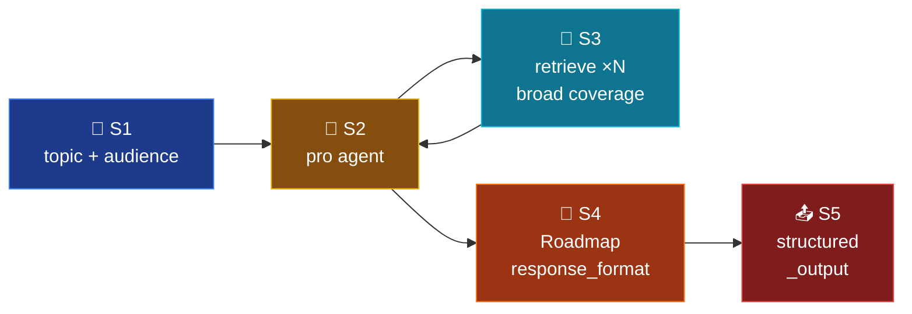

# Mode 8 — `roadmap`

> **v2.** Video production brief. `pro` model + `retrieve` tool +
> `response_format=Roadmap`. Stateless; ideal for batch generation.

---

## Spec

| Field | Value |
|-------|-------|
| `id` / `icon` | `roadmap` · `film` |
| `arch` | `single` |
| Runner | `langchain.agents.create_agent` |
| Model | `full` |
| `response_format` | `Roadmap` |
| Tools | `[retrieve]` |
| Builder | `src/services/chat/mode_impls/roadmap.py` |

---

## Pipeline



---

## Builder — `mode_impls/roadmap.py`

```python
@lru_cache(maxsize=1)
def build_agent():
    return build_structured_agent(
        system_prompt=INSTRUCTIONS,
        tools=[retrieve],
        response_format=Roadmap,
        model=settings.openai_model_full,
    )
```

---

## Output schema

`Roadmap` (`schemas/output.py:257-276`):

```python
class Scene(BaseModel):
    id: int
    title: str
    concept: str
    source: Citation
    suggested_visual: str
    duration_hint: str
    figure: str | None = None

class Roadmap(BaseModel):
    topic: str
    target_audience: str = ""
    total_duration_estimate: str = ""
    duration_total_min: int = 0
    scenes: list[Scene]
```

---

## Multi-query expansion

v1 had `RetrievalFlags(multi_query=3, decompose=True, rerank=True)`. v2
delegates query breadth to the LLM: instead of pre-expanding to 3 variants
upstream of retrieval, the LLM may call `retrieve` 3 times with different
phrasings inside the agent loop. `recursion_limit=10` caps the loop.

---

## Synopsis

Heaviest single-tool agent. The LLM autonomously broadens the retrieval
pool by issuing multiple `retrieve` calls before assembling the scene
list. Stateless. Good fit for content-batch workflows where the same topic
needs fresh briefs.
