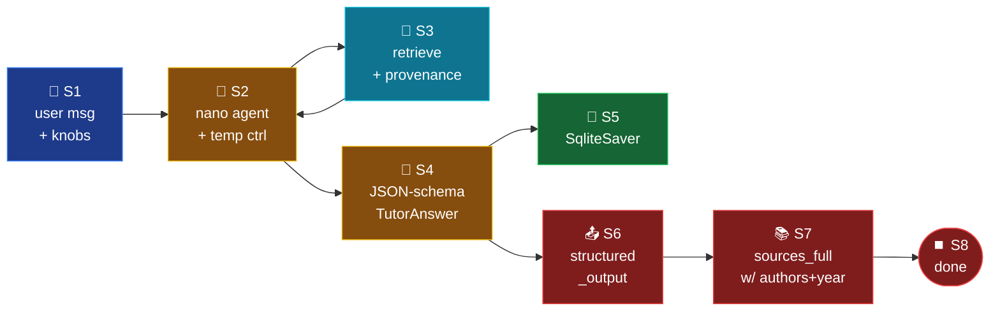

# Mode 1 — `tutor`

> **v2 + T13.** LangChain `create_agent` w/ a single `retrieve` tool +
> `response_format=TutorAnswer`. Perplexity-style traceability: every
> non-trivial sentence carries a numbered inline cite `[¹]` that resolves
> to a `TutorCitation` span with author / year / page range.

---

## Spec

| Field | Value |
|-------|-------|
| `id` / `icon` | `tutor` · `book` |
| `arch` | `single` |
| Runner | `langchain.agents.create_agent` |
| Model | `nano` (`openai_model_nano`) |
| `response_format` | `TutorAnswer` *(T13-E — env override `TUTOR_FREE_TEXT=1` rolls back to plain text)* |
| Tools | `[retrieve]` |
| Checkpointer | shared `SqliteSaver` |
| User-controllable | `temperature`, `top_k`, `rerank` *(T13-F)* |
| Builder | `src/services/chat/mode_impls/tutor.py` |

---

## Pipeline



---

## Builder — `mode_impls/tutor.py`

```python
import asyncio
import os
from langchain.agents import create_agent

from src.core.config import settings
from src.services.chat.checkpointer import get_async_checkpointer
from src.services.chat.prompts.tutor import TUTOR_INSTRUCTIONS
from src.services.chat.schemas.output import TutorAnswer
from src.services.chat.tools import retrieve

_AGENT = None
_BUILD_LOCK: asyncio.Lock | None = None


async def build_agent():
    global _AGENT
    if _AGENT is not None:
        return _AGENT
    async with _lock():
        if _AGENT is not None:
            return _AGENT
        kwargs = {
            "model": f"openai:{settings.openai_model_nano}",
            "tools": [retrieve],
            "system_prompt": TUTOR_INSTRUCTIONS,
            "checkpointer": await get_async_checkpointer(),
        }
        if not os.environ.get("TUTOR_FREE_TEXT"):
            kwargs["response_format"] = TutorAnswer
        _AGENT = create_agent(**kwargs)
        return _AGENT
```

Builder is `async def` with a module-level `_AGENT` singleton + lazy
`asyncio.Lock` (`src/services/chat/mode_impls/tutor.py:30-64`). Router
calls `await build_agent()`. Must run inside an active event loop —
`get_async_checkpointer()` opens an aiosqlite connection bound to that
loop.

`TUTOR_FREE_TEXT=1` returns to v1-style free prose; the rest of the
pipeline (SSE adapter, sources_full) is unchanged.

---

## Tools registered

| Tool | Provenance now returned (T13-C) |
|------|-------------------------------|
| `retrieve(query, k, book_filter, rerank, adjacent_sections)` | Each hit: `rank, book, book_name, authors, authors_short, year, chapter, section, title, page_from, page_to, page, excerpt, chunk (≤1500 chars), score, chunkId`. |

---

## Output schema — `TutorAnswer`

`src/services/chat/schemas/output.py` (T13-E):

```python
class TutorCitation(BaseModel):
    index: int                       # 1-based [¹] number
    chunkId: str = ""
    authors_short: str = ""          # "Smith et al."
    year: int | None = None
    book_name: str = ""
    chapter: str = ""
    section: str = ""
    page_from: int | None = None
    page_to: int | None = None
    quote: str = ""                  # exact sentence the cite supports

class TutorAnswer(BaseModel):
    text: str                        # markdown with [1] markers
    sections: list[str] = []         # H2 headings used
    citations: list[TutorCitation] = []
    math_blocks: list[str] = []
    figures: list[FigureRef] = []
```

OpenAI enforces this schema at decode time via `response_format`.

---

## Prompt — `TUTOR_INSTRUCTIONS` (T13-D + T18)

T18 rewrote the prompt as an **XML-scaffolded** system message — the
LLM parses each concern in its own tag:

```xml
<role>You are statrag, a research-grade tutor …</role>
<task>Produce a structured markdown answer with [1] inline cites …</task>
<output_format>## Definition … ## Sources [N] {authors_short} … </output_format>
<citation_template>[N] {authors_short} ({year}). *{book_name}*, …</citation_template>
<math_format>Inline $...$; display $$...$$.</math_format>
<rules>NEVER fabricate authors/year/pages …</rules>
<failure_mode>If retrieval is empty, emit `## No corpus coverage` …</failure_mode>
<examples><example><question>What is the DGP?</question>
<answer>## Definition … [1][2] … ## Sources [1] James et al. (2023) …</answer></example></examples>
```

Contract enforced by the prompt:

1. **H2 sections** chosen by question type (`## Definition`,
   `## Formal statement`, `## Why it matters`, …). No `## Introduction`.
2. **1-based sequential numbering** for inline `[N]` markers — `[1]`
   for the first cited chunk, `[2]` for the second, and so on. The
   `<citation_template>` block explicitly states this is **NOT** the
   `rank` field returned by the `retrieve` tool (which is 1..k of the
   retrieval result list, regardless of how many chunks the LLM ends
   up citing). Re-use the same number when the same chunk is cited
   again.
3. **Bidirectional contract**: every `[N]` marker in `text` must
   correspond to exactly one entry in `citations[]`, and every entry
   in `citations[]` must be referenced by at least one inline marker.
   Orphans on either side are an error.
4. **Omit null fields entirely** — never print the literal strings
   `null`, `None`, `0`, `n.d.`, or `Unknown` in the rendered output.
   If `year` is missing, skip the `(year)` parenthetical; if pages are
   missing, omit the `pp.` clause; etc.
5. **No `## Sources` block.** The frontend renders the source list from
   the structured `citations[]` array; emitting a markdown `## Sources`
   section is now forbidden because it would duplicate the UI's
   citation cards.
6. **Hard rules**: cite only from the `retrieve` tool's metadata; never
   fabricate; respond with `## No corpus coverage` when retrieval comes
   up empty.

Full prompt: `src/services/chat/prompts/tutor.py`.

### Visual reference

The static preview at `data/preview/tutor_sample.html` renders a sample
`TutorAnswer` with marked.js + MathJax so the expected output structure
can be eyeballed without spinning up the frontend.

---

## Citation reconciler (T22)

Even with the strengthened prompt the LLM occasionally numbers inline
markers using the retrieve tool's `rank` (1..10) instead of a proper
1-based citation index — leaving the UI unable to resolve markers like
`[6]` when `citations[]` only has four entries. The router runs a
defensive post-processor on every `TutorAnswer` payload before the
`structured_output` SSE event is emitted
(`src/services/chat/router.py:26-94`, called from line 188).

`_reconcile_tutor_citations(payload)` performs four operations in one
pass over `payload["text"]`:

1. **Walk `text` in order**, collecting unique `[N]` marker numbers as
   they first appear.
2. **Renumber markers** 1..k in order of first appearance — the first
   distinct marker encountered becomes `[1]`, the second `[2]`, etc.
3. **Renumber `citations[i].index`** to match the new numbering so
   each citation lines up with its marker.
4. **Drop dangling entries on both sides** — citations not referenced
   by any inline marker are removed from `citations[]`; markers whose
   number has no matching citation are stripped from `text`.

The result is an internally consistent `(text, citations)` pair: every
marker resolves to exactly one citation card, every citation card is
referenced by at least one marker. Test coverage lives in
`src/services/chat/tests/test_t22_reconcile_citations.py`.

---

## Provenance plumbing (where each field comes from)

```mermaid
flowchart LR
    accTitle: Provenance plumbing from ingestion to LLM
    accDescr: Author and year set at ingest time; payload stored in Qdrant; _point_to_source maps the payload to a Source; retrieve tool serialises Source fields the LLM uses to write APA-style cites.

    yaml["📄 books/&lt;slug&gt;.yaml<br/>authors, year"]
    ingest["⚙️ ingestion<br/>_flat_meta"]
    qdrant["💾 Qdrant<br/>payload"]
    pt2s["🔄 _point_to_source<br/>maps to Source"]
    src["📦 Source<br/>w/ authors_short<br/>+ year + pages"]
    tool["🔧 retrieve tool<br/>JSON payload"]
    llm["🤖 LLM<br/>cites [1]"]

    yaml --> ingest --> qdrant --> pt2s --> src --> tool --> llm

    classDef src fill:#1e3a8a,stroke:#3b82f6,color:#fff
    classDef step fill:#0e7490,stroke:#06b6d4,color:#fff
    classDef llm fill:#854d0e,stroke:#eab308,color:#fff

    class yaml,qdrant src
    class ingest,pt2s,tool step
    class src step
    class llm llm
```



---

## Chat-UI controls (T13-F)

`ChatRequest` (in `schemas/_core.py`) now accepts:

```python
class ChatRequest(BaseModel):
    ...
    temperature: float | None = Field(None, ge=0.0, le=2.0)
    top_k: int | None = Field(None, ge=1, le=20)
    rerank: bool | None = None
```

- `temperature=0.0` → deterministic responses. Router threads this into
  `config.configurable.model_kwargs.temperature` so the LLM picks it up.
- `top_k` and `rerank` are exposed to the agent via the `retrieve` tool's
  args (the LLM may still override per-call).
- Frontend integration: add a settings tab w/ a temperature slider
  (0 → 2, step 0.1) and `top_k` stepper. See
  `docs/upgrades/Chat/traceability_plan.md` §T13-G for the ticket shape.

---

## Synopsis

Tutor v2 + T13 transforms the answer from "wall of text with opaque
citation tags" into a Perplexity-style traceable artefact: every claim
ties back to a chunk via a numbered `[¹]` marker; every marker resolves
to a `TutorCitation` carrying authors, year, page range, and the
supporting quote; the agent's `## Sources` block lists everything in
APA form. The `retrieve` tool now hands the LLM **everything** the
ingestion side wrote into Qdrant — book_name, authors, year, page_from /
page_to. Temperature and `top_k` are user-controllable for the first
time. `TUTOR_FREE_TEXT=1` rolls back to the prior free-form behaviour
without touching code.
