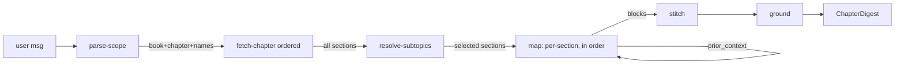

# Chapter Modes (Facilitate + Resume) Implementation Plan

> **For agentic workers:** REQUIRED SUB-SKILL: Use superpowers:subagent-driven-development (recommended) or superpowers:executing-plans to implement this plan task-by-task. Steps use checkbox (`- [ ]`) syntax for tracking.

**Goal:** Add two chat modes — `facilitate` (teach a chapter span in order) and `resume` (compress the same span) — that traverse a chapter's intrinsic section order instead of search relevance.

**Architecture:** One shared multi-node agent (`agents/chapter.py`): parse-scope → fetch-chapter → resolve-subtopics → map(per-section, in order) → stitch → ground. Order is fixed structurally by sorting fetched sections (page_from, section_id) before any LLM runs; the map node walks them in sequence with a running `prior_context`. The two modes differ only in the map prompt (teach vs compress). Reuses Qdrant scroll via `src.core.qdrant_store` and the existing `_point_to_source` contract; no tutor pipeline reuse.

**Tech Stack:** Python 3.12 (FastAPI, pydantic, openai async, qdrant-client), pytest; React + Vite + TypeScript, vitest.

**Spec:** `docs/superpowers/specs/2026-05-31-chapter-modes-design.md`

**Pre-flight:** Create a feature branch off `main` before Task 1:
```bash
git checkout main && git pull && git checkout -b feat/chapter-modes
```

---

## File Structure

**Backend (create):**
- `src/services/chat/prompts/chapter.py` — six prompt constants.
- `src/services/chat/agents/chapter.py` — `run_chapter` + node functions.
- `src/services/chat/tests/test_chapter_schema.py`
- `src/services/chat/tests/test_chapter_agent.py`

**Backend (modify):**
- `src/services/chat/schemas/output.py` — add `ResolvedSubtopic`, `ChapterScope`, `ChapterBlock`, `ChapterDigest`.
- `src/services/chat/schemas/__init__.py` — re-export the four new models.
- `src/services/chat/schemas/_core.py` — extend `ModeId`.
- `src/services/chat/retrieval.py` — add `fetch_chapter_sections`.
- `src/services/chat/modes.py` — register two specs.
- `src/services/chat/router.py` — dispatch both modes.
- `src/core/config.py` — add the two modes to the `use_v2_modes` default.

**Frontend (create):**
- `web/src/data/chapterPipeline.ts`
- `web/src/components/ChapterDigestCard.tsx`
- `web/src/components/ChapterDigestCard.test.tsx`
- `web/src/data/chapterPipeline.test.ts`

**Frontend (modify):**
- `web/src/types.ts` — `ModeId`, chapter interfaces, `StructuredOutputEvent`.
- `web/src/App.tsx` — `STATRAG_MODES`.
- `web/src/components/MessageThread.tsx` — `STRUCTURED_MODES` + render branch.
- `web/src/components/ModePicker.tsx` — icon map entries.

**Docs (modify/create):**
- `docs/services/chat-features/NN-chapter-modes.md` (new; pick the next free NN, currently 51)
- `docs/services/chat.md`, `docs/system/invariants.md`, `docs/system/changelog.md`

---

## Phase 1 — Schemas

### Task 1: ChapterDigest output models

**Files:**
- Modify: `src/services/chat/schemas/output.py`
- Modify: `src/services/chat/schemas/__init__.py`
- Test: `src/services/chat/tests/test_chapter_schema.py`

- [ ] **Step 1: Write the failing test**

Create `src/services/chat/tests/test_chapter_schema.py`:

```python
"""Validation tests for the chapter-mode output schemas."""
from __future__ import annotations

import pytest
from pydantic import ValidationError

from src.services.chat.schemas import (
    ChapterBlock,
    ChapterDigest,
    ChapterScope,
    ResolvedSubtopic,
)


def test_chapter_scope_defaults():
    scope = ChapterScope(book_slug="islp", chapter_id="ch02")
    assert scope.requested_subtopics == []
    assert scope.resolution == []


def test_resolved_subtopic_roundtrip():
    r = ResolvedSubtopic(asked="the tradeoff", matched_h2="2.2 | Bias-Variance",
                         section_id="2.2", score=0.81)
    assert r.matched_h2.endswith("Bias-Variance")


def test_chapter_digest_minimal_and_block_order_preserved():
    blocks = [
        ChapterBlock(h2_path="2.1 | A", section_id="2.1", body="first"),
        ChapterBlock(h2_path="2.2 | B", section_id="2.2", body="second"),
    ]
    d = ChapterDigest(
        mode="facilitate",
        scope=ChapterScope(book_slug="islp", chapter_id="ch02"),
        blocks=blocks,
    )
    assert [b.section_id for b in d.blocks] == ["2.1", "2.2"]
    assert d.intro == "" and d.outro == ""
    assert d.citations == [] and d.grounding == {}


def test_chapter_digest_rejects_bad_mode():
    with pytest.raises(ValidationError):
        ChapterDigest(
            mode="explain",  # not in Literal
            scope=ChapterScope(book_slug="islp", chapter_id="ch02"),
            blocks=[],
        )
```

- [ ] **Step 2: Run test to verify it fails**

Run: `.venv/bin/python -m pytest src/services/chat/tests/test_chapter_schema.py -q`
Expected: FAIL — `ImportError: cannot import name 'ChapterDigest'`.

- [ ] **Step 3: Add the models**

In `src/services/chat/schemas/output.py`, after the `QAAnswer` class (end of the `Mode 2 — qa` block, before `Concept graph primitives`), insert:

```python
# ---------------------------------------------------------------------------
# Mode 3/4 — chapter (facilitate + resume)
# ---------------------------------------------------------------------------


class ResolvedSubtopic(BaseModel):
    """One requested subtopic mapped to a real chapter heading.

    ``matched_h2`` is "" when the request could not be resolved (dropped).
    ``score`` is the match confidence (1.0 for the whole-chapter default).
    """

    asked: str
    matched_h2: str = ""
    section_id: str = ""
    score: float = 0.0


class ChapterScope(BaseModel):
    """Resolved scope for a chapter-mode run.

    ``requested_subtopics`` empty means "whole chapter, in order".
    ``resolution`` echoes the closest-match mapping for UI transparency.
    """

    book_slug: str
    chapter_id: str
    requested_subtopics: list[str] = Field(default_factory=list)
    resolution: list[ResolvedSubtopic] = Field(default_factory=list)


class ChapterBlock(BaseModel):
    """One subtopic's rendered block. List position in ``ChapterDigest.blocks``
    IS the chapter order — never re-sorted by the frontend."""

    h2_path: str
    section_id: str
    body: str
    page_from: int = -1
    page_to: int = -1


class ChapterDigest(BaseModel):
    """Ordered chapter digest shared by ``facilitate`` and ``resume``.

    ``mode`` tells the renderer which header/styling to use. ``blocks`` are in
    chapter order. Reuses :class:`TutorCitation` so existing citation cards
    render unchanged. ``grounding`` carries the verify-node verdict.
    """

    mode: Literal["facilitate", "resume"]
    scope: ChapterScope
    intro: str = ""
    blocks: list[ChapterBlock] = Field(default_factory=list)
    outro: str = ""
    citations: list[TutorCitation] = Field(default_factory=list)
    math_blocks: list[str] = Field(default_factory=list)
    grounding: dict = Field(default_factory=dict)
```

In `src/services/chat/schemas/__init__.py`, add the four names to BOTH the `from ...output import (...)` block and `__all__` (alongside `QAScope`, `QAAnswer`):

```python
    ChapterScope,
    ChapterBlock,
    ChapterDigest,
    ResolvedSubtopic,
```

- [ ] **Step 4: Run test to verify it passes**

Run: `.venv/bin/python -m pytest src/services/chat/tests/test_chapter_schema.py -q`
Expected: PASS (4 passed).

- [ ] **Step 5: Commit**

```bash
git add src/services/chat/schemas/output.py src/services/chat/schemas/__init__.py src/services/chat/tests/test_chapter_schema.py
git commit -m "feat(chapter): ChapterDigest output schemas"
```

---

### Task 2: Extend ModeId

**Files:**
- Modify: `src/services/chat/schemas/_core.py:34` (the `ModeId` line)
- Test: `src/services/chat/tests/test_chapter_schema.py`

- [ ] **Step 1: Add the failing test**

Append to `src/services/chat/tests/test_chapter_schema.py`:

```python
def test_chat_request_accepts_chapter_modes():
    from src.services.chat.schemas import ChatRequest
    for m in ("facilitate", "resume"):
        req = ChatRequest(message="ch2 bias-variance", mode=m)
        assert req.mode == m
```

- [ ] **Step 2: Run test to verify it fails**

Run: `.venv/bin/python -m pytest src/services/chat/tests/test_chapter_schema.py::test_chat_request_accepts_chapter_modes -q`
Expected: FAIL — `ValidationError` (mode not in Literal).

- [ ] **Step 3: Extend the Literal**

In `src/services/chat/schemas/_core.py`, change:

```python
ModeId = Literal["tutor", "qa"]
```
to:
```python
ModeId = Literal["tutor", "qa", "facilitate", "resume"]
```

- [ ] **Step 4: Run test to verify it passes**

Run: `.venv/bin/python -m pytest src/services/chat/tests/test_chapter_schema.py -q`
Expected: PASS (5 passed).

- [ ] **Step 5: Commit**

```bash
git add src/services/chat/schemas/_core.py src/services/chat/tests/test_chapter_schema.py
git commit -m "feat(chapter): add facilitate + resume to ModeId"
```

---

## Phase 2 — Chapter fetch (retrieval helper)

### Task 3: `fetch_chapter_sections`

Scrolls all chunks of one chapter and returns them as `Source` objects in chapter order (`page_from`, then `section_id`). This is the structural fetch — no embeddings, no search.

**Files:**
- Modify: `src/services/chat/retrieval.py` (add function after `_expand_adjacent`, before `def hybrid_search`)
- Test: `src/services/chat/tests/test_chapter_agent.py`

- [ ] **Step 1: Write the failing test**

Create `src/services/chat/tests/test_chapter_agent.py`:

```python
"""Tests for the chapter-mode pipeline (fetch, resolve, map order)."""
from __future__ import annotations

from types import SimpleNamespace

import src.services.chat.retrieval as retrieval


class _FakePoint:
    def __init__(self, pid, payload):
        self.id = pid
        self.payload = payload
        self.score = 0.0


def _payload(section_id, h2, page):
    return {
        "book_slug": "islp", "book_name": "ISLP", "chapter_id": "ch02",
        "section_id": section_id, "h2_path": h2, "h1": "Statistical Learning",
        "text": f"body of {section_id}", "page_from": page, "page_to": page,
        "authors": "James et al.", "year": 2021,
    }


def test_fetch_chapter_sections_sorted_by_page(monkeypatch):
    # Return points out of order; expect output sorted by (page_from, section_id).
    points = [
        _FakePoint("c", _payload("2.3", "2.3 | C", 30)),
        _FakePoint("a", _payload("2.1", "2.1 | A", 10)),
        _FakePoint("b", _payload("2.2", "2.2 | B", 20)),
    ]

    class _FakeClient:
        def scroll(self, **kwargs):
            return (points, None)

    monkeypatch.setattr(retrieval, "client", lambda: _FakeClient())
    monkeypatch.setattr(
        retrieval, "collections_for_books",
        lambda slugs: {"ml_dp_textbooks": ["islp"]},
    )

    out = retrieval.fetch_chapter_sections("islp", "ch02")
    assert [s.section for s in out] == ["A", "B", "C"]
    assert [s.chapter for s in out] == ["ch02", "ch02", "ch02"]
```

- [ ] **Step 2: Run test to verify it fails**

Run: `.venv/bin/python -m pytest src/services/chat/tests/test_chapter_agent.py::test_fetch_chapter_sections_sorted_by_page -q`
Expected: FAIL — `AttributeError: module ... has no attribute 'fetch_chapter_sections'`.

- [ ] **Step 3: Implement the function**

In `src/services/chat/retrieval.py`, add directly after the `_expand_adjacent` function and before `def hybrid_search(`:

```python
def fetch_chapter_sections(
    book_slug: str,
    chapter_id: str,
    *,
    max_sections: int = 200,
) -> list[Source]:
    """Scroll every chunk of one chapter and return them in chapter order.

    Order is structural: sort by ``(page_from, section_id)`` so the reading
    sequence (and the author's build-of-ideas) is preserved. No embeddings,
    no relevance scoring — this is a metadata fetch, not a search.

    Args:
        book_slug: Book slug (e.g. ``"islp"``).
        chapter_id: Chapter id (e.g. ``"ch02"``).
        max_sections: Hard cap on chunks scrolled.

    Returns:
        Ordered ``Source`` list (may be empty when the chapter is unknown).
    """
    collection_map = collections_for_books([book_slug])
    flt = Filter(
        must=[
            FieldCondition(key="book_slug", match=MatchAny(any=[book_slug])),
            FieldCondition(key="chapter_id", match=MatchAny(any=[chapter_id])),
        ]
    )
    raw: list[Any] = []
    for collection in collection_map:
        try:
            points, _ = client().scroll(
                collection_name=collection,
                scroll_filter=flt,
                limit=max_sections,
                with_payload=True,
            )
        except Exception:  # noqa: BLE001
            logger.exception("chapter scroll failed for %r", collection)
            continue
        raw.extend(points)

    def _order_key(p: Any) -> tuple[int, str]:
        payload = p.payload or {}
        pf = _safe_int(payload.get("page_from"))
        return (pf if pf is not None else 10**9, str(payload.get("section_id", "")))

    raw.sort(key=_order_key)
    return [_point_to_source(p, rank=i + 1) for i, p in enumerate(raw[:max_sections])]
```

- [ ] **Step 4: Run test to verify it passes**

Run: `.venv/bin/python -m pytest src/services/chat/tests/test_chapter_agent.py::test_fetch_chapter_sections_sorted_by_page -q`
Expected: PASS.

- [ ] **Step 5: Commit**

```bash
git add src/services/chat/retrieval.py src/services/chat/tests/test_chapter_agent.py
git commit -m "feat(chapter): fetch_chapter_sections ordered structural fetch"
```

---

## Phase 3 — Prompts

### Task 4: Chapter prompt constants

**Files:**
- Create: `src/services/chat/prompts/chapter.py`

No test (pure string constants; exercised by Phase 4 agent tests).

- [ ] **Step 1: Create the prompts file**

Create `src/services/chat/prompts/chapter.py`:

```python
"""Prompts for the chapter modes (facilitate + resume).

Six single-purpose system prompts: parse-scope, resolve-subtopics, two map
prompts (teach vs compress), stitch, and ground. Both modes share everything
except which MAP prompt the agent picks.

Chinese-wall: pure string constants, no imports from src.*.
"""
from __future__ import annotations

CHAPTER_PARSE_PROMPT = """You extract the chapter scope from a study request.

You are given the user's message and an optional list of selected book slugs.
Return ONLY a JSON object with exactly these keys:
  "book_slug": string — the book to use. If exactly one slug is selected, use
      it. Otherwise infer from the message; use "" if unknown.
  "chapter_id": string — the chapter id mentioned, normalised like "ch02"
      (zero-padded, lowercase). Use "" if the message names no chapter.
  "requested_subtopics": array of strings — the specific subtopics the user
      asked for, verbatim phrases. Empty array means "the whole chapter".

Do not invent subtopics. Extract only what the user explicitly named.
"""

CHAPTER_RESOLVE_PROMPT = """You map a user's requested subtopics to a chapter's
real section headings (closest-match).

You are given:
  "requested": array of the phrases the user asked for.
  "headings": array of {"section_id": "...", "h2_path": "..."} — the chapter's
      actual sections, in order.

For EACH requested phrase, pick the single closest heading by meaning. Return
ONLY a JSON object:
  "matches": array of {"asked": "...", "section_id": "...",
      "matched_h2": "...", "score": 0..1} — score is your match confidence.
      If nothing is a reasonable match, set section_id="" matched_h2="" score=0.

Never invent a section_id that is not in "headings".
"""

CHAPTER_MAP_FACILITATE_PROMPT = """You TEACH one subtopic of a textbook chapter,
grounded ONLY in the provided section text.

You are given the section text, its heading, and a short "prior_context"
summarising what earlier subtopics already covered. Write a flowing didactic
explanation that BUILDS ON the prior context — do not repeat what it already
established; connect to it.

Return ONLY a JSON object:
  "body": markdown — a clear, intuitive explanation (roughly 150-350 words):
      plain-language meaning, why it matters, and the intuition. Cite claims
      with inline [n] markers referencing the source numbers you used.
  "citations": array of {"index": n, "chunkId": "...", "book_name": "...",
      "authors_short": "...", "year": int|null, "chapter": "...",
      "section": "...", "quote": "the exact supporting sentence"}.
  "math_blocks": array of LaTeX strings for display equations (may be empty).

Stay strictly within this section's content. Preserve the author's order of ideas.
"""

CHAPTER_MAP_RESUME_PROMPT = """You COMPRESS one subtopic of a textbook chapter
into a terse recap, grounded ONLY in the provided section text.

You are given the section text, its heading, and a short "prior_context".

Return ONLY a JSON object:
  "body": markdown — a tight summary (roughly 40-100 words): the key
      definition(s), result(s), and any formula, as compact bullets or one
      dense paragraph. No teaching, no analogies, no padding. Cite with inline
      [n] markers.
  "citations": array of {"index": n, "chunkId": "...", "book_name": "...",
      "authors_short": "...", "year": int|null, "chapter": "...",
      "section": "...", "quote": "the exact supporting sentence"}.
  "math_blocks": array of LaTeX strings (may be empty).

Stay strictly within this section's content. Preserve order.
"""

CHAPTER_STITCH_PROMPT = """You write a short intro and outro for an ordered
chapter digest. You are given the ordered list of subtopic headings covered.

Return ONLY a JSON object:
  "intro": one or two sentences naming what this digest covers, in order.
  "outro": one sentence on how the pieces fit together.

Do not add new facts or reorder anything. Keep both very short.
"""

CHAPTER_GROUND_PROMPT = """You audit an assembled chapter digest against its
sources. You are given the concatenated body text and the numbered sources.

Return ONLY a JSON object:
  "ok": boolean — true if every claim is supported by some source.
  "unsupported": array of strings — claims not found in the sources.
  "confidence": number 0..1 — confidence the digest is fully grounded.

Do not rewrite the digest. Only report.
"""
```

- [ ] **Step 2: Verify it imports**

Run: `.venv/bin/python -c "from src.services.chat.prompts import chapter; print(bool(chapter.CHAPTER_MAP_RESUME_PROMPT))"`
Expected: prints `True`.

- [ ] **Step 3: Commit**

```bash
git add src/services/chat/prompts/chapter.py
git commit -m "feat(chapter): map/resolve/stitch/ground prompts"
```

---

## Phase 4 — Agent

The agent mirrors `agents/qa.py`: a single `_chat` seam, fail-open nodes, v1 SSE events. Build it node-by-node with tests.

### Task 5: Agent scaffold + `_chat` seam + `_model_for`

**Files:**
- Create: `src/services/chat/agents/chapter.py`
- Test: `src/services/chat/tests/test_chapter_agent.py`

- [ ] **Step 1: Write the failing test**

Append to `src/services/chat/tests/test_chapter_agent.py`:

```python
def test_model_for_prefers_stage_models():
    from src.services.chat.agents import chapter as ch
    from src.services.chat.schemas import ChatRequest
    req = ChatRequest(message="x", mode="resume", stageModels={"map": "gpt-4o-mini"})
    assert ch._model_for("map", req) == "gpt-4o-mini"
    # falls back to nano when unset
    req2 = ChatRequest(message="x", mode="resume")
    assert ch._model_for("map", req2) == ch.settings.openai_model_nano
```

- [ ] **Step 2: Run to verify it fails**

Run: `.venv/bin/python -m pytest src/services/chat/tests/test_chapter_agent.py::test_model_for_prefers_stage_models -q`
Expected: FAIL — module `chapter` not found.

- [ ] **Step 3: Create the scaffold**

Create `src/services/chat/agents/chapter.py`:

```python
"""Chapter modes agent: facilitate (teach) + resume (compress).

Shared pipeline: parse-scope -> fetch-chapter -> resolve-subtopics ->
map(per-section, in order) -> stitch -> ground. Order is fixed structurally
by ``fetch_chapter_sections`` before any LLM runs. The two modes differ only
in which MAP prompt is used.

Each LLM node goes through the single ``_chat`` seam so tests monkeypatch one
function. Emits the v1 SSE event schema.

Chinese-wall: imports only ``src.core.*`` and sibling ``src.services.chat.*``.
"""
from __future__ import annotations

import json
import logging
import os
import time
from typing import AsyncIterator

from src.core.config import settings
from src.services.chat._fences import strip_fences
from src.services.chat.llm.router import aclient_for
from src.services.chat.prompts.chapter import (
    CHAPTER_GROUND_PROMPT,
    CHAPTER_MAP_FACILITATE_PROMPT,
    CHAPTER_MAP_RESUME_PROMPT,
    CHAPTER_PARSE_PROMPT,
    CHAPTER_RESOLVE_PROMPT,
    CHAPTER_STITCH_PROMPT,
)
from src.services.chat.retrieval import fetch_chapter_sections
from src.services.chat.schemas import (
    ChapterBlock,
    ChapterDigest,
    ChapterScope,
    ChatRequest,
    ResolvedSubtopic,
    Source,
    TutorCitation,
)

logger = logging.getLogger(__name__)

_CHAPTER_RESOLVE = os.environ.get("CHAPTER_RESOLVE", "1") == "1"
_CHAPTER_MAX_SECTIONS = int(os.environ.get("CHAPTER_MAX_SECTIONS", "30"))
_CHAPTER_STITCH = os.environ.get("CHAPTER_STITCH", "1") == "1"
_CHAPTER_GROUND = os.environ.get("CHAPTER_GROUND", "1") == "1"
_CHUNK_PREVIEW_CHARS = 1500


def _model_for(stage: str, req: ChatRequest | None) -> str:
    """Resolve the model for a chapter stage: stageModels > env > nano."""
    sm = req.stageModels if req else None
    if sm and isinstance(sm.get(stage), str) and sm[stage].strip():
        return sm[stage].strip()
    env = os.environ.get(f"CHAPTER_{stage.upper()}_MODEL", "").strip()
    return env or settings.openai_model_nano


async def _chat(messages, *, model, max_tokens, temperature=0.0) -> str:
    """Single LLM seam. Returns the raw assistant content string."""
    oa = aclient_for(model)
    resp = await oa.chat.completions.create(
        model=model,
        messages=messages,
        temperature=temperature,
        max_completion_tokens=max_tokens,
    )
    return resp.choices[0].message.content or ""
```

- [ ] **Step 4: Run to verify it passes**

Run: `.venv/bin/python -m pytest src/services/chat/tests/test_chapter_agent.py::test_model_for_prefers_stage_models -q`
Expected: PASS.

- [ ] **Step 5: Commit**

```bash
git add src/services/chat/agents/chapter.py src/services/chat/tests/test_chapter_agent.py
git commit -m "feat(chapter): agent scaffold + _chat seam"
```

---

### Task 6: `parse_scope` node

**Files:**
- Modify: `src/services/chat/agents/chapter.py`
- Test: `src/services/chat/tests/test_chapter_agent.py`

- [ ] **Step 1: Write the failing test**

Append to the test file:

```python
import pytest


@pytest.mark.asyncio
async def test_parse_scope_extracts_chapter_and_subtopics(monkeypatch):
    from src.services.chat.agents import chapter as ch

    async def fake_chat(messages, *, model, max_tokens, temperature=0.0):
        return ('{"book_slug":"islp","chapter_id":"ch02",'
                '"requested_subtopics":["the tradeoff"]}')

    monkeypatch.setattr(ch, "_chat", fake_chat)
    scope = await ch.parse_scope("explain the tradeoff in ch2", book_slugs=["islp"])
    assert scope.book_slug == "islp"
    assert scope.chapter_id == "ch02"
    assert scope.requested_subtopics == ["the tradeoff"]


@pytest.mark.asyncio
async def test_parse_scope_fail_open(monkeypatch):
    from src.services.chat.agents import chapter as ch

    async def boom(messages, *, model, max_tokens, temperature=0.0):
        raise RuntimeError("llm down")

    monkeypatch.setattr(ch, "_chat", boom)
    scope = await ch.parse_scope("ch2 please", book_slugs=["islp"])
    # fail-open: single selected book used, no chapter, whole-chapter intent
    assert scope.book_slug == "islp"
    assert scope.requested_subtopics == []
```

- [ ] **Step 2: Run to verify it fails**

Run: `.venv/bin/python -m pytest src/services/chat/tests/test_chapter_agent.py -k parse_scope -q`
Expected: FAIL — `parse_scope` not defined.

- [ ] **Step 3: Implement `parse_scope`**

Append to `src/services/chat/agents/chapter.py`:

```python
async def parse_scope(
    message: str,
    *,
    book_slugs: list[str] | None,
    model: str | None = None,
) -> ChapterScope:
    """Extract {book_slug, chapter_id, requested_subtopics} from the message.

    Fail-open: a single selected book becomes book_slug; chapter "" and empty
    subtopics (whole chapter) on any parse error.
    """
    default_book = book_slugs[0] if book_slugs and len(book_slugs) == 1 else ""
    fallback = ChapterScope(book_slug=default_book, chapter_id="", requested_subtopics=[])
    chosen = model or settings.openai_model_nano
    try:
        raw = await _chat(
            [
                {"role": "system", "content": CHAPTER_PARSE_PROMPT},
                {"role": "user", "content": f"selected_books: {json.dumps(book_slugs or [])}\n\nmessage: {message}"},
            ],
            model=chosen,
            max_tokens=200,
        )
        data = json.loads(strip_fences(raw))
        return ChapterScope(
            book_slug=str(data.get("book_slug") or default_book).strip(),
            chapter_id=str(data.get("chapter_id") or "").strip(),
            requested_subtopics=[
                str(x).strip() for x in (data.get("requested_subtopics") or []) if str(x).strip()
            ],
        )
    except Exception:  # noqa: BLE001
        logger.exception("chapter.parse_scope failed; using fail-open scope")
        return fallback
```

- [ ] **Step 4: Run to verify it passes**

Run: `.venv/bin/python -m pytest src/services/chat/tests/test_chapter_agent.py -k parse_scope -q`
Expected: PASS (2 passed).

- [ ] **Step 5: Commit**

```bash
git add src/services/chat/agents/chapter.py src/services/chat/tests/test_chapter_agent.py
git commit -m "feat(chapter): parse_scope node"
```

---

### Task 7: `resolve_subtopics` node (closest-match + confirm)

Operates on the already-fetched chapter sections. Empty request → all sections (whole chapter, score 1.0). Named requests → exact/substring match first, then one nano call for the unmatched. Returns the ordered selected `Source` list + the `ResolvedSubtopic` list. Selection preserves the fetched order (never re-sorted).

**Files:**
- Modify: `src/services/chat/agents/chapter.py`
- Test: `src/services/chat/tests/test_chapter_agent.py`

- [ ] **Step 1: Write the failing test**

Append:

```python
def _src(section_id, h2):
    from src.services.chat.schemas import Source
    return Source(rank=1, book="islp", chapter="ch02", section=h2.split("|")[-1].strip(),
                  title=h2, excerpt="", score=0.0, chunkId=section_id, chunk="body",
                  page_from=1, page_to=1)


@pytest.mark.asyncio
async def test_resolve_empty_request_returns_whole_chapter(monkeypatch):
    from src.services.chat.agents import chapter as ch
    sections = [_src("2.1", "2.1 | A"), _src("2.2", "2.2 | B")]
    selected, resolution = await ch.resolve_subtopics([], sections)
    assert [s.chunkId for s in selected] == ["2.1", "2.2"]
    assert resolution == []  # whole-chapter: no per-name mapping


@pytest.mark.asyncio
async def test_resolve_substring_match_no_llm(monkeypatch):
    from src.services.chat.agents import chapter as ch

    async def boom(*a, **k):
        raise AssertionError("LLM must not be called for a substring hit")

    monkeypatch.setattr(ch, "_chat", boom)
    sections = [_src("2.1", "2.1 | Bias-Variance Trade-Off"), _src("2.2", "2.2 | Other")]
    selected, resolution = await ch.resolve_subtopics(["bias-variance"], sections)
    assert [s.chunkId for s in selected] == ["2.1"]
    assert resolution[0].matched_h2.endswith("Trade-Off")
    assert resolution[0].score >= 0.9


@pytest.mark.asyncio
async def test_resolve_fuzzy_falls_back_to_llm(monkeypatch):
    from src.services.chat.agents import chapter as ch

    async def fake_chat(messages, *, model, max_tokens, temperature=0.0):
        return ('{"matches":[{"asked":"the tradeoff","section_id":"2.1",'
                '"matched_h2":"2.1 | Bias-Variance Trade-Off","score":0.78}]}')

    monkeypatch.setattr(ch, "_chat", fake_chat)
    sections = [_src("2.1", "2.1 | Bias-Variance Trade-Off"), _src("2.2", "2.2 | Other")]
    selected, resolution = await ch.resolve_subtopics(["the tradeoff"], sections)
    assert [s.chunkId for s in selected] == ["2.1"]
    assert resolution[0].asked == "the tradeoff"
    assert resolution[0].score == pytest.approx(0.78)
```

- [ ] **Step 2: Run to verify it fails**

Run: `.venv/bin/python -m pytest src/services/chat/tests/test_chapter_agent.py -k resolve -q`
Expected: FAIL — `resolve_subtopics` not defined.

- [ ] **Step 3: Implement `resolve_subtopics`**

Append to `src/services/chat/agents/chapter.py`:

```python
def _section_index(sections: list[Source]) -> dict[str, Source]:
    """Map section_id (chunkId) -> Source for selection by id."""
    return {s.chunkId: s for s in sections}


async def resolve_subtopics(
    requested: list[str],
    sections: list[Source],
    *,
    model: str | None = None,
) -> tuple[list[Source], list[ResolvedSubtopic]]:
    """Map requested subtopic phrases to fetched sections (closest-match).

    Empty ``requested`` -> the whole chapter in fetched order, no resolution
    entries. Otherwise: case-insensitive substring match first; any phrase
    that still has no hit is resolved by one nano call. Selection preserves the
    fetched order; duplicates are de-duplicated.
    """
    if not requested:
        return list(sections), []

    by_id = _section_index(sections)
    resolution: list[ResolvedSubtopic] = []
    matched_ids: set[str] = set()
    unmatched: list[str] = []

    for phrase in requested:
        low = phrase.lower().strip()
        hit = next((s for s in sections if low in s.title.lower()), None)
        if hit is not None:
            resolution.append(ResolvedSubtopic(
                asked=phrase, matched_h2=hit.title, section_id=hit.chunkId, score=0.95))
            matched_ids.add(hit.chunkId)
        else:
            unmatched.append(phrase)

    if unmatched and _CHAPTER_RESOLVE:
        headings = [{"section_id": s.chunkId, "h2_path": s.title} for s in sections]
        try:
            raw = await _chat(
                [
                    {"role": "system", "content": CHAPTER_RESOLVE_PROMPT},
                    {"role": "user", "content": json.dumps({"requested": unmatched, "headings": headings})},
                ],
                model=model or settings.openai_model_nano,
                max_tokens=400,
            )
            data = json.loads(strip_fences(raw))
            for m in data.get("matches", []):
                sid = str(m.get("section_id") or "")
                if sid and sid in by_id:
                    resolution.append(ResolvedSubtopic(
                        asked=str(m.get("asked", "")),
                        matched_h2=str(m.get("matched_h2") or by_id[sid].title),
                        section_id=sid,
                        score=float(m.get("score", 0.5)),
                    ))
                    matched_ids.add(sid)
                else:
                    resolution.append(ResolvedSubtopic(asked=str(m.get("asked", ""))))
        except Exception:  # noqa: BLE001
            logger.exception("chapter.resolve_subtopics LLM step failed")
            for phrase in unmatched:
                resolution.append(ResolvedSubtopic(asked=phrase))

    selected = [s for s in sections if s.chunkId in matched_ids]
    return selected, resolution
```

- [ ] **Step 4: Run to verify it passes**

Run: `.venv/bin/python -m pytest src/services/chat/tests/test_chapter_agent.py -k resolve -q`
Expected: PASS (3 passed).

- [ ] **Step 5: Commit**

```bash
git add src/services/chat/agents/chapter.py src/services/chat/tests/test_chapter_agent.py
git commit -m "feat(chapter): resolve_subtopics closest-match node"
```

---

### Task 8: `map_sections` node (per-section, in order; teach vs compress)

**Files:**
- Modify: `src/services/chat/agents/chapter.py`
- Test: `src/services/chat/tests/test_chapter_agent.py`

- [ ] **Step 1: Write the failing test**

Append:

```python
@pytest.mark.asyncio
async def test_map_sections_preserves_order_and_uses_mode_prompt(monkeypatch):
    from src.services.chat.agents import chapter as ch

    seen_prompts = []

    async def fake_chat(messages, *, model, max_tokens, temperature=0.0):
        seen_prompts.append(messages[0]["content"])
        # echo the section id from the user content into the body
        return '{"body":"explained","citations":[],"math_blocks":[]}'

    monkeypatch.setattr(ch, "_chat", fake_chat)
    sections = [_src("2.1", "2.1 | A"), _src("2.2", "2.2 | B")]

    blocks_fac = await ch.map_sections(sections, mode="facilitate")
    assert [b.section_id for b in blocks_fac] == ["2.1", "2.2"]  # order preserved
    assert all("TEACH" in p for p in seen_prompts)

    seen_prompts.clear()
    blocks_res = await ch.map_sections(sections, mode="resume")
    assert all("COMPRESS" in p for p in seen_prompts)


@pytest.mark.asyncio
async def test_map_sections_fail_open_uses_excerpt(monkeypatch):
    from src.services.chat.agents import chapter as ch

    async def boom(*a, **k):
        raise RuntimeError("node down")

    monkeypatch.setattr(ch, "_chat", boom)
    sections = [_src("2.1", "2.1 | A")]
    sections[0].excerpt = "synopsis fallback"
    blocks = await ch.map_sections(sections, mode="facilitate")
    assert blocks[0].body == "synopsis fallback"
```

- [ ] **Step 2: Run to verify it fails**

Run: `.venv/bin/python -m pytest src/services/chat/tests/test_chapter_agent.py -k map_sections -q`
Expected: FAIL — `map_sections` not defined.

- [ ] **Step 3: Implement `map_sections` + the per-section helper**

Append to `src/services/chat/agents/chapter.py`:

```python
def _coerce_citations(raw: list) -> list[TutorCitation]:
    """Build TutorCitation list defensively from model JSON."""
    out: list[TutorCitation] = []
    for c in raw or []:
        if not isinstance(c, dict):
            continue
        try:
            out.append(TutorCitation(
                index=int(c.get("index", len(out) + 1)),
                chunkId=str(c.get("chunkId", "")),
                authors_short=str(c.get("authors_short", "")),
                year=c.get("year") if isinstance(c.get("year"), int) else None,
                book_name=str(c.get("book_name", "")),
                chapter=str(c.get("chapter", "")),
                section=str(c.get("section", "")),
                quote=str(c.get("quote", "")),
            ))
        except Exception:  # noqa: BLE001
            continue
    return out


async def map_sections(
    sections: list[Source],
    *,
    mode: str,
    model: str | None = None,
) -> tuple[list[ChapterBlock], list[TutorCitation]]:
    """Generate one block per section, IN ORDER, threading a running summary.

    ``mode`` picks the prompt: "facilitate" -> teach, otherwise compress.
    Fail-open per section: on error the section excerpt becomes the body so the
    digest never has a hole.
    """
    sys_prompt = CHAPTER_MAP_FACILITATE_PROMPT if mode == "facilitate" else CHAPTER_MAP_RESUME_PROMPT
    chosen = model or settings.openai_model_nano
    blocks: list[ChapterBlock] = []
    all_citations: list[TutorCitation] = []
    prior_context = ""

    for i, s in enumerate(sections, 1):
        body_text = (s.chunk or s.excerpt or "")[:_CHUNK_PREVIEW_CHARS]
        user = (
            f"heading: {s.title}\n"
            f"prior_context: {prior_context}\n\n"
            f"section text:\n[{i}] {body_text}"
        )
        try:
            raw = await _chat(
                [{"role": "system", "content": sys_prompt}, {"role": "user", "content": user}],
                model=chosen,
                max_tokens=900,
            )
            data = json.loads(strip_fences(raw))
            body = str(data.get("body", "")).strip() or (s.excerpt or "")
            cites = _coerce_citations(data.get("citations"))
        except Exception:  # noqa: BLE001
            logger.exception("chapter.map_sections failed at %s; using excerpt", s.chunkId)
            body, cites = (s.excerpt or ""), []

        blocks.append(ChapterBlock(
            h2_path=s.title, section_id=s.chunkId, body=body,
            page_from=s.page_from if s.page_from is not None else -1,
            page_to=s.page_to if s.page_to is not None else -1,
        ))
        all_citations.extend(cites)
        # running context: last ~240 chars of what we just produced
        prior_context = (prior_context + " " + body)[-240:]

    return blocks, all_citations
```

> Note: the prompt constants must contain the literal words `TEACH` (facilitate) and `COMPRESS` (resume) for the test — they already do (Task 4).

- [ ] **Step 4: Run to verify it passes**

Run: `.venv/bin/python -m pytest src/services/chat/tests/test_chapter_agent.py -k map_sections -q`
Expected: PASS (2 passed).

- [ ] **Step 5: Commit**

```bash
git add src/services/chat/agents/chapter.py src/services/chat/tests/test_chapter_agent.py
git commit -m "feat(chapter): map_sections per-section ordered generation"
```

---

### Task 9: `stitch` + `ground` nodes

**Files:**
- Modify: `src/services/chat/agents/chapter.py`
- Test: `src/services/chat/tests/test_chapter_agent.py`

- [ ] **Step 1: Write the failing test**

Append:

```python
@pytest.mark.asyncio
async def test_stitch_returns_intro_outro(monkeypatch):
    from src.services.chat.agents import chapter as ch
    from src.services.chat.schemas import ChapterBlock

    async def fake_chat(messages, *, model, max_tokens, temperature=0.0):
        return '{"intro":"Covers A then B.","outro":"Together they explain X."}'

    monkeypatch.setattr(ch, "_chat", fake_chat)
    blocks = [ChapterBlock(h2_path="2.1 | A", section_id="2.1", body="a")]
    intro, outro = await ch.stitch(blocks)
    assert intro == "Covers A then B."
    assert outro == "Together they explain X."


@pytest.mark.asyncio
async def test_ground_fail_open(monkeypatch):
    from src.services.chat.agents import chapter as ch
    from src.services.chat.schemas import ChapterBlock

    async def boom(*a, **k):
        raise RuntimeError("down")

    monkeypatch.setattr(ch, "_chat", boom)
    g = await ch.ground([ChapterBlock(h2_path="h", section_id="1", body="x")], [_src("1", "h")])
    assert g["ok"] is False and 0.0 <= g["confidence"] <= 1.0
```

- [ ] **Step 2: Run to verify it fails**

Run: `.venv/bin/python -m pytest src/services/chat/tests/test_chapter_agent.py -k "stitch or ground" -q`
Expected: FAIL — `stitch` not defined.

- [ ] **Step 3: Implement `stitch` + `ground`**

Append to `src/services/chat/agents/chapter.py`:

```python
def _sources_block(sources: list[Source]) -> str:
    lines = []
    for i, s in enumerate(sources, 1):
        body = (s.chunk or s.excerpt or "")[:_CHUNK_PREVIEW_CHARS]
        lines.append(f"[{i}] {s.book_name or s.book} · {s.chapter} {s.section} — {s.title}\n{body}")
    return "\n\n".join(lines)


async def stitch(blocks: list[ChapterBlock], *, model: str | None = None) -> tuple[str, str]:
    """Generate a short intro/outro. Fail-open: empty strings on error."""
    if not blocks:
        return "", ""
    headings = [b.h2_path for b in blocks]
    try:
        raw = await _chat(
            [
                {"role": "system", "content": CHAPTER_STITCH_PROMPT},
                {"role": "user", "content": json.dumps({"headings": headings})},
            ],
            model=model or settings.openai_model_nano,
            max_tokens=200,
        )
        data = json.loads(strip_fences(raw))
        return str(data.get("intro", "")).strip(), str(data.get("outro", "")).strip()
    except Exception:  # noqa: BLE001
        logger.exception("chapter.stitch failed; empty intro/outro")
        return "", ""


async def ground(
    blocks: list[ChapterBlock],
    sources: list[Source],
    *,
    model: str | None = None,
) -> dict:
    """Audit the digest against sources. Advisory; fail-open marks low confidence."""
    body = "\n\n".join(b.body for b in blocks)
    try:
        raw = await _chat(
            [
                {"role": "system", "content": CHAPTER_GROUND_PROMPT},
                {"role": "user", "content": f"digest:\n{body}\n\nsources:\n{_sources_block(sources)}"},
            ],
            model=model or settings.openai_model_nano,
            max_tokens=500,
        )
        data = json.loads(strip_fences(raw))
        return {
            "ok": bool(data.get("ok", False)),
            "unsupported": [str(x) for x in (data.get("unsupported") or [])],
            "confidence": float(data.get("confidence", 0.5)),
        }
    except Exception:  # noqa: BLE001
        logger.exception("chapter.ground failed; low confidence")
        return {"ok": False, "unsupported": [], "confidence": 0.5}
```

- [ ] **Step 4: Run to verify it passes**

Run: `.venv/bin/python -m pytest src/services/chat/tests/test_chapter_agent.py -k "stitch or ground" -q`
Expected: PASS (2 passed).

- [ ] **Step 5: Commit**

```bash
git add src/services/chat/agents/chapter.py src/services/chat/tests/test_chapter_agent.py
git commit -m "feat(chapter): stitch + ground nodes"
```

---

### Task 10: `run_chapter` orchestration + SSE

**Files:**
- Modify: `src/services/chat/agents/chapter.py`
- Test: `src/services/chat/tests/test_chapter_agent.py`

- [ ] **Step 1: Write the failing test**

Append:

```python
@pytest.mark.asyncio
async def test_run_chapter_emits_ordered_digest(monkeypatch):
    from src.services.chat.agents import chapter as ch
    from src.services.chat.schemas import ChatRequest

    # stub the fetch so no Qdrant is needed
    sections = [_src("2.1", "2.1 | A"), _src("2.2", "2.2 | B")]
    monkeypatch.setattr(ch, "fetch_chapter_sections", lambda b, c, **k: sections)

    async def fake_chat(messages, *, model, max_tokens, temperature=0.0):
        sys = messages[0]["content"]
        if "extract the chapter scope" in sys:
            return '{"book_slug":"islp","chapter_id":"ch02","requested_subtopics":[]}'
        if "TEACH" in sys or "COMPRESS" in sys:
            return '{"body":"b","citations":[],"math_blocks":[]}'
        if "intro" in sys:
            return '{"intro":"i","outro":"o"}'
        return '{"ok":true,"unsupported":[],"confidence":0.9}'

    monkeypatch.setattr(ch, "_chat", fake_chat)

    req = ChatRequest(message="resume ch2", mode="resume", bookFilter=["islp"])
    events = [e async for e in ch.run_chapter(req)]
    kinds = [e["type"] for e in events]
    assert kinds[0] == "meta" and kinds[-1] == "done"

    so = next(e for e in events if e["type"] == "structured_output")
    assert so["schema"] == "ChapterDigest"
    data = so["data"]
    assert data["mode"] == "resume"
    assert [b["section_id"] for b in data["blocks"]] == ["2.1", "2.2"]  # order preserved


@pytest.mark.asyncio
async def test_run_chapter_unknown_chapter_is_honest(monkeypatch):
    from src.services.chat.agents import chapter as ch
    from src.services.chat.schemas import ChatRequest

    monkeypatch.setattr(ch, "fetch_chapter_sections", lambda b, c, **k: [])

    async def fake_chat(messages, *, model, max_tokens, temperature=0.0):
        return '{"book_slug":"islp","chapter_id":"ch99","requested_subtopics":[]}'

    monkeypatch.setattr(ch, "_chat", fake_chat)
    req = ChatRequest(message="resume ch99", mode="resume", bookFilter=["islp"])
    events = [e async for e in ch.run_chapter(req)]
    so = next(e for e in events if e["type"] == "structured_output")
    assert so["data"]["blocks"] == []
    assert so["data"]["citations"] == []  # never fabricate
    assert events[-1]["type"] == "done"
```

- [ ] **Step 2: Run to verify it fails**

Run: `.venv/bin/python -m pytest src/services/chat/tests/test_chapter_agent.py -k run_chapter -q`
Expected: FAIL — `run_chapter` not defined.

- [ ] **Step 3: Implement `run_chapter`**

Append to `src/services/chat/agents/chapter.py`:

```python
async def run_chapter(req: ChatRequest) -> AsyncIterator[dict]:
    """Execute the chapter pipeline and yield v1 SSE event dicts."""
    t0 = time.time()
    mode = req.mode if req.mode in ("facilitate", "resume") else "resume"
    message = req.message or ""
    bf = req.bookFilter
    book_slugs = list(bf) if isinstance(bf, list) and bf else None

    yield {
        "type": "meta", "mode": mode, "books": book_slugs or [],
        "sourceCount": 0, "latencyMs": int((time.time() - t0) * 1000), "model": req.model,
    }

    # 1. parse scope
    yield {"type": "stage", "stage": "parse", "label": "Parse scope"}
    scope = await parse_scope(message, book_slugs=book_slugs, model=_model_for("parse", req))

    # 2. fetch chapter (structural, ordered)
    yield {"type": "stage", "stage": "fetch", "label": "Fetch chapter"}
    sections = (
        fetch_chapter_sections(scope.book_slug, scope.chapter_id, max_sections=_CHAPTER_MAX_SECTIONS)
        if scope.book_slug and scope.chapter_id else []
    )

    if not sections:
        digest = ChapterDigest(
            mode=mode, scope=scope, blocks=[],
            intro=("Chapter not found in the selected books. Pick a book and name a "
                   "chapter (e.g. 'ch02')."),
            grounding={"ok": True, "unsupported": [], "confidence": 1.0},
        )
        yield {"type": "structured_output", "schema": "ChapterDigest", "data": digest.model_dump()}
        yield {"type": "sources_full", "sources": []}
        yield {"type": "usage", "durationMs": int((time.time() - t0) * 1000),
               "promptChars": len(message), "completionChars": len(digest.intro),
               "estTokens": (len(message) + len(digest.intro)) // 4}
        yield {"type": "done"}
        return

    # 3. resolve subtopics -> selected ordered sections
    yield {"type": "stage", "stage": "resolve", "label": "Resolve subtopics"}
    if scope.requested_subtopics and _CHAPTER_RESOLVE:
        selected, resolution = await resolve_subtopics(
            scope.requested_subtopics, sections, model=_model_for("resolve", req))
    else:
        selected, resolution = list(sections), []
    scope = scope.model_copy(update={"resolution": resolution})
    if not selected:  # all requested names dropped -> fall back to whole chapter
        selected = list(sections)

    try:
        # 4. map per-section, in order
        for s in selected:
            yield {"type": "stage", "stage": "map", "label": f"Map · {s.section}"}
        blocks, citations = await map_sections(selected, mode=mode, model=_model_for("map", req))

        # 5. stitch
        intro, outro = "", ""
        if _CHAPTER_STITCH:
            yield {"type": "stage", "stage": "stitch", "label": "Stitch"}
            intro, outro = await stitch(blocks, model=_model_for("stitch", req))

        # 6. ground (advisory)
        grounding = {"ok": True, "unsupported": [], "confidence": 0.7}
        if _CHAPTER_GROUND:
            yield {"type": "stage", "stage": "ground", "label": "Ground"}
            grounding = await ground(blocks, selected, model=_model_for("ground", req))
    except Exception as exc:  # noqa: BLE001
        yield {"type": "error", "code": type(exc).__name__, "message": str(exc)}
        yield {"type": "done"}
        return

    digest = ChapterDigest(
        mode=mode, scope=scope, intro=intro, blocks=blocks, outro=outro,
        citations=citations, grounding=grounding,
    )

    yield {"type": "structured_output", "schema": "ChapterDigest", "data": digest.model_dump()}
    yield {
        "type": "sources_full",
        "sources": [
            {
                "rank": s.rank, "book": s.book, "book_name": s.book_name or s.book,
                "authors_short": s.authors_short, "year": s.year,
                "chapter": s.chapter, "section": s.section, "title": s.title,
                "excerpt": s.excerpt, "chunk": (s.chunk or "")[:_CHUNK_PREVIEW_CHARS],
                "score": round(float(s.score), 4), "chunkId": s.chunkId,
            }
            for s in selected
        ],
    }
    yield {
        "type": "usage", "durationMs": int((time.time() - t0) * 1000),
        "promptChars": len(message),
        "completionChars": sum(len(b.body) for b in blocks),
        "estTokens": (len(message) + sum(len(b.body) for b in blocks)) // 4,
    }
    yield {"type": "done"}
```

- [ ] **Step 4: Run to verify it passes**

Run: `.venv/bin/python -m pytest src/services/chat/tests/test_chapter_agent.py -q`
Expected: PASS (all chapter-agent tests).

- [ ] **Step 5: Commit**

```bash
git add src/services/chat/agents/chapter.py src/services/chat/tests/test_chapter_agent.py
git commit -m "feat(chapter): run_chapter orchestration + SSE"
```

---

## Phase 5 — Registration, dispatch, feature flag

### Task 11: Register both modes in `modes.py`

**Files:**
- Modify: `src/services/chat/modes.py` (inside `register_all_modes`, after the `qa` block)
- Test: `src/services/chat/tests/test_chapter_agent.py`

- [ ] **Step 1: Write the failing test**

Append:

```python
def test_chapter_modes_registered():
    from src.services.chat.modes import ModeRegistry, register_all_modes
    register_all_modes()
    for mid in ("facilitate", "resume"):
        spec = ModeRegistry.get(mid)
        assert spec.arch == "multi"
        assert spec.output_schema.__name__ == "ChapterDigest"
```

- [ ] **Step 2: Run to verify it fails**

Run: `.venv/bin/python -m pytest src/services/chat/tests/test_chapter_agent.py::test_chapter_modes_registered -q`
Expected: FAIL — `KeyError: Unknown mode: 'facilitate'`.

- [ ] **Step 3: Register the specs**

In `src/services/chat/modes.py`, inside `register_all_modes()` after the `qa` registration block, add:

```python
    # ------------------------------------------------------------------
    # facilitate + resume — chapter modes; shared multi-node runner
    # ------------------------------------------------------------------
    from src.services.chat.prompts.chapter import (  # noqa: PLC0415
        CHAPTER_MAP_FACILITATE_PROMPT,
        CHAPTER_MAP_RESUME_PROMPT,
    )
    from src.services.chat.schemas.output import ChapterDigest  # noqa: PLC0415

    ModeRegistry.register(
        ModeSpec(
            id="facilitate",
            icon="graduation-cap",
            arch="multi",
            system_prompt=CHAPTER_MAP_FACILITATE_PROMPT,
            output_schema=ChapterDigest,
            tools=[],
            retrieval_flags=RetrievalFlags(rerank=False),
            model="nano",
            post_validators=(),
            memory="off",
        )
    )
    ModeRegistry.register(
        ModeSpec(
            id="resume",
            icon="file-text",
            arch="multi",
            system_prompt=CHAPTER_MAP_RESUME_PROMPT,
            output_schema=ChapterDigest,
            tools=[],
            retrieval_flags=RetrievalFlags(rerank=False),
            model="nano",
            post_validators=(),
            memory="off",
        )
    )
```

- [ ] **Step 4: Run to verify it passes**

Run: `.venv/bin/python -m pytest src/services/chat/tests/test_chapter_agent.py::test_chapter_modes_registered -q`
Expected: PASS.

- [ ] **Step 5: Commit**

```bash
git add src/services/chat/modes.py src/services/chat/tests/test_chapter_agent.py
git commit -m "feat(chapter): register facilitate + resume mode specs"
```

---

### Task 12: Dispatch in `router.py` + enable in `use_v2_modes`

**Files:**
- Modify: `src/services/chat/router.py` (after the `if req.mode == "qa":` block, around line 255-258)
- Modify: `src/core/config.py:80` (the `use_v2_modes` default)
- Test: `src/services/chat/tests/test_chapter_agent.py`

- [ ] **Step 1: Write the failing test**

Append:

```python
@pytest.mark.asyncio
async def test_router_dispatches_chapter_modes(monkeypatch):
    import src.services.chat.router as router
    from src.services.chat.schemas import ChatRequest

    monkeypatch.setattr(router.settings, "use_v2_modes", ["tutor", "qa", "facilitate", "resume"])

    async def fake_run_chapter(req):
        yield {"type": "meta", "mode": req.mode}
        yield {"type": "done"}

    import src.services.chat.agents.chapter as chmod
    monkeypatch.setattr(chmod, "run_chapter", fake_run_chapter)

    req = ChatRequest(message="resume ch2", mode="resume", bookFilter=["islp"])
    events = [e async for e in router.stream_chat(req)]
    assert any(e.get("mode") == "resume" for e in events)
    assert events[-1]["type"] == "done"
```

> If `stream_chat` takes extra args (e.g. a conversation id / history), match its real signature — check `src/services/chat/router.py:222`. Pass the minimum it requires; the dispatch branch only reads `req.mode`.

- [ ] **Step 2: Run to verify it fails**

Run: `.venv/bin/python -m pytest src/services/chat/tests/test_chapter_agent.py::test_router_dispatches_chapter_modes -q`
Expected: FAIL — modes not dispatched (falls through to default / tutor).

- [ ] **Step 3: Add dispatch + enable flag**

In `src/services/chat/router.py`, immediately after the existing `qa` dispatch block:

```python
    if req.mode == "qa":
        from src.services.chat.agents.qa import run_qa  # noqa: PLC0415
        async for event in run_qa(req):
            ...
```
add:
```python
    if req.mode in ("facilitate", "resume"):
        from src.services.chat.agents.chapter import run_chapter  # noqa: PLC0415
        async for event in run_chapter(req):
            yield event
        return
```
(Match the exact `yield`/`return` shape of the surrounding branches — copy the `qa` branch's trailing lines.)

In `src/core/config.py`, extend the `use_v2_modes` default list to include the two new modes. Find (around line 80):

```python
    use_v2_modes: list[str] = Field(
        default=["tutor", "qa"],
        ...
    )
```
and change the default to:
```python
        default=["tutor", "qa", "facilitate", "resume"],
```
(Keep the surrounding `Field(...)` arguments — alias/env — unchanged. If the current default differs, just add `"facilitate"` and `"resume"` to whatever list is there.)

- [ ] **Step 4: Run to verify it passes**

Run: `.venv/bin/python -m pytest src/services/chat/tests/test_chapter_agent.py::test_router_dispatches_chapter_modes -q`
Expected: PASS.

- [ ] **Step 5: Run the full chat backend suite (no regressions)**

Run: `.venv/bin/python -m pytest src/services/chat/tests -q`
Expected: PASS (existing + new). Fix any breakage before committing.

- [ ] **Step 6: Commit**

```bash
git add src/services/chat/router.py src/core/config.py src/services/chat/tests/test_chapter_agent.py
git commit -m "feat(chapter): dispatch facilitate + resume; enable in use_v2_modes"
```

---

## Phase 6 — Frontend

### Task 13: Types — `ModeId`, chapter interfaces, structured event

**Files:**
- Modify: `web/src/types.ts`

- [ ] **Step 1: Extend `ModeId` (line 3)**

```typescript
export type ModeId = "tutor" | "qa" | "facilitate" | "resume";
```

- [ ] **Step 2: Add chapter interfaces** after the `QAAnswer` interface (near line 153):

```typescript
export interface ResolvedSubtopic {
  asked: string;
  matched_h2: string;
  section_id: string;
  score: number;
}

export interface ChapterScope {
  book_slug: string;
  chapter_id: string;
  requested_subtopics: string[];
  resolution: ResolvedSubtopic[];
}

export interface ChapterBlock {
  h2_path: string;
  section_id: string;
  body: string;
  page_from: number;
  page_to: number;
}

export interface ChapterDigest {
  mode: "facilitate" | "resume";
  scope: ChapterScope;
  intro: string;
  blocks: ChapterBlock[];
  outro: string;
  citations: TutorCitation[];
  math_blocks: string[];
  grounding: { ok?: boolean; unsupported?: string[]; confidence?: number };
}
```

- [ ] **Step 3: Add the structured-output variant** (in the `StructuredOutputEvent` union near line 161, before the catch-all `string` arm):

```typescript
  | { type: "structured_output"; schema: "ChapterDigest"; data: ChapterDigest }
```

- [ ] **Step 4: Typecheck**

Run: `cd web && npx tsc --noEmit`
Expected: no errors.

- [ ] **Step 5: Commit**

```bash
git add web/src/types.ts
git commit -m "feat(chapter): frontend types for ChapterDigest"
```

---

### Task 14: Pipeline diagram data + parity test

**Files:**
- Create: `web/src/data/chapterPipeline.ts`
- Create: `web/src/data/chapterPipeline.test.ts`

- [ ] **Step 1: Write the failing test**

Create `web/src/data/chapterPipeline.test.ts`:

```typescript
import { describe, it, expect } from "vitest";
import { CHAPTER_PIPELINE } from "./chapterPipeline";

describe("CHAPTER_PIPELINE", () => {
  it("has six ordered nodes ending at ground", () => {
    const ids = CHAPTER_PIPELINE.nodes.map((n) => n.id);
    expect(ids).toEqual(["parse", "fetch", "resolve", "map", "stitch", "ground"]);
  });

  it("edges form a single chain through every node", () => {
    expect(CHAPTER_PIPELINE.edges).toEqual([
      { from: "parse", to: "fetch" },
      { from: "fetch", to: "resolve" },
      { from: "resolve", to: "map" },
      { from: "map", to: "stitch" },
      { from: "stitch", to: "ground" },
    ]);
  });
});
```

- [ ] **Step 2: Run to verify it fails**

Run: `cd web && npx vitest run src/data/chapterPipeline.test.ts`
Expected: FAIL — cannot resolve `./chapterPipeline`.

- [ ] **Step 3: Create the data file**

Create `web/src/data/chapterPipeline.ts`:

```typescript
// Static description of the chapter pipeline (facilitate + resume) for the
// mode's (i) modal. Mirrors src/services/chat/agents/chapter.py::run_chapter.
// Both modes share this diagram; only node-label copy verbosity differs.

export interface ChapterNode {
  id: "parse" | "fetch" | "resolve" | "map" | "stitch" | "ground";
  label: string;
  desc: string;
  kind: "llm" | "data";
  defaultModel: string;
}

export interface ChapterEdge {
  from: string;
  to: string;
}

export const CHAPTER_PIPELINE: { nodes: ChapterNode[]; edges: ChapterEdge[] } = {
  nodes: [
    {
      id: "parse",
      label: "Parse scope",
      desc: "Reads which book, chapter, and subtopics you named.",
      kind: "llm",
      defaultModel: "gpt-5.4-nano-2026-03-17",
    },
    {
      id: "fetch",
      label: "Fetch chapter",
      desc: "Pulls every section of the chapter from Qdrant and sorts them in reading order (by page). No search — structural fetch.",
      kind: "data",
      defaultModel: "qdrant scroll (book + chapter filter)",
    },
    {
      id: "resolve",
      label: "Resolve subtopics",
      desc: "Maps the subtopics you asked for to the chapter's real headings (closest-match + confirm). Empty = whole chapter.",
      kind: "llm",
      defaultModel: "gpt-5.4-nano-2026-03-17",
    },
    {
      id: "map",
      label: "Per-section pass",
      desc: "Walks the selected sections in order; teaches each (facilitate) or compresses each (resume), threading a running context so ideas build as the author intended.",
      kind: "llm",
      defaultModel: "gpt-5.4-nano-2026-03-17",
    },
    {
      id: "stitch",
      label: "Stitch",
      desc: "Adds a short intro and outro. Never reorders the sections.",
      kind: "llm",
      defaultModel: "gpt-5.4-nano-2026-03-17",
    },
    {
      id: "ground",
      label: "Ground check",
      desc: "Audits the digest against the sources and sets the grounding badge. Advisory — never blocks the output.",
      kind: "llm",
      defaultModel: "gpt-5.4-nano-2026-03-17",
    },
  ],
  edges: [
    { from: "parse", to: "fetch" },
    { from: "fetch", to: "resolve" },
    { from: "resolve", to: "map" },
    { from: "map", to: "stitch" },
    { from: "stitch", to: "ground" },
  ],
};
```

- [ ] **Step 4: Run to verify it passes**

Run: `cd web && npx vitest run src/data/chapterPipeline.test.ts`
Expected: PASS.

- [ ] **Step 5: Commit**

```bash
git add web/src/data/chapterPipeline.ts web/src/data/chapterPipeline.test.ts
git commit -m "feat(chapter): chapterPipeline diagram data + parity test"
```

---

### Task 15: `ChapterDigestCard` renderer + test

**Files:**
- Create: `web/src/components/ChapterDigestCard.tsx`
- Create: `web/src/components/ChapterDigestCard.test.tsx`

> Mirror the structure/idioms of `web/src/components/QAAnswerCard.tsx` (read it first for the citation-pill + grounding-badge patterns and class names). Reuse the existing citation pill component it uses.

- [ ] **Step 1: Write the failing test**

Create `web/src/components/ChapterDigestCard.test.tsx`:

```tsx
import { describe, it, expect } from "vitest";
import { render, screen } from "@testing-library/react";
import ChapterDigestCard from "./ChapterDigestCard";
import type { ChapterDigest } from "../types";

const digest: ChapterDigest = {
  mode: "facilitate",
  scope: {
    book_slug: "islp", chapter_id: "ch02", requested_subtopics: ["the tradeoff"],
    resolution: [{ asked: "the tradeoff", matched_h2: "2.2 | Bias-Variance", section_id: "2.2", score: 0.8 }],
  },
  intro: "Covers A then B.",
  blocks: [
    { h2_path: "2.1 | A", section_id: "2.1", body: "first body", page_from: 10, page_to: 11 },
    { h2_path: "2.2 | Bias-Variance", section_id: "2.2", body: "second body", page_from: 12, page_to: 13 },
  ],
  outro: "They fit together.",
  citations: [],
  math_blocks: [],
  grounding: { ok: true, unsupported: [], confidence: 0.9 },
};

describe("ChapterDigestCard", () => {
  it("renders blocks in order", () => {
    render(<ChapterDigestCard digest={digest} />);
    const headings = screen.getAllByRole("heading").map((h) => h.textContent);
    const aIdx = headings.findIndex((t) => t?.includes("A"));
    const bIdx = headings.findIndex((t) => t?.includes("Bias-Variance"));
    expect(aIdx).toBeGreaterThanOrEqual(0);
    expect(bIdx).toBeGreaterThan(aIdx);
  });

  it("shows the resolution line when a subtopic was fuzzy-matched", () => {
    render(<ChapterDigestCard digest={digest} />);
    expect(screen.getByText(/interpreted/i)).toBeInTheDocument();
  });

  it("shows a grounding badge", () => {
    render(<ChapterDigestCard digest={digest} />);
    expect(screen.getByTestId("chapter-grounding-badge")).toBeInTheDocument();
  });
});
```

- [ ] **Step 2: Run to verify it fails**

Run: `cd web && npx vitest run src/components/ChapterDigestCard.test.tsx`
Expected: FAIL — cannot resolve `./ChapterDigestCard`.

- [ ] **Step 3: Implement the component**

Create `web/src/components/ChapterDigestCard.tsx`:

```tsx
import type { ChapterDigest } from "../types";
import Math from "./Math";

interface Props {
  digest: ChapterDigest;
}

export default function ChapterDigestCard({ digest }: Props) {
  const fuzzy = digest.scope.resolution.filter((r) => r.matched_h2 && r.score < 0.95);
  const conf = digest.grounding?.confidence ?? 0;
  const grounded = digest.grounding?.ok && conf >= 0.7;

  return (
    <div className={`chapter-card chapter-card--${digest.mode}`}>
      <div className="chapter-card__hd">
        <span className="chapter-card__mode">
          {digest.mode === "facilitate" ? "Facilitate" : "Resume"}
        </span>
        <span className="chapter-card__scope">
          {digest.scope.book_slug} · {digest.scope.chapter_id}
        </span>
        <span
          className={`chapter-card__badge ${grounded ? "is-ok" : "is-partial"}`}
          data-testid="chapter-grounding-badge"
          title={`grounding confidence ${conf.toFixed(2)}`}
        >
          {grounded ? "✓ grounded" : "⚠ partial"}
        </span>
      </div>

      {fuzzy.length > 0 && (
        <p className="chapter-card__resolution">
          {fuzzy.map((r) => `interpreted "${r.asked}" as ${r.matched_h2}`).join("; ")}
        </p>
      )}

      {digest.intro && <p className="chapter-card__intro">{digest.intro}</p>}

      <div className="chapter-card__blocks">
        {digest.blocks.map((b) => (
          <section key={b.section_id} className="chapter-block">
            <h3 className="chapter-block__h">{b.h2_path}</h3>
            {b.page_from > 0 && (
              <span className="chapter-block__pages">
                pp. {b.page_from}{b.page_to > b.page_from ? `–${b.page_to}` : ""}
              </span>
            )}
            <div className="chapter-block__body">{b.body}</div>
          </section>
        ))}
      </div>

      {digest.math_blocks.map((m, i) => (
        <Math key={i} tex={m} display />
      ))}

      {digest.outro && <p className="chapter-card__outro">{digest.outro}</p>}
    </div>
  );
}
```

> Check `web/src/components/Math.tsx`'s actual prop names (e.g. `tex`/`display` vs `children`) and adjust the `<Math>` usage to match — QAAnswerCard shows the convention.

- [ ] **Step 4: Run to verify it passes**

Run: `cd web && npx vitest run src/components/ChapterDigestCard.test.tsx`
Expected: PASS (3 passed).

- [ ] **Step 5: Commit**

```bash
git add web/src/components/ChapterDigestCard.tsx web/src/components/ChapterDigestCard.test.tsx
git commit -m "feat(chapter): ChapterDigestCard renderer"
```

---

### Task 16: Wire renderer + mode chips

**Files:**
- Modify: `web/src/components/MessageThread.tsx` (line 216 `STRUCTURED_MODES`; render branch ~341)
- Modify: `web/src/App.tsx` (line 35 `STATRAG_MODES`)
- Modify: `web/src/components/ModePicker.tsx` (the `MODE_ICON_MAP`)

- [ ] **Step 1: Add the modes to the structured set + import**

In `web/src/components/MessageThread.tsx` line 216:
```typescript
const STRUCTURED_MODES = new Set(["tutor", "qa", "facilitate", "resume"]);
```
Add the import near the `QAAnswerCard` import (line 6):
```typescript
import ChapterDigestCard from "./ChapterDigestCard";
```
Add `ChapterDigest` to the type import on line 2:
```typescript
import type { Message, AssistantMessage as AssistantMsg, UserMessage as UserMsg, AssistantBlock, TutorAnswer, QAAnswer, ChapterDigest } from "../types";
```

- [ ] **Step 2: Add the render branch** after the `QAAnswer` branch (~line 342):

```tsx
            {msg.structuredOutput.schema === "ChapterDigest" && (
              <ChapterDigestCard digest={msg.structuredOutput.data as ChapterDigest} />
            )}
```

- [ ] **Step 3: Add the mode chips** in `web/src/App.tsx` line 35:

```typescript
const STATRAG_MODES: ModeMeta[] = [
  { id: "tutor", label: "Tutor", glyph: "T" },
  { id: "qa", label: "Q&A", glyph: "?" },
  { id: "facilitate", label: "Facilitate", glyph: "F" },
  { id: "resume", label: "Resume", glyph: "R" },
];
```

- [ ] **Step 4: Add icons** in `web/src/components/ModePicker.tsx` `MODE_ICON_MAP`:

```typescript
const MODE_ICON_MAP: Record<string, IconComponent> = {
  tutor: IconBook,
  qa: IconBook,
  facilitate: IconBook,
  resume: IconBook,
};
```

- [ ] **Step 5: Typecheck + frontend tests**

Run: `cd web && npx tsc --noEmit && npx vitest run`
Expected: no type errors; all tests pass.

- [ ] **Step 6: Commit**

```bash
git add web/src/components/MessageThread.tsx web/src/App.tsx web/src/components/ModePicker.tsx
git commit -m "feat(chapter): wire ChapterDigestCard + facilitate/resume chips"
```

---

### Task 17: Browser verification on :5175

**Files:** none (manual verification per CLAUDE.md — the (i) modal is the source of truth).

- [ ] **Step 1: Start the dev stack**

Run: `docker compose -f ops/docker/docker-compose.yml up -d` then `./scripts/dev.sh`
Open `http://localhost:5175`.

- [ ] **Step 2: Exercise both modes**

- Select a book that is ingested (check `docs/state.md` for a live collection).
- Switch mode to **Resume**, send: `resume chapter 2`. Confirm an ordered ChapterDigest renders, blocks top-to-bottom in chapter order, grounding badge present.
- Switch to **Facilitate**, send: `facilitate the bias-variance subtopics of chapter 2`. Confirm a resolution line ("interpreted …") appears and blocks are longer/teaching-style.
- Open the mode's **(i) pipeline modal** and confirm the six nodes (parse→fetch→resolve→map→stitch→ground) match `web/src/data/chapterPipeline.ts`.

- [ ] **Step 3: Note any drift**

If the modal or card drifts from the design, fix the data/component and re-verify before moving on. No commit if nothing changed.

---

## Phase 7 — Docs

### Task 18: Per-feature doc + invariants + changelog + service doc

**Files:**
- Create: `docs/services/chat-features/51-chapter-modes.md` (confirm 51 is the next free number; bump if taken)
- Modify: `docs/services/chat.md`, `docs/system/invariants.md`, `docs/system/changelog.md`

- [ ] **Step 1: Write the per-feature doc**

Create `docs/services/chat-features/51-chapter-modes.md` with: the goal (facilitate=teach, resume=compress; scoped + order-preserving), the node table, the env-flag table (copy from spec §7), and the synced-artifacts table (spec §11).

Use the **implemented** node order (the plan refined the spec: fetch runs before resolve, so resolve matches against the already-fetched heading list — one Qdrant round-trip, no second query). The mermaid must be:



Include the env table:

```markdown
| Flag | Default | Meaning |
|---|---|---|
| `CHAPTER_RESOLVE` | `1` | fuzzy subtopic→h2_path resolve (0 = exact only) |
| `CHAPTER_MAX_SECTIONS` | `30` | cap on sections per run |
| `CHAPTER_STITCH` | `1` | connective intro/outro pass |
| `CHAPTER_GROUND` | `1` | grounding-verify node |
| `CHAPTER_{PARSE,RESOLVE,MAP,STITCH,GROUND}_MODEL` | nano | per-node model override |
```

- [ ] **Step 2: Note the modes in `docs/services/chat.md`**

Add a short paragraph: two new modes `facilitate` and `resume` (structural chapter traversal, order-preserving), pointing to `chat-features/51-chapter-modes.md`.

- [ ] **Step 3: Add an invariant**

In `docs/system/invariants.md`, add: *"Chapter modes (facilitate/resume) MUST emit blocks in chapter reading order (`page_from`, then `section_id`); block order equals fetched-section order and is never re-sorted downstream."*

- [ ] **Step 4: Changelog entry**

In `docs/system/changelog.md`, add a dated entry for the two new chapter modes (date 2026-05-31), summarising the pipeline and the order-preservation invariant.

- [ ] **Step 5: Commit**

```bash
git add docs/services/chat-features/51-chapter-modes.md docs/services/chat.md docs/system/invariants.md docs/system/changelog.md
git commit -m "docs(chapter): per-feature doc, invariant, changelog for chapter modes"
```

---

## Phase 8 — Final verification

### Task 19: Full suite + finish

- [ ] **Step 1: Backend suite**

Run: `.venv/bin/python -m pytest src/services/chat/tests -q`
Expected: all pass.

- [ ] **Step 2: Frontend suite + typecheck**

Run: `cd web && npx tsc --noEmit && npx vitest run`
Expected: all pass, no type errors.

- [ ] **Step 3: Finish the branch**

Use the `superpowers:finishing-a-development-branch` skill to choose merge/PR/cleanup.

---

## Notes for the implementer

- **Chinese wall:** `agents/chapter.py`, `prompts/chapter.py`, and the new `retrieval.fetch_chapter_sections` import only `src.core.*` and sibling `src.services.chat.*`. Never import `src.ingestion`.
- **Order is sacred:** the whole point of these modes is that the chapter's section order survives. The only sort is in `fetch_chapter_sections`; nothing downstream re-orders. The test `test_run_chapter_emits_ordered_digest` and the invariant guard this.
- **Fail-open everywhere:** every LLM node degrades gracefully; the pipeline always emits a `ChapterDigest` (or an honest "chapter not found"), never a hard 500 for routine hiccups.
- **`async_hybrid_search`/figures are NOT used.** Chapter content is fetched structurally; embeddings only ever appear if you later choose to back the resolve node with vectors (the current resolve is substring + nano, no embeddings).
- **Chapter picker dropdown (deferred):** this plan parses book/chapter/subtopics from the message (+ `bookFilter`). A future enhancement can add a `GET /api/chapters?book=<slug>` endpoint (scroll distinct `chapter_id`/`h1`) and a dropdown that prefills the message — out of scope here, no new request fields needed.
```
